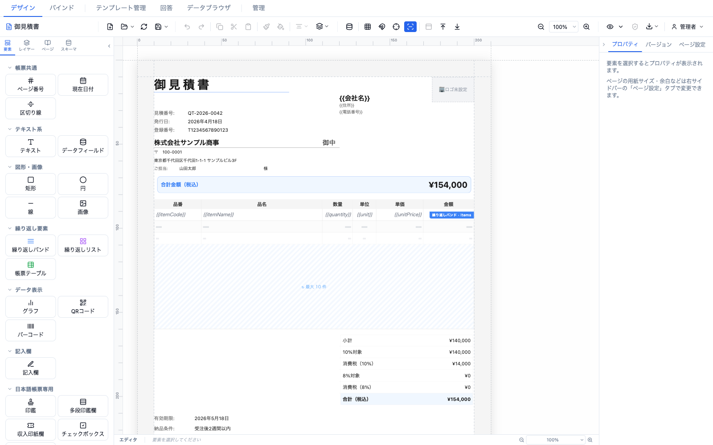
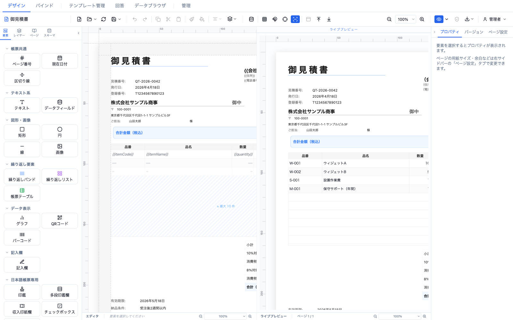
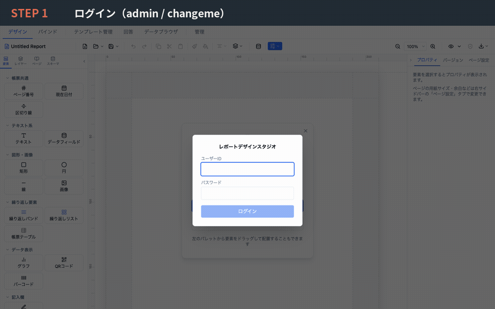

# Report Studio

[](https://github.com/wfukatsu/report-studio/actions/workflows/ci.yml)

🌐 **日本語**: see [README.md](./README.md).

A web application for designing business reports and forms by drag-and-drop, with
PDF/PNG export and ScalarDB integration. It natively supports the elements Japanese
business documents need (quotations, invoices, tax forms): _hanko_ seal boxes,
Japanese era (_wareki_) dates, vertical text, and _furigana_ ruby annotations.



The designer's `{{fieldKey}}` tokens (left) resolve to real data in the live preview (right):



### Workflow at a glance

Log in → pick a template → edit → preview → bind → export → responses/status — captured from an actual session. See the [user manual](docs/user-manual.md) for a step-by-step guide.



## Features

- **Visual design** — drag-and-drop report layout
- **24 element types** — text, data fields, charts, barcodes, and Japan-specific
  elements (hanko seals, revenue stamps, approval rows, era selectors)
- **Data binding** — dynamic values via `{{fieldKey}}` tokens
- **ScalarDB integration** — read table schemas and bind data
- **PDF/PNG export** — both client-side and server-side; the canvas and the server PDF render with the same self-hosted Noto fonts, so preview and output match
- **Tenant information** — embed org info (company name, logo, address) into reports
- **Version control** — template version history and restore
- **Form response collection** — collect responses from public forms, export to Excel/PDF
- **Calculation & validation** — JEXL-based calculation rules and input validation

## Tech Stack

| Layer | Technology |
|-------|------------|
| Frontend | Vite 8 + React 19 + TypeScript 7 (native tsc; a TS6 API alias coexists for typescript-eslint) |
| State | Zustand 5 (Immer middleware) |
| Styling | Tailwind CSS 4 + Radix UI |
| Drag & drop | @dnd-kit/core |
| Backend | Java 21 + Javalin 7 |
| Database | ScalarDB 3.17 + SQLite (development) |
| Testing | Vitest 4 + Playwright (frontend) / JUnit 5 (backend) |
| Component catalog | Storybook 10 |

## Quick Start with Docker (recommended)

Run the full stack (frontend + backend + SQLite) with a single command — no local
Node.js or JDK required. Requires [Docker](https://docs.docker.com/get-docker/) and
Docker Compose.

```bash
git clone https://github.com/wfukatsu/report-studio.git
cd report-studio

docker compose up --build
```

Then open **http://localhost:8080** and log in as `admin` / `changeme`.

- **Data persistence**: the SQLite database is stored in the named volume
  `report-studio-data` and survives container recreation. Stop with `docker compose down`
  (keeps data); add `-v` to also delete the data.
- **Change the port**: if 8080 is taken, use `APP_PORT=8090 docker compose up --build`
  (`ALLOWED_ORIGIN` follows automatically).
- **Initial password**: for anything public, set it before the first start with
  `ADMIN_PASSWORD=... docker compose up --build`.

> nginx serves the static assets and reverse-proxies `/api` to the backend as the same
> origin, so the browser sees a single origin (no CORS needed; cookies and CSRF checks
> just work). See [`docker-compose.yml`](./docker-compose.yml) and
> [`docker/nginx.conf`](./docker/nginx.conf).

## Quick Start from Source (~15 min)

### Prerequisites

- Node.js 22+ / npm 10+ (CI runs on Node 22)
- JDK 21 ([Temurin](https://adoptium.net/) or `brew install openjdk@21`)

> **Mind the JDK version:** the backend Gradle build requires a Java 21 toolchain.
> If your default `java` is not 21, point `JAVA_HOME` at a JDK 21. Example (macOS + Homebrew):
> `export JAVA_HOME=/opt/homebrew/opt/openjdk@21/libexec/openjdk.jdk/Contents/Home`

### Setup

```bash
git clone https://github.com/wfukatsu/report-studio.git
cd report-studio

npm install                                                       # frontend deps
cp server/scalardb.properties.example server/scalardb.properties  # dev uses SQLite; no extra config
```

### Run

```bash
npm run dev:full     # frontend + backend together
# or individually
npm run dev          # frontend (http://localhost:5173)
npm run dev:backend  # backend  (http://localhost:8080)
```

### Log in

Open `http://localhost:5173`.

| User ID | Password |
|---------|----------|
| `admin` | `changeme` (default) |

> **⚠ Security:** do not expose the app with the default password. Change it from the
> admin screen after first login, or set the `ADMIN_PASSWORD` environment variable
> before the first start. See [SECURITY.md](./SECURITY.md).

## Commands

### Frontend

```bash
npm run dev              # dev server (http://localhost:5173)
npm run build            # type-check + build (dist/)
npm run lint             # ESLint
npm test                 # tests (watch mode)
npm test -- --run        # tests (single run)
npm run test:coverage    # coverage (ratchet thresholds — fails on regression)
```

### Backend

```bash
npm run dev:backend                 # start backend (http://localhost:8080)
npm run test:backend                # backend tests
cd server && ./gradlew installDist  # distribution build (server/build/install/ — same path as the Docker build)
```

## Environment Variables

| Variable | Default | Description |
|----------|---------|-------------|
| `ADMIN_PASSWORD` | `changeme` | Initial admin password |
| `LOGIN_RATE_LIMIT_MAX` | `5` | Max login attempts (per IP / 5 min) |
| `LOGIN_RATE_LIMIT_WINDOW_MS` | `300000` | Rate-limit window (ms) |
| `WEBHOOK_SECRET_KEY` | _(unset)_ | Webhook secret encryption key (32-byte Base64, e.g. `openssl rand -base64 32`). Stored in plaintext with a startup warning if unset |

## Documentation

| Document | Contents |
|----------|----------|
| [Architecture](docs/architecture.md) | System structure and data flow |
| [Design](docs/design.md) | Component design and key patterns |
| [OpenAPI spec](docs/openapi.yaml) | Machine-readable REST API spec (entry point for PAT/Bearer external use) |
| [Observability](docs/observability.md) | Health checks, metrics, logging |
| [User Manual](docs/user-manual.md) | Operations and features |

## Contributing

See [CONTRIBUTING.md](./CONTRIBUTING.md) for dev setup, branch workflow, PR conventions,
and testing policy. Bug reports, feature proposals, and PRs are welcome. Report security
vulnerabilities via [SECURITY.md](./SECURITY.md), not public issues.

If you use Report Studio, please consider adding your organization to
[ADOPTERS.md](./ADOPTERS.md) (self-reported, no telemetry).

## License

[Apache License 2.0](./LICENSE)

See [docs/license-audit.md](./docs/license-audit.md) for the third-party dependency
license audit.
