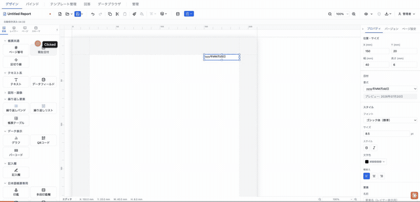
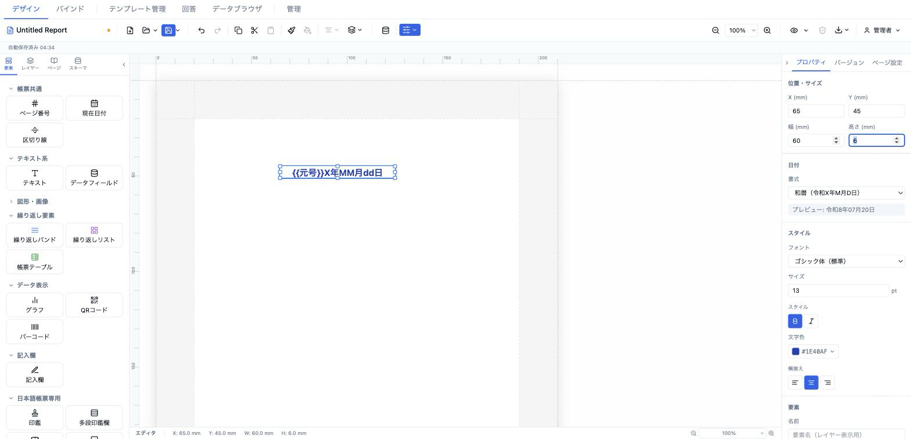

# 現在日付 (currentDate)

帳票の出力日を書式付きで自動表示する要素。西暦・和暦・曜日つきなど定型書式に加え、`yyyy`/`MM`/`dd`/`ddd` トークンによるカスタム書式に対応する。編集時は書式プレースホルダを表示し、プレビュー／PDF 出力時に実際の日付へ解決される。



- **ElementType**: `currentDate`
- **パレット**: 帳票共通 → `現在日付`
- **ファクトリ**: `createCurrentDateElement()` (`src/lib/elementFactories.ts`)
- **Renderer**: `src/elements/currentDate/Renderer.tsx`
- **PropertiesPanel**: `src/elements/currentDate/PropertiesPanel.tsx`

## 型定義

```ts
export type CurrentDateFormat =
  | 'yyyy/MM/dd'
  | 'yyyy年MM月dd日'
  | 'yyyy-MM-dd'
  | 'MM/dd/yyyy'
  | 'wareki_full'       // 令和8年4月10日
  | 'wareki_short'      // R8.04.10
  | 'yyyy年MM月dd日 (ddd)' // 2026年04月10日 (木)
  | 'custom'

export interface CurrentDateElement extends ElementBase {
  type: 'currentDate'
  format: CurrentDateFormat
  /** Custom format string (used when format === 'custom') */
  customFormat?: string
  style: TextStyle
}
```

`ElementBase`（全要素共通）は `id` / `type` / `position` (mm) / `size` (mm) / `zIndex` / `locked` / `visible` / `name?` / `conditionalDisplay?` / `printable?` / `schemaBinding?` を持つ。

## 設定可能なプロパティ（全網羅）

プロパティパネル最上部の「位置・サイズ」と最下部の「要素」セクションは共通ディスパッチャ（`src/components/sidebar/PropertiesPanel.tsx`）が付与し、その間に要素固有の「日付」「スタイル」セクションが挿入される。

### 位置・サイズ（共通・`PositionSizeSection`）

| UIラベル | プロパティ | 型 | 既定値 | 説明・効果 |
|---|---|---|---|---|
| X (mm) | `position.x` | number | 13 | セクション相対 X 座標（mm）。step 0.5 |
| Y (mm) | `position.y` | number | 13 | セクション相対 Y 座標（mm）。step 0.5 |
| 幅 (mm) | `size.width` | number | 40 | 要素の幅（mm）。min 1 / step 0.5 |
| 高さ (mm) | `size.height` | number | 6 | 要素の高さ（mm）。min 1 / step 0.5 |

### 日付（固有・`PropSection title="日付"`）

| UIラベル | プロパティ | 型 | 既定値 | 説明・効果 |
|---|---|---|---|---|
| 書式 | `format` | `CurrentDateFormat` (select) | `yyyy年MM月dd日` | 定型書式を選択。選択肢: yyyy/MM/dd / yyyy年MM月dd日 / yyyy-MM-dd / MM/dd/yyyy / 和暦（令和X年M月D日） / 和暦略（R8.04.10） / yyyy年MM月dd日 (曜日) / カスタム |
| カスタム書式 | `customFormat` | string (text) | undefined | `format === 'custom'` のときのみ表示。`yyyy`・`MM`・`dd`・`ddd`（曜日）トークンを置換。placeholder は `yyyy/MM/dd (ddd)` |
| プレビュー | （表示専用） | text | — | `formatCurrentDate(format, customFormat)` の結果を常時表示する読み取り専用行 |

### スタイル（固有・`PropSection title="スタイル"`）

| UIラベル | プロパティ | 型 | 既定値 | 説明・効果 |
|---|---|---|---|---|
| フォント | `style.fontFamily` | select | `sans-serif` 表示 | `FONT_FAMILIES`（12種: ゴシック体/明朝体/等幅/Noto Sans JP/Noto Serif JP/BIZ UDP ゴシック/BIZ UDP 明朝/メイリオ/MS ゴシック/MS 明朝/游ゴシック/游明朝） |
| サイズ | `style.fontSize` | number (`NumInput`) | 8.5 | フォントサイズ。min 1 / step 0.5 / 単位 pt。未設定時パネル表示は 10 |
| スタイル → 太字 | `style.fontWeight` | toggle (`bold`/`normal`) | `normal` | トグルで `bold` ⇄ `normal` |
| スタイル → 斜体 | `style.fontStyle` | toggle (`italic`/`normal`) | `normal` | トグルで `italic` ⇄ `normal` |
| 文字色 | `style.color` | color (`ColorInput`) | `#000000` | 文字色。未設定時パネル表示は `#000000` |
| 横揃え | `style.textAlign` | toggle (`left`/`center`/`right`) | `left` | 左/中央/右のアイコントグル |

### 要素（共通・`ElementCommonSection`）

| UIラベル | プロパティ | 型 | 既定値 | 説明・効果 |
|---|---|---|---|---|
| 名前 | `name` | string | undefined | レイヤーパネル表示名 |
| 表示 | `visible` | checkbox | true | 非表示にすると編集・出力とも描画されない |
| ロック | `locked` | checkbox | false | ロック中はドラッグ・リサイズ不可 |
| 印刷 | `printable` | checkbox | true | 印刷対象フラグ |
| 表示条件 | `conditionalDisplay` | `ConditionalDisplayEditor` | undefined | AND/OR ロジックの構造化表示条件 |
| バリアント非表示 | （`hiddenElementIds`） | checkbox 群 | — | 出力バリアントが1件以上あるときのみ表示。各バリアントでこの要素を隠す |

> 補足: Renderer は `style.verticalAlign`（縦揃え）も参照するが、現在日付のプロパティパネルには縦揃えコントロールは存在しない。

## 既定値（ファクトリ）

```ts
{
  id: uuidv4(),
  type: 'currentDate',
  position: { x: 13, y: 13 },
  size: { width: 40, height: 6 },
  zIndex: 1,
  visible: true,
  locked: false,
  format: 'yyyy年MM月dd日',
  style: { fontSize: 8.5, color: '#000000', textAlign: 'left' },
}
```

## レンダリング挙動

- 外側 `div` は `width/height: 100%`・flex 縦並びで、`style.verticalAlign` を `toFlexAlign` で `justifyContent` に変換（縦位置）。内側テキストは `whiteSpace: nowrap`。
- テキスト内容の分岐:
  - 編集時（`resolveValues=false`）: 実日付ではなく**プレースホルダ**を表示。`FORMAT_PLACEHOLDERS` により `wareki_full` → `{{元号}}X年MM月dd日`、`wareki_short` → `{{元号}}X.MM.dd`、`yyyy年MM月dd日 (ddd)` → `yyyy年MM月dd日 (曜日)` など。`format === 'custom'` なら `customFormat`（無ければ `カスタム日付`）を表示。
  - プレビュー／PDF 出力時（`resolveValues=true`）: `formatCurrentDate(format, customFormat)` で当日の実日付に解決。
- 和暦変換（`format.ts` の `toWareki`）は令和/平成/昭和/大正/明治の元号テーブル（新しい順）で年を算出。`wareki_full` は「令和8年04月10日」形式、`wareki_short` は「R8.04.10」形式。
- カスタム書式は `yyyy`→西暦、`MM`→月(0埋め2桁)、`ddd`→曜日(日〜土)、`dd`→日(0埋め2桁) の順で置換。
- 適用スタイル: `fontSize`(既定 10pt) / `fontWeight`(既定 normal) / `fontStyle`(既定 normal) / `color`(既定 `#000000`) / `fontFamily` / `textAlign`(既定 left)。

## 操作手順（GIF デモの流れ）

1. パレットの「帳票共通」から `現在日付` をキャンバスへドラッグして配置する。
2. プロパティパネル「位置・サイズ」で X / Y / 幅 / 高さ を調整する。
3. 「日付」セクションの「書式」で `yyyy年MM月dd日` → `和暦（令和X年M月D日）` → `yyyy年MM月dd日 (曜日)` と切り替え、直下の「プレビュー」行が追従することを確認する。
4. 「書式」を「カスタム」に変更し、現れた「カスタム書式」欄に `yyyy/MM/dd (ddd)` を入力する。
5. 「スタイル」セクションの「フォント」でフォントファミリを変更する。
6. 「サイズ」の pt 値を変更する。
7. 「スタイル」トグルで太字、続いて斜体を切り替える。
8. 「文字色」で色を変更する。
9. 「横揃え」を 左 → 中央 → 右 と切り替える。
10. 「要素」セクションで名前を入力し、表示 / ロック / 印刷 のチェックを操作する。
11. プレビュー（`readonly`）に切り替え、プレースホルダが当日の実日付に解決されることを確認する。

## スクリーンショット

編集画面（プロパティパネルで設定）:



設定後のプレビュー表示（プレビュー画面 / PDF 出力のイメージ）:


## 関連要素

- [ページ番号 (pageNumber)](./pageNumber.md)
- [区切り線 (divider)](./divider.md)
