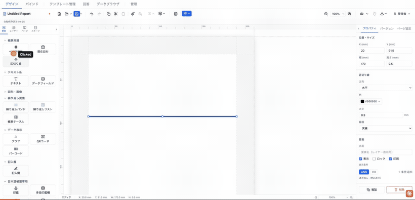
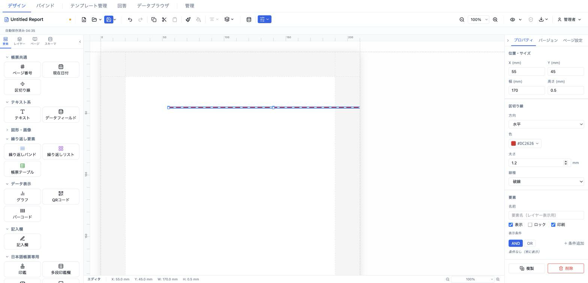
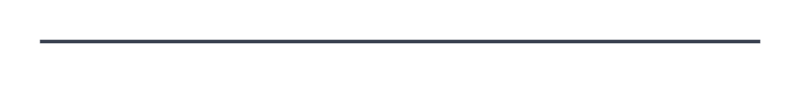

# 区切り線 (divider)

セクション区切り用の水平／垂直の罫線を描画する要素。色・太さ（mm）・線種（実線／破線／点線）を設定でき、SVG の `<line>` として非拡大ストロークで描画される。



- **ElementType**: `divider`
- **パレット**: 帳票共通 → `区切り線`
- **ファクトリ**: `createDividerElement()` (`src/lib/elementFactories.ts`)
- **Renderer**: `src/elements/divider/Renderer.tsx`
- **PropertiesPanel**: `src/elements/divider/PropertiesPanel.tsx`

## 型定義

```ts
export type DividerDirection = 'horizontal' | 'vertical'

export interface DividerElement extends ElementBase {
  type: 'divider'
  direction: DividerDirection
  color: string
  thickness: number       // mm
  dashStyle: 'solid' | 'dashed' | 'dotted'
}
```

`ElementBase`（全要素共通）は `id` / `type` / `position` (mm) / `size` (mm) / `zIndex` / `locked` / `visible` / `name?` / `conditionalDisplay?` / `printable?` / `schemaBinding?` を持つ。`divider` は `style` を持たない（テキスト要素と異なる）。

## 設定可能なプロパティ（全網羅）

プロパティパネル最上部の「位置・サイズ」と最下部の「要素」セクションは共通ディスパッチャ（`src/components/sidebar/PropertiesPanel.tsx`）が付与し、その間に要素固有の「区切り線」セクションが挿入される。

### 位置・サイズ（共通・`PositionSizeSection`）

| UIラベル | プロパティ | 型 | 既定値 | 説明・効果 |
|---|---|---|---|---|
| X (mm) | `position.x` | number | 13 | セクション相対 X 座標（mm）。step 0.5 |
| Y (mm) | `position.y` | number | 13 | セクション相対 Y 座標（mm）。step 0.5 |
| 幅 (mm) | `size.width` | number | 170 | 要素の幅（mm）。min 1 / step 0.5。水平線の長さ |
| 高さ (mm) | `size.height` | number | 0.5 | 要素の高さ（mm）。min 1 / step 0.5。垂直線の長さ |

### 区切り線（固有・`PropSection title="区切り線"`）

| UIラベル | プロパティ | 型 | 既定値 | 説明・効果 |
|---|---|---|---|---|
| 方向 | `direction` | select (`horizontal`/`vertical`) | `horizontal` | 水平／垂直。変更時は `size.width` と `size.height` を**入れ替える**（線の向きに合わせて自動リサイズ） |
| 色 | `color` | color (`ColorInput`) | `#000000` | 線の色（SVG `stroke`） |
| 太さ | `thickness` | number (`NumInput`) | 0.3 | 線の太さ（mm）。min 0.1 / max 5 / step 0.1。入力値は `0.1〜5` にクランプ |
| 線種 | `dashStyle` | select (`solid`/`dashed`/`dotted`) | `solid` | 実線／破線／点線 |

### 要素（共通・`ElementCommonSection`）

| UIラベル | プロパティ | 型 | 既定値 | 説明・効果 |
|---|---|---|---|---|
| 名前 | `name` | string | undefined | レイヤーパネル表示名 |
| 表示 | `visible` | checkbox | true | 非表示にすると編集・出力とも描画されない |
| ロック | `locked` | checkbox | false | ロック中はドラッグ・リサイズ不可 |
| 印刷 | `printable` | checkbox | true | 印刷対象フラグ |
| 表示条件 | `conditionalDisplay` | `ConditionalDisplayEditor` | undefined | AND/OR ロジックの構造化表示条件 |
| バリアント非表示 | （`hiddenElementIds`） | checkbox 群 | — | 出力バリアントが1件以上あるときのみ表示。各バリアントでこの要素を隠す |

## 既定値（ファクトリ）

```ts
{
  id: uuidv4(),
  type: 'divider',
  position: { x: 13, y: 13 },
  size: { width: 170, height: 0.5 },
  zIndex: 1,
  visible: true,
  locked: false,
  direction: 'horizontal',
  color: '#000000',
  thickness: 0.3,
  dashStyle: 'solid',
}
```

## レンダリング挙動

- `<svg width="100%" height="100%">` に `viewBox="0 0 size.width size.height"`・`preserveAspectRatio="none"`・`overflow: visible` を設定し、内部に単一の `<line>` を描画。
- 線の座標は方向で分岐:
  - 水平（`horizontal`）: `(0, height/2)` → `(width, height/2)`（中央を横断）。
  - 垂直（`vertical`）: `(0, 0)` → `(width/2, height)`（中央を縦断）。
- `stroke = color`、`strokeWidth = thickness mm`、`vectorEffect="non-scaling-stroke"` により viewBox スケールに影響されない一定太さで描画。
- 破線パターンは `DASH_MAP` で `strokeDasharray` に変換: `solid`→`none`、`dashed`→`4mm 2mm`、`dotted`→`1mm 1mm`。
- `readonly`（プレビュー）と編集時で描画差異はない（データバインドを持たない静的要素）。

## 操作手順（GIF デモの流れ）

1. パレットの「帳票共通」から `区切り線` をキャンバスへドラッグして配置する。
2. プロパティパネル「位置・サイズ」で X / Y / 幅 / 高さ を調整する。
3. 「区切り線」セクションの「方向」を 水平 → 垂直 に切り替え、幅と高さが入れ替わることを確認する。
4. 「色」で線の色を変更する。
5. 「太さ」を 0.3 → 1.0mm などに変更する（0.1〜5mm でクランプ）。
6. 「線種」を 実線 → 破線 → 点線 と切り替える。
7. 「要素」セクションで名前を入力し、表示 / ロック / 印刷 のチェックを操作する。

## スクリーンショット

編集画面（プロパティパネルで設定）:



設定後のプレビュー表示（プレビュー画面 / PDF 出力のイメージ）:



## 関連要素

- [ページ番号 (pageNumber)](./pageNumber.md)
- [現在日付 (currentDate)](./currentDate.md)
