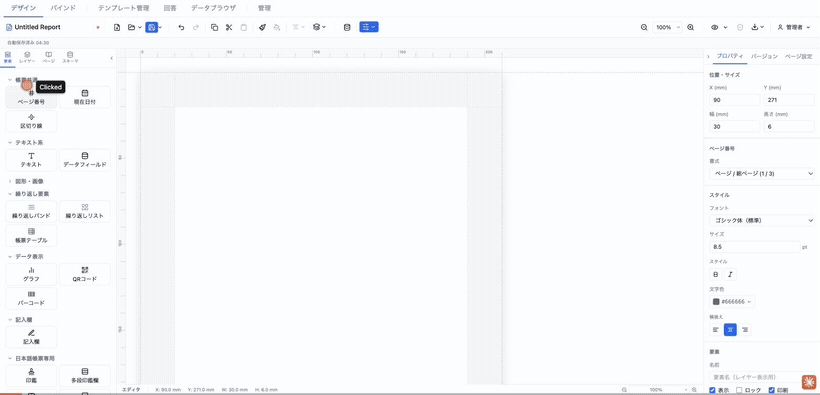
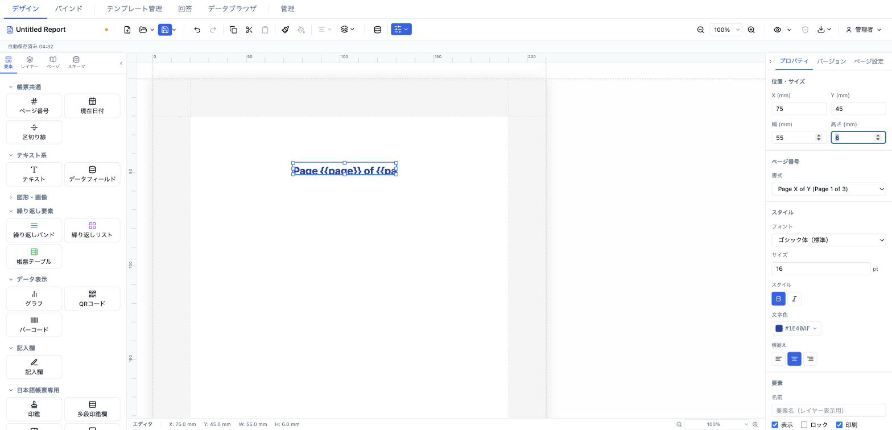

# ページ番号 (pageNumber)

現在ページ番号と総ページ数を書式付きで自動表示する要素。編集時は書式テンプレート（例 `{{page}} / {{pages}}`）をそのまま表示し、プレビュー／PDF 出力時に実際のページ番号へ解決される。



- **ElementType**: `pageNumber`
- **パレット**: 帳票共通 → `ページ番号`
- **ファクトリ**: `createPageNumberElement()` (`src/lib/elementFactories.ts`)
- **Renderer**: `src/elements/pageNumber/Renderer.tsx`
- **PropertiesPanel**: `src/elements/pageNumber/PropertiesPanel.tsx`

## 型定義

```ts
export type PageNumberFormat =
  | '{{page}}'               // 1
  | '{{page}} / {{pages}}'   // 1 / 3
  | '{{page}}/{{pages}}'     // 1/3
  | 'Page {{page}} of {{pages}}'  // Page 1 of 3
  | '{{page}}ページ'          // 1ページ
  | 'custom'

export interface PageNumberElement extends ElementBase {
  type: 'pageNumber'
  /** Display format — {{page}} = current, {{pages}} = total */
  format: PageNumberFormat
  /** Custom format string (used when format === 'custom') */
  customFormat?: string
  style: TextStyle
}
```

`ElementBase`（全要素共通）は `id` / `type` / `position` (mm) / `size` (mm) / `zIndex` / `locked` / `visible` / `name?` / `conditionalDisplay?` / `printable?` / `schemaBinding?` を持つ。

## 設定可能なプロパティ（全網羅）

プロパティパネル最上部の「位置・サイズ」と最下部の「要素」セクションは共通ディスパッチャ（`src/components/sidebar/PropertiesPanel.tsx`）が付与し、その間に要素固有の「ページ番号」「スタイル」セクションが挿入される。

### 位置・サイズ（共通・`PositionSizeSection`）

| UIラベル | プロパティ | 型 | 既定値 | 説明・効果 |
|---|---|---|---|---|
| X (mm) | `position.x` | number | 13 | セクション相対 X 座標（mm）。step 0.5 |
| Y (mm) | `position.y` | number | 13 | セクション相対 Y 座標（mm）。step 0.5 |
| 幅 (mm) | `size.width` | number | 30 | 要素の幅（mm）。min 1 / step 0.5 |
| 高さ (mm) | `size.height` | number | 6 | 要素の高さ（mm）。min 1 / step 0.5 |

### ページ番号（固有・`PropSection title="ページ番号"`）

| UIラベル | プロパティ | 型 | 既定値 | 説明・効果 |
|---|---|---|---|---|
| 書式 | `format` | `PageNumberFormat` (select) | `{{page}} / {{pages}}` | 定型書式を選択。選択肢はラベル+例つき: ページ番号のみ (1) / ページ / 総ページ (1 / 3) / ページ/総ページ (1/3) / Page X of Y (Page 1 of 3) / Xページ (1ページ) / カスタム |
| カスタム書式 | `customFormat` | string (text) | undefined | `format === 'custom'` のときのみ表示。`{{page}}`・`{{pages}}` トークンを含む任意文字列。placeholder は `{{page}} / {{pages}}` |

### スタイル（固有・`PropSection title="スタイル"`）

| UIラベル | プロパティ | 型 | 既定値 | 説明・効果 |
|---|---|---|---|---|
| フォント | `style.fontFamily` | select | `sans-serif` 表示 | `FONT_FAMILIES`（12種: ゴシック体/明朝体/等幅/Noto Sans JP/Noto Serif JP/BIZ UDP ゴシック/BIZ UDP 明朝/メイリオ/MS ゴシック/MS 明朝/游ゴシック/游明朝） |
| サイズ | `style.fontSize` | number (`NumInput`) | 8.5 | フォントサイズ。min 1 / step 0.5 / 単位 pt。未設定時パネル表示は 10 |
| スタイル → 太字 | `style.fontWeight` | toggle (`bold`/`normal`) | `normal` | トグルで `bold` ⇄ `normal` |
| スタイル → 斜体 | `style.fontStyle` | toggle (`italic`/`normal`) | `normal` | トグルで `italic` ⇄ `normal` |
| 文字色 | `style.color` | color (`ColorInput`) | `#666666` | 文字色。未設定時パネル表示は `#666666` |
| 横揃え | `style.textAlign` | toggle (`left`/`center`/`right`) | `center` | 左/中央/右のアイコントグル |

### 要素（共通・`ElementCommonSection`）

| UIラベル | プロパティ | 型 | 既定値 | 説明・効果 |
|---|---|---|---|---|
| 名前 | `name` | string | undefined | レイヤーパネル表示名 |
| 表示 | `visible` | checkbox | true | 非表示にすると編集・出力とも描画されない |
| ロック | `locked` | checkbox | false | ロック中はドラッグ・リサイズ不可 |
| 印刷 | `printable` | checkbox | true | 印刷対象フラグ |
| 表示条件 | `conditionalDisplay` | `ConditionalDisplayEditor` | undefined | AND/OR ロジックの構造化表示条件 |
| バリアント非表示 | （`hiddenElementIds`） | checkbox 群 | — | 出力バリアントが1件以上あるときのみ表示。各バリアントでこの要素を隠す |

> 補足: Renderer は `style.verticalAlign`（縦揃え）も参照するが、ページ番号のプロパティパネルには縦揃えコントロールは存在しない。

## 既定値（ファクトリ）

```ts
{
  id: uuidv4(),
  type: 'pageNumber',
  position: { x: 13, y: 13 },
  size: { width: 30, height: 6 },
  zIndex: 1,
  visible: true,
  locked: false,
  format: '{{page}} / {{pages}}',
  style: { fontSize: 8.5, color: '#666666', textAlign: 'center' },
}
```

## レンダリング挙動

- 外側 `div` は `width/height: 100%`・flex 縦並びで、`style.verticalAlign` を `toFlexAlign` で `justifyContent` に変換（縦位置）。内側テキストは `whiteSpace: nowrap` で折り返しなし。
- テキスト内容の分岐:
  - 編集時（`resolveValues=false`）: `format === 'custom'` なら `customFormat`（無ければ `{{page}}`）、それ以外は `format` の**テンプレート文字列そのまま**（例 `{{page}} / {{pages}}`）を表示。
  - プレビュー／PDF-PNG 出力時（`resolveValues=true`）: `formatPageNumber(format, customFormat, pageIndex, totalPages)` で `{{page}}` → 現在ページ、`{{pages}}` → 総ページ数に置換した結果を表示。
- `pageIndex`（1始まり）・`totalPages` は `resolveValues=true` のときのみ使用。既定は 1 / 1。
- 適用スタイル: `fontSize`(既定 `DEFAULT_FONT_SIZE`=10pt) / `fontWeight`(既定 normal) / `fontStyle`(既定 normal) / `color`(既定 `#666666`) / `fontFamily` / `textAlign`(既定 center)。

## 操作手順（GIF デモの流れ）

1. パレットの「帳票共通」から `ページ番号` をキャンバスへドラッグして配置する。
2. プロパティパネル「位置・サイズ」で X / Y / 幅 / 高さ を調整する。
3. 「ページ番号」セクションの「書式」で `Page X of Y` など定型書式を切り替える。
4. 「書式」を「カスタム」に変更し、現れた「カスタム書式」欄に `{{page}} / {{pages}}` を入力する。
5. 「スタイル」セクションの「フォント」でフォントファミリを変更する。
6. 「サイズ」の pt 値を変更する。
7. 「スタイル」トグルで太字、続いて斜体を切り替える。
8. 「文字色」で色を変更する。
9. 「横揃え」を 左 → 中央 → 右 と切り替える。
10. 「要素」セクションで名前を入力し、表示 / ロック / 印刷 のチェックを操作する。
11. プレビュー（`readonly`）に切り替え、テンプレートが実ページ番号に解決されることを確認する。

## スクリーンショット

編集画面（プロパティパネルで設定）:



設定後のプレビュー表示（プレビュー画面 / PDF 出力のイメージ）:


## 関連要素

- [現在日付 (currentDate)](./currentDate.md)
- [区切り線 (divider)](./divider.md)
