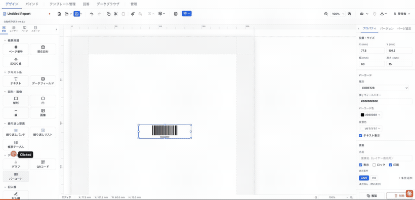
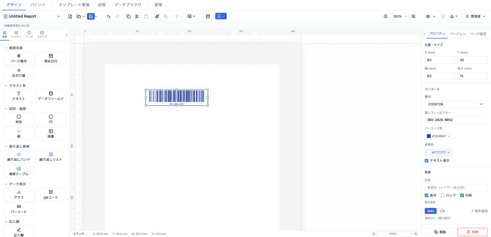

# バーコード / QRコード (barcode)

QRコード・CODE128・CODE39・JAN13（EAN-13）を描画する要素。エンコード値は静的文字列でも `{{fieldKey}}` トークンでのデータバインドでも指定できる。



- **ElementType**: `barcode`
- **パレット**: データ表示 → `QRコード` / `バーコード`
- **ファクトリ**: `createBarcodeElement()`（QR用）・`createBarcodeCode128Element()`（CODE128用） (`src/lib/elementFactories.ts`)
- **Renderer**: `src/elements/barcode/Renderer.tsx`
- **PropertiesPanel**: `src/elements/barcode/PropertiesPanel.tsx`

## 型定義

```ts
export type BarcodeKind = 'qr' | 'code128' | 'code39' | 'jan13'

export interface BarcodeElement extends ElementBase {
  type: 'barcode'
  kind: BarcodeKind
  /** エンコード値 ({{token}} 可) */
  value: string
  errorCorrection?: 'L' | 'M' | 'Q' | 'H'
  darkColor?: string
  lightColor?: string
  showText?: boolean
}
```

`ElementBase` から `id` / `position` / `size` / `zIndex` / `visible` / `locked` などの共通プロパティを継承する。描画サイズは要素の `size.width` / `size.height`（mm）から算出される。

## 設定可能なプロパティ（全網羅）

すべて単一の PropSection「バーコード」内に並ぶ。

| UIラベル | プロパティ | 型 | 既定値 | 説明・効果 |
|---|---|---|---|---|
| 種別 | `kind` | `'qr' \| 'code128' \| 'code39' \| 'jan13'` | ファクトリ依存（QR:`qr` / バーコード:`code128`） | セレクトで QRコード / CODE128 / CODE39 / JAN13 (EAN-13) を選択。QR のときのみ「誤り訂正レベル」行が出現する。 |
| 値 / フィールドキー | `value` | `string` | ファクトリ依存 | `FieldKeyInput` に静的値または `{{fieldKey}}` トークンを入力。トークンは描画時に `interpolate` でデータ解決される。プレースホルダ `値または {{fieldKey}}`。 |
| 誤り訂正レベル | `errorCorrection` | `'L' \| 'M' \| 'Q' \| 'H'` | `'M'` | **`kind === 'qr'` のときのみ表示**。L（低）/ M（中）/ Q（高）/ H（最高）。QR の冗長度を決める。 |
| バーコード色 | `darkColor` | `string` | `'#000000'` | `ColorInput`。QR の前景色 / バーコードの線色。 |
| 背景色 | `lightColor` | `string` | `'#ffffff'` | `ColorInput`。QR / バーコードの背景色。 |
| テキスト表示 | `showText` | `boolean` | `true`（UI 既定） | チェックボックス。CODE128/CODE39/JAN13 でバーの下に値テキストを表示するか（`displayValue`）。**QR には影響しない**（QR は常にテキスト非表示）。 |

## 既定値（ファクトリ）

このパレットカテゴリには 2 つのファクトリが対応する。

### `createBarcodeElement()`（パレット「QRコード」）

| プロパティ | 値 |
|---|---|
| `type` | `'barcode'` |
| `position` | `{ x: 13, y: 13 }` |
| `size` | `{ width: 30, height: 30 }` |
| `zIndex` / `visible` / `locked` | `1` / `true` / `false` |
| `kind` | `'qr'` |
| `value` | `'https://example.com'` |
| `errorCorrection` | `'M'` |
| `darkColor` | `'#000000'` |
| `lightColor` | `'#ffffff'` |
| `showText` | `false` |

### `createBarcodeCode128Element()`（パレット「バーコード」）

| プロパティ | 値 |
|---|---|
| `type` | `'barcode'` |
| `position` | `{ x: 13, y: 13 }` |
| `size` | `{ width: 60, height: 15 }` |
| `zIndex` / `visible` / `locked` | `1` / `true` / `false` |
| `kind` | `'code128'` |
| `value` | `'0000000000'` |
| `darkColor` | `'#000000'` |
| `lightColor` | `'#ffffff'` |
| `showText` | `true` |

`code128` ファクトリは `errorCorrection` を持たない（QR 専用のため）。

## レンダリング挙動

- **値解決**: `interpolate(el.value, data)` で `{{token}}` を解決してから `BarcodeContent` に渡す。
- **空値フォールバック**: 解決後が空文字なら種別ごとの既定値（QR:`https://example.com`, code128:`0000000000`, code39:`HELLO`, jan13:`4902778913406`）を使う。
- **サニタイズ**（JsBarcode は不正文字で例外を投げるため描画前に整形）:
  - `code39`: 大文字化し、許可文字（A-Z・0-9・空白・`- . $ / + %`）以外を除去。空になれば既定値 `HELLO`。
  - `jan13`: 数字以外を除去し、12〜13 桁でなければ既定値にフォールバック、13 桁に切り詰め。
- **QR 描画**（`qrcode.react` の `QRCodeSVG`）: 一辺 = `min(width, height) × MM_TO_PX` の正方形。前景 `darkColor`、背景 `lightColor`、`level=errorCorrection`。中央寄せ。`showText` は無関係。
- **1次元バーコード描画**（`react-barcode` / JsBarcode, CODE128/CODE39/EAN13）: `format` は `code128→CODE128` / `code39→CODE39` / `jan13→EAN13` にマップ。`width=1.2`、`height=size.height × MM_TO_PX × 0.75`、`displayValue=showText`、`lineColor=darkColor`、`background=lightColor`、`margin=2`、`fontSize=8`。中央寄せ・はみ出しは `overflow: hidden`。

## 操作手順（GIF デモの流れ）

1. パレットの「データ表示 → QRコード」をキャンバスにドラッグし、QRコード要素を追加する（初期値 `https://example.com`）。
2. プロパティパネル「バーコード」→「種別」を `QRコード` → `CODE128` → `CODE39` → `JAN13 (EAN-13)` の順に切り替え、描画が変わることを確認する（QR 選択時のみ「誤り訂正レベル」行が現れる）。
3. 「値 / フィールドキー」に静的値（例: `4902778913406`）を入力して描画を確認し、続けて `{{order.id}}` のようなトークンを入力してデータバインドできることを確認する。
4. 種別を `QRコード` に戻し、「誤り訂正レベル」を `L（低）` → `M（中）` → `Q（高）` → `H（最高）` と切り替え、QR の密度が変わることを確認する。
5. 「バーコード色」を任意の色（例: `#003366`）に変更し、前景/線色が変わることを確認する。
6. 「背景色」を任意の色（例: `#f5f5f5`）に変更し、背景色が変わることを確認する。
7. 種別を `CODE128` にして「テキスト表示」チェックを外し、バー下の数字が消えることを確認してから戻す（QR ではこのチェックは効かない）。

## スクリーンショット



## 関連要素

- ハンコ (hanko) — 印影の描画
- 画像 (image) — 画像・ロゴの配置
- データフィールド (dataField) — 単一値のバインド表示
