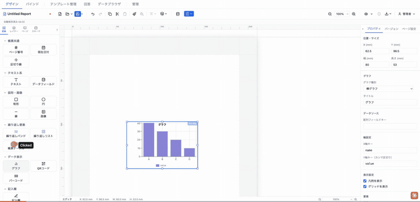
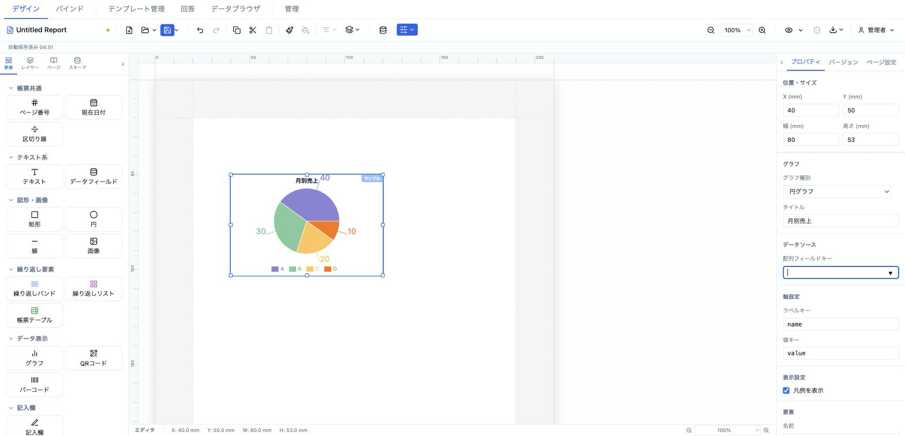

# グラフ (chart)

配列データを棒・折れ線・円・ドーナツの各グラフとして描画する要素。Recharts をベースに、系列キーやカラー、凡例・グリッドの表示を切り替えられる。



- **ElementType**: `chart`
- **パレット**: データ表示 → `グラフ`
- **ファクトリ**: `createChartElement()` (`src/lib/elementFactories.ts`)
- **Renderer**: `src/elements/chart/Renderer.tsx`
- **PropertiesPanel**: `src/elements/chart/PropertiesPanel.tsx`

## 型定義

```ts
export interface ChartElement extends ElementBase {
  type: 'chart'
  chartType: 'bar' | 'line' | 'pie' | 'donut'
  dataBinding?: string
  title?: string
  /** X軸に使うデータキー (default: 'name') */
  xAxisKey?: string
  /** Y軸に使うデータキー (複数系列対応) */
  yAxisKeys?: string[]
  /** カスタムカラーパレット */
  colors?: string[]
  /** 凡例表示 (default: true) */
  showLegend?: boolean
  /** グリッド表示 (default: true) */
  showGrid?: boolean
}
```

`dataBinding` は「配列」を返すフィールドキーを指す（`dataField` 等の単一値バインドとは別系統）。`ElementBase` から `id` / `position` / `size` / `zIndex` / `visible` / `locked` などの共通プロパティを継承する。

## 設定可能なプロパティ（全網羅）

### グラフ（PropSection「グラフ」）

| UIラベル | プロパティ | 型 | 既定値 | 説明・効果 |
|---|---|---|---|---|
| グラフ種別 | `chartType` | `'bar' \| 'line' \| 'pie' \| 'donut'` | `'bar'` | セレクトで棒グラフ / 折れ線グラフ / 円グラフ / ドーナツグラフを選択。`pie`・`donut` の場合は下段の軸ラベルが「ラベルキー」「値キー」に変わる。 |
| タイトル | `title` | `string` | `'グラフ'`（ファクトリ） | グラフ上部中央に太字（3mm）で重ねて表示。空文字なら非表示。 |

### データソース（`DataBindingSection`, title=「データソース」）

| UIラベル | プロパティ | 型 | 既定値 | 説明・効果 |
|---|---|---|---|---|
| 配列フィールドキー | `dataBinding` | `string \| undefined` | 未設定 | `FieldKeyInput` で配列を返すフィールドキーを指定。空にすると `undefined` に戻り、デザイン時はハードコードされたサンプルデータ（A/B/C/D）が表示される。 |

### 軸設定（PropSection「軸設定」）

| UIラベル | プロパティ | 型 | 既定値 | 説明・効果 |
|---|---|---|---|---|
| X軸キー / ラベルキー | `xAxisKey` | `string \| undefined` | `'name'`（ファクトリ） | 棒・折れ線では X 軸のカテゴリキー、円・ドーナツでは各扇形のラベル（`nameKey`）に使う。ラベルは種別が pie/donut のとき「ラベルキー」に変わる。プレースホルダ `例: name`。 |
| Y軸キー（カンマ区切り） / 値キー | `yAxisKeys` | `string[] \| undefined` | `['value']`（ファクトリ） | 棒・折れ線では系列キーをカンマ区切りで複数指定でき、各系列が別色で描画される。円・ドーナツでは先頭キーのみ値（`dataKey`）として使う。入力はカンマ分割・トリム後に空要素を除去。プレースホルダは棒/折れ線が `例: revenue, cost`、円/ドーナツが `例: value`。 |

### 表示設定（PropSection「表示設定」）

| UIラベル | プロパティ | 型 | 既定値 | 説明・効果 |
|---|---|---|---|---|
| 凡例を表示 | `showLegend` | `boolean` | `true` | チェックボックス。オフで `Legend` を非表示。全種別で表示。 |
| グリッドを表示 | `showGrid` | `boolean` | `true` | チェックボックス。オフで `CartesianGrid`（破線グリッド）を非表示。**棒・折れ線のときのみ表示**（円・ドーナツ選択時は UI から消える）。 |

> `colors`（カスタムカラーパレット）は型・Renderer・`ChartContent` では受け渡されるが、**PropertiesPanel には対応する UI コントロールが無い**。未指定時は `DEFAULT_CHART_COLORS`（`#8884d8`, `#82ca9d`, `#ffc658`, `#ff7300`, `#a4de6c`）を系列インデックスで循環使用する。

## 既定値（ファクトリ）

`createChartElement()` が生成する初期値:

| プロパティ | 値 |
|---|---|
| `type` | `'chart'` |
| `position` | `{ x: 13, y: 13 }` |
| `size` | `{ width: 80, height: 53 }` |
| `zIndex` | `1` |
| `visible` | `true` |
| `locked` | `false` |
| `chartType` | `'bar'` |
| `title` | `'グラフ'` |
| `xAxisKey` | `'name'` |
| `yAxisKeys` | `['value']` |
| `showLegend` | `true` |
| `showGrid` | `true` |

`dataBinding` / `colors` は初期状態では未設定。

## レンダリング挙動

- **データ解決**: `dataBinding` が設定され、かつ `data[dataBinding]` が「オブジェクトの配列」（長さ 1 以上・先頭がプレーンオブジェクト）のとき、その配列を実データとして描画。空配列 `[]` はそのまま渡され `ChartContent` 側で「データなし」表示になる。バインドが未設定、またはプリミティブ配列など不正な形の場合は `SAMPLE_DATA`（`{name,value}` の 4 行）にフォールバックする。
- **サンプルバッジ**: `sampleHint`（デザインモード = `!readonly` 時に真）かつサンプルデータ表示中のとき、右上に青い「サンプル」バッジを重ねる。プレビュー/エクスポートには出ない。
- **タイトル**: `title` があればグラフ上部中央に太字で重ねて表示。
- **チャート本体**（`ChartContent`, Recharts の `ResponsiveContainer` で 100%×100%）:
  - `bar`: `BarChart` +（グリッド時）`CartesianGrid` + `XAxis`/`YAxis`（フォント 10）+ `Tooltip` +（凡例時）`Legend`。`yAxisKeys` ごとに `Bar` を色循環で描画。アニメーション無効。
  - `line`: `LineChart` で `Line`（`type="monotone"`）を系列ごとに描画。他は棒と同様。
  - `pie` / `donut`: `PieChart` + `Pie`（`dataKey=yAxisKeys[0] ?? 'value'`, `nameKey=xAxisKey`, `outerRadius=75%`）。`donut` は `innerRadius=40%`。`pie` のみ扇形ラベルを表示。各 `Cell` を色循環で塗り分け。
  - データが空: 破線枠に「データなし」を表示。
  - 未知の `chartType`: 赤系の破線枠に「不明なグラフタイプ」を表示（デシリアライズ時の防御）。

## 操作手順（GIF デモの流れ）

1. パレットの「データ表示 → グラフ」をキャンバスにドラッグして棒グラフ要素を追加する（初期はサンプルデータの棒グラフ）。
2. プロパティパネル「グラフ」→「グラフ種別」を `棒グラフ` → `折れ線グラフ` → `円グラフ` → `ドーナツグラフ` の順に切り替え、描画の違いを確認する。
3. 「タイトル」に任意の文字列（例: `月次売上`）を入力し、グラフ上部に表示されることを確認する。
4. 「データソース」→「配列フィールドキー」に配列を返すフィールドキー（例: `sales`）を入力し、サンプルバッジが消えて実データ描画に切り替わることを確認する（プレビュー時）。
5. 「軸設定」→「X軸キー」に `name`（円/ドーナツ選択時は「ラベルキー」表示）を入力する。
6. 「軸設定」→「Y軸キー（カンマ区切り）」に `revenue, cost` のように複数系列をカンマ区切りで入力し、系列ごとに色が分かれることを確認する（円/ドーナツでは「値キー」となり先頭のみ有効）。
7. 「表示設定」→「凡例を表示」のチェックを外し、凡例が消えることを確認してから戻す。
8. グラフ種別を棒グラフに戻し、「表示設定」→「グリッドを表示」のチェックを外し、背景の破線グリッドが消えることを確認する（このチェックは円/ドーナツでは非表示）。

## スクリーンショット



## 関連要素

- 帳票テーブル (formTable) — 表形式でのデータ表示
- リピートバンド (repeatingBand) / リピートリスト (repeatingList) — 配列データの繰り返し描画
- データフィールド (dataField) — 単一値のバインド表示
