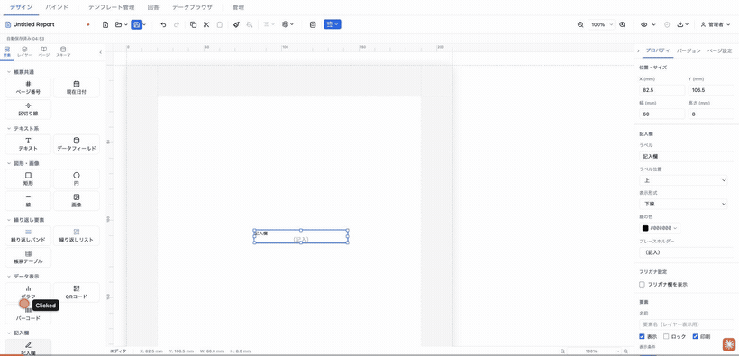
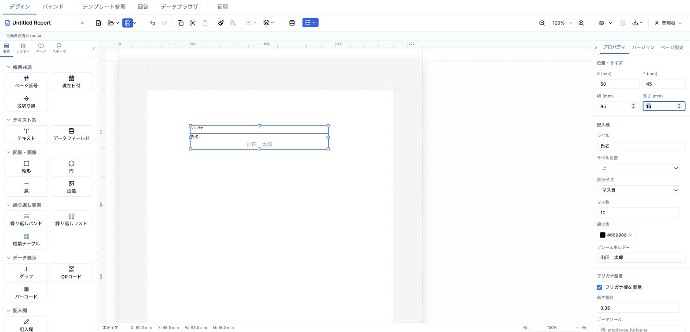

# 記入欄 (manualEntry)

手書き記入用の空欄（下線・ボックス・マス目）を配置する要素。ラベルとプレースホルダーを備え、任意でフリガナ欄を上部に追加できる。帳票の手書き入力エリアを表現する。



- **ElementType**: `manualEntry`
- **パレット**: 記入欄 → `記入欄`
- **ファクトリ**: `createManualEntryField()` (`src/lib/elementFactories.ts`)
- **Renderer**: `src/elements/manualEntry/Renderer.tsx`
- **PropertiesPanel**: `src/elements/manualEntry/PropertiesPanel.tsx`

## 型定義

```ts
export type ManualEntryDisplayMode = 'line' | 'box' | 'grid' | 'none'

export interface ManualEntryField extends ElementBase {
  type: 'manualEntry'
  label: string
  labelPosition: 'top' | 'left' | 'none'
  displayMode: ManualEntryDisplayMode
  lineColor: string
  gridCount?: number
  placeholder?: string
  style: TextStyle
  /** フリガナゾーンを表示する (デフォルト: false) */
  furiganaEnabled?: boolean
  /** フリガナのデータプレビュー値 — resolveField で解決するキー */
  furiganaDataSource?: string
  /** フリガナ行の高さ割合 0〜1 (デフォルト: 0.35) */
  furiganaRatio?: number
}
```

## 設定可能なプロパティ（全網羅）

### 位置・サイズ（共通セクション）

| UIラベル | プロパティ | 型 | 既定値 | 説明・効果 |
|---|---|---|---|---|
| X (mm) | `position.x` | number | 13 | セクション相対の水平位置 |
| Y (mm) | `position.y` | number | 13 | セクション相対の垂直位置 |
| 幅 (mm) | `size.width` | number | 60 | 要素の幅 |
| 高さ (mm) | `size.height` | number | 8 | 要素の高さ |

### 記入欄（型固有セクション）

| UIラベル | プロパティ | 型 | 既定値 | 説明・効果 |
|---|---|---|---|---|
| ラベル | `label` | string | `記入欄` | 記入欄に添えるラベルテキスト |
| ラベル位置 | `labelPosition` | `'top' \| 'left' \| 'none'` | `top` | ラベルを上／左に配置、`none` で非表示 |
| 表示形式 | `displayMode` | `'line' \| 'box' \| 'grid' \| 'none'` | `line` | `line`=下線、`box`=四方枠、`grid`=マス目、`none`=枠なし |
| マス数 | `gridCount` | number | 10 | `displayMode='grid'` のときだけ表示。マス目の分割数（1〜50） |
| 線の色 | `lineColor` | string(#RRGGBB) | `#000000` | 下線・枠・マス目線の色 |
| プレースホルダー | `placeholder` | string | `（記入）` | 記入エリア中央に不透明度40%で表示する見本テキスト。空にすると非表示 |

### フリガナ設定（型固有セクション）

| UIラベル | プロパティ | 型 | 既定値 | 説明・効果 |
|---|---|---|---|---|
| フリガナ欄を表示 | `furiganaEnabled` | boolean | `false` | 上部にフリガナゾーン（「フリガナ」ラベル＋下線）を追加 |
| 高さ割合 | `furiganaRatio` | number | 0.35 | フリガナゾーンが占める高さ比率（0.1〜0.9）。`furiganaEnabled` 有効時のみ表示 |
| データソース | `furiganaDataSource` | string | （未設定） | フリガナ欄に表示する値を `resolveField` で解決するキー（例: `employee.furigana`）。`furiganaEnabled` 有効時のみ表示 |

### 要素（共通セクション）

| UIラベル | プロパティ | 型 | 既定値 | 説明・効果 |
|---|---|---|---|---|
| 名前 | `name` | string | （未設定） | レイヤーパネル表示名 |
| 表示 | `visible` | boolean | `true` | 非表示化 |
| ロック | `locked` | boolean | `false` | ドラッグ・リサイズ禁止 |
| 印刷 | `printable` | boolean | `true` | 印刷対象か |
| 表示条件 | `conditionalDisplay` | ConditionalDisplay | （未設定） | AND/OR による条件表示 |
| バリアント非表示 | （出力バリアント連動） | — | — | 出力バリアントが定義されている場合のみ表示 |

> 注: `style`（`fontSize` pt / `color`）はこのパネルに専用コントロールがなく、ファクトリ既定値 `{ fontSize: 10, color: '#000000' }` のまま使われる。値はプレースホルダーテキストの文字サイズ・色に反映される。

## 既定値（ファクトリ）

```ts
{
  type: 'manualEntry',
  position: { x: 13, y: 13 },
  size: { width: 60, height: 8 },
  zIndex: 1, visible: true, locked: false,
  label: '記入欄',
  labelPosition: 'top',
  displayMode: 'line',
  lineColor: '#000000',
  placeholder: '（記入）',
  style: { fontSize: 10, color: '#000000' },
}
```

## レンダリング挙動

- **表示形式**: `line` は記入エリア下端に下線（`DEFAULT_BORDER_WIDTH mm solid lineColor`）、`box` は四方枠、`grid` は `GridLines` で `gridCount` 本のマス目、`none` は枠線なし。
- **プレースホルダー**: 設定時、記入エリア中央に不透明度40%・折り返しなしで表示（`pointerEvents: none`）。フォントサイズは `style.fontSize`（pt）、無指定時は `DEFAULT_FONT_SIZE`。
- **ラベル**: `labelPosition='left'` で横並び（`flex-direction: row`）、`'top'` で縦並び、`'none'` で非表示。ラベル文字サイズは固定 2.8mm。
- **フリガナ**: `furiganaEnabled` 時、上部に高さ `furiganaRatio` 比のゾーンを設け、「フリガナ」ラベル（2.2mm）＋下線を描画。`furiganaDataSource` を `resolveField(data, key)` で解決した値を 2.8mm で表示（未解決時は空）。
- 全体は `userSelect: none`。デザイン／プレビューで同一表示（`readonly` による差分なし）。

## 操作手順（GIF デモの流れ）

1. パレットの「記入欄」→ `記入欄` をキャンバスにドラッグして配置する。
2. プロパティパネルの「ラベル」を `氏名` に変更する。
3. 「ラベル位置」を `左` に切り替え、続けて `上` に戻す。
4. 「表示形式」を `下線` → `ボックス` → `マス目` → `なし` と順に切り替える。
5. `マス目` を選んだ状態で「マス数」を `10` から `6` に変更する。
6. 「線の色」を青系（例 `#2563eb`）に変更する。
7. 「プレースホルダー」を `（フルネームを記入）` に変更する。
8. 「フリガナ設定」の「フリガナ欄を表示」をオンにする。
9. 表示された「高さ割合」を `0.35` から `0.4` に変更する。
10. 「データソース」に `employee.furigana` を入力する。
11. 共通「位置・サイズ」で幅・高さを調整し、「要素」セクションで名前・表示・ロック・印刷・表示条件を確認する。

## スクリーンショット

編集画面（プロパティパネルで設定）:



設定後のプレビュー表示（プレビュー画面 / PDF 出力のイメージ）:


## 関連要素

- [チェックボックス (checkbox)](../japanese/checkbox.md) — 選択入力欄
- [元号選択 (eraSelect)](../japanese/eraSelect.md) — 和暦元号の選択欄
- [帳票テーブル (formTable)](../repeating/formTable.md) — セル内に記入欄（`input` セル）を持てるテーブル
