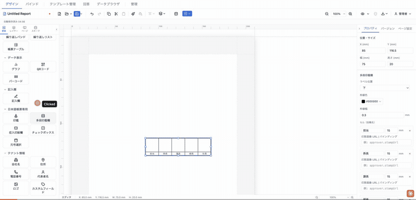
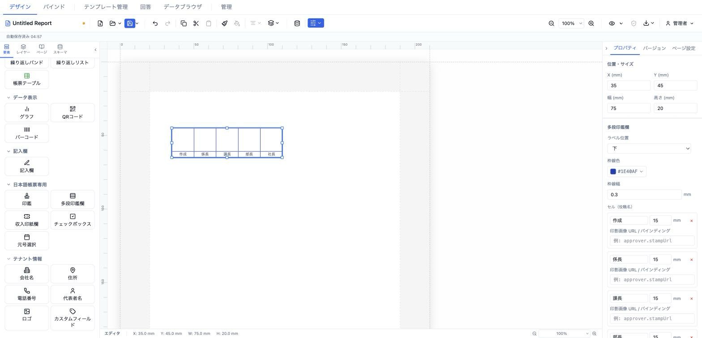
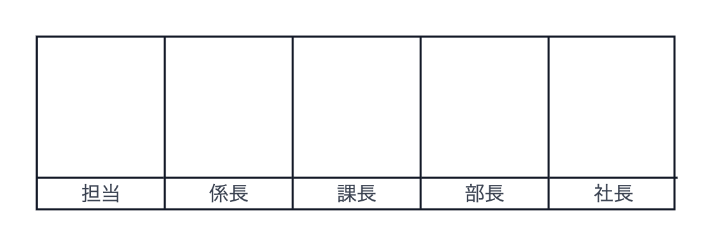

# 多段印鑑欄 (approvalStampRow)

承認フロー（担当→係長→課長→部長→社長 等）を横並びで表す複数列の印鑑欄。各列に役職名ラベルと押印スペースを持ち、任意で押印済み画像を差し込める。



- **ElementType**: `approvalStampRow`
- **パレット**: 日本語帳票専用 → `多段印鑑欄`
- **ファクトリ**: `createApprovalStampRowElement()` (`src/lib/elementFactories.ts`)
- **Renderer**: `src/elements/approvalStampRow/Renderer.tsx`
- **PropertiesPanel**: `src/elements/approvalStampRow/PropertiesPanel.tsx`

## 型定義

```ts
export interface ApprovalStampCell {
  role: string
  stampSrc?: string
  width: number   // mm
}

export interface ApprovalStampRowElement extends ElementBase {
  type: 'approvalStampRow'
  cells: ApprovalStampCell[]
  labelPosition: 'top' | 'bottom'
  borderColor: string
  borderWidth: number   // mm
  cellHeight: number    // mm
}
```

## 設定可能なプロパティ（全網羅）

### 位置・サイズ（共通セクション）

| UIラベル | プロパティ | 型 | 既定値 | 説明・効果 |
|---|---|---|---|---|
| X (mm) | `position.x` | number | 13 | セクション相対の水平位置 |
| Y (mm) | `position.y` | number | 13 | セクション相対の垂直位置 |
| 幅 (mm) | `size.width` | number | 75 | 全体幅。セル追加・削除・幅編集時は自動的に各セル幅の合計へ更新される |
| 高さ (mm) | `size.height` | number | 20 | 全体高さ |

### 多段印鑑欄（型固有セクション）

| UIラベル | プロパティ | 型 | 既定値 | 説明・効果 |
|---|---|---|---|---|
| ラベル位置 | `labelPosition` | `'top' \| 'bottom'`（上／下） | `bottom` | 役職名ラベルを各列の上か下に配置 |
| 枠線色 | `borderColor` | string(#RRGGBB) | `#000000` | 外枠・列区切りの線色 |
| 枠線幅 | `borderWidth` | number(mm) | 0.3 | 外枠・列区切りの線幅（0 以上、0.1 刻み） |
| セル（役職名） | `cells[]` | ApprovalStampCell[] | 5列（担当/係長/課長/部長/社長、各幅15mm） | 各列の役職名・幅・印影を編集。「＋ セル追加」で末尾に幅15mmの空セルを追加、「×」で削除 |

各セル（`cells[i]`）の編集項目:

| UIラベル | プロパティ | 型 | 既定値 | 説明・効果 |
|---|---|---|---|---|
| 役職名（テキスト欄） | `cells[i].role` | string | 担当/係長/課長/部長/社長 | 列の役職ラベル（空文字可） |
| 幅 (mm) | `cells[i].width` | number(mm) | 15 | 列幅（最小 5mm）。変更すると `size.width` が全セル幅合計へ再計算される |
| 印影画像 URL / バインディング | `cells[i].stampSrc` | string | （未設定） | 押印済み画像の URL / data-URI、またはデータバインドキー（例: `approver.stampUrl`） |

### 要素（共通セクション）

| UIラベル | プロパティ | 型 | 既定値 | 説明・効果 |
|---|---|---|---|---|
| 名前 | `name` | string | （未設定） | レイヤーパネル表示名 |
| 表示 | `visible` | boolean | `true` | 非表示化 |
| ロック | `locked` | boolean | `false` | ドラッグ・リサイズ禁止 |
| 印刷 | `printable` | boolean | `true` | 印刷対象か |
| 表示条件 | `conditionalDisplay` | ConditionalDisplay | （未設定） | AND/OR による条件表示 |
| バリアント非表示 | （出力バリアント連動） | — | — | 出力バリアントが定義されている場合のみ表示 |

> 注: `cellHeight`（既定 15mm）は型・ファクトリに存在するが、現在の Renderer では参照されていない。列高さは要素の `size.height` と 4mm 固定のラベル行から決まる。プロパティパネルにも `cellHeight` 用のコントロールはない。

## 既定値（ファクトリ）

```ts
{
  type: 'approvalStampRow',
  position: { x: 13, y: 13 },
  size: { width: 75, height: 20 },
  zIndex: 1, visible: true, locked: false,
  cells: [
    { role: '担当', width: 15 },
    { role: '係長', width: 15 },
    { role: '課長', width: 15 },
    { role: '部長', width: 15 },
    { role: '社長', width: 15 },
  ],
  labelPosition: 'bottom',
  borderColor: '#000000',
  borderWidth: 0.3,
  cellHeight: 15,
}
```

## レンダリング挙動

- 全体は横並び（`flex`）で外枠 `borderWidth mm solid borderColor`。各列は `flex: 0 0 <width>mm`、最終列以外は右側に区切り罫線。
- **ラベル行**: 高さ 4mm 固定。`labelPosition='top'` は各列の上に下罫線付きで、`'bottom'` は下に上罫線付きで役職名を中央表示（文字 2.5mm、色 `#374151`）。
- **押印スペース**: 残り高さいっぱい。`stampSrc` があり `isSafeImageSrc()` を満たす場合のみ画像を中央に表示（最大幅・高さ80%、不透明度0.85）。
- `stampSrc` はデザイン・プレビュー双方で画像として描画される（`readonly` 差分なし）。

## 操作手順（GIF デモの流れ）

1. パレットの「日本語帳票専用」→ `多段印鑑欄` をキャンバスにドラッグして配置する。
2. 「ラベル位置」を `下` → `上` に切り替える。
3. 「枠線色」を任意の色に変更する。
4. 「枠線幅」を `0.3` から `0.5` に変更する。
5. 1列目の役職名を `担当` から `起案` に変更する。
6. 1列目の「幅 (mm)」を `15` から `20` に変更し、全体幅が自動更新されることを確認する。
7. 1列目の「印影画像 URL / バインディング」に `approver.stampUrl` を入力する。
8. 「＋ セル追加」で列を1つ追加し、役職名を `監査` に設定する。
9. 追加した列の「×」を押して削除する。
10. 「要素」セクションで名前・表示・ロック・印刷・表示条件を確認する。

## スクリーンショット

編集画面（プロパティパネルで設定）:



設定後のプレビュー表示（プレビュー画面 / PDF 出力のイメージ）:



## 関連要素

- [印鑑 (hanko)](./hanko.md) — 単独の押印欄
- [収入印紙欄 (revenueStamp)](./revenueStamp.md) — 収入印紙の貼付欄
- [帳票テーブル (formTable)](../repeating/formTable.md) — 承認欄を任意レイアウトで組む場合
