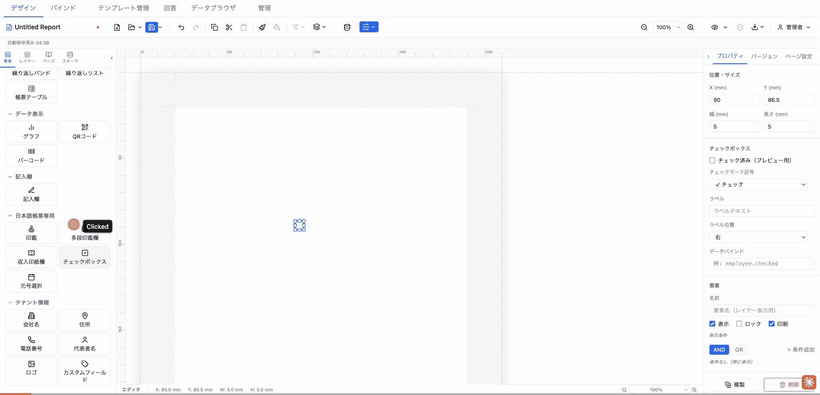
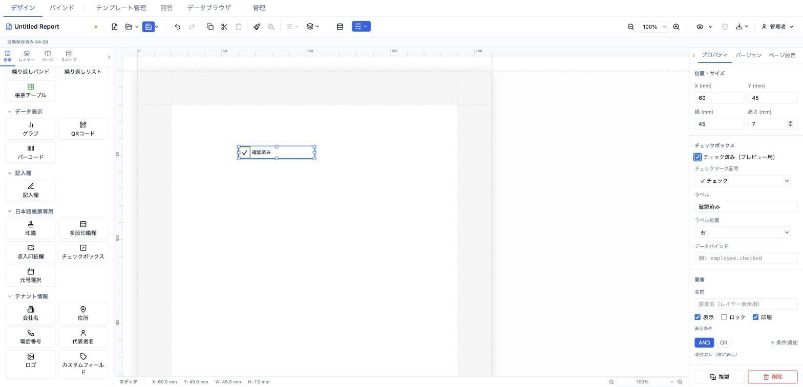

# チェックボックス (checkbox)

固定チェック状態とデータバインドの両方に対応するチェックボックス。チェックマーク記号（✓ / × / ●）とラベル位置を選択でき、帳票の選択入力欄を表現する。



- **ElementType**: `checkbox`
- **パレット**: 日本語帳票専用 → `チェックボックス`
- **ファクトリ**: `createCheckboxElement()` (`src/lib/elementFactories.ts`)
- **Renderer**: `src/elements/checkbox/Renderer.tsx`
- **PropertiesPanel**: `src/elements/checkbox/PropertiesPanel.tsx`

## 型定義

```ts
export type CheckmarkStyle = '✓' | '×' | '●'
export type CheckboxLabelPosition = 'left' | 'right' | 'top' | 'bottom'

export interface CheckboxElement extends ElementBase {
  type: 'checkbox'
  /** 静的 checked 状態（デザインプレビュー用） */
  checked: boolean
  /** チェックマーク記号 */
  checkmark: CheckmarkStyle
  /** ラベルテキスト（空文字なら非表示） */
  label: string
  /** ラベル位置 (default: 'right') */
  labelPosition?: CheckboxLabelPosition
  /** データバインドモード: resolveField(data, dataSource) !== '' なら checked */
  dataSource?: string
  style?: TextStyle
}
```

## 設定可能なプロパティ（全網羅）

### 位置・サイズ（共通セクション）

| UIラベル | プロパティ | 型 | 既定値 | 説明・効果 |
|---|---|---|---|---|
| X (mm) | `position.x` | number | 13 | セクション相対の水平位置 |
| Y (mm) | `position.y` | number | 13 | セクション相対の垂直位置 |
| 幅 (mm) | `size.width` | number | 5 | 要素の幅 |
| 高さ (mm) | `size.height` | number | 5 | 要素の高さ。**チェックボックスの正方形サイズと記号フォントサイズはこの高さから算出**（幅は箱の大きさに影響しない） |

### チェックボックス（型固有セクション）

| UIラベル | プロパティ | 型 | 既定値 | 説明・効果 |
|---|---|---|---|---|
| チェック済み（プレビュー用） | `checked` | boolean | `false` | 静的なチェック状態。`dataSource` 未設定時に使用 |
| チェックマーク記号 | `checkmark` | `'✓' \| '×' \| '●'`（✓ チェック／× バツ／● 黒丸） | `✓` | チェック時に箱内へ描画する記号 |
| ラベル | `label` | string | `''`（空） | 箱に添える文字。空文字なら非表示 |
| ラベル位置 | `labelPosition` | `'right' \| 'left' \| 'top' \| 'bottom'`（右／左／上／下） | `right` | ラベルの配置方向 |
| データバインド | `dataSource` | string | （未設定） | `resolveField(data, dataSource)` の解決値が空文字でなければチェック扱い（例: `employee.checked`） |

### 要素（共通セクション）

| UIラベル | プロパティ | 型 | 既定値 | 説明・効果 |
|---|---|---|---|---|
| 名前 | `name` | string | （未設定） | レイヤーパネル表示名 |
| 表示 | `visible` | boolean | `true` | 非表示化 |
| ロック | `locked` | boolean | `false` | ドラッグ・リサイズ禁止 |
| 印刷 | `printable` | boolean | `true` | 印刷対象か |
| 表示条件 | `conditionalDisplay` | ConditionalDisplay | （未設定） | AND/OR による条件表示 |
| バリアント非表示 | （出力バリアント連動） | — | — | 出力バリアントが定義されている場合のみ表示 |

> 注: `style`（TextStyle）は型に存在し箱要素へスプレッド適用されるが、このパネルに専用コントロールはない。

## 既定値（ファクトリ）

```ts
{
  type: 'checkbox',
  position: { x: 13, y: 13 },
  size: { width: 5, height: 5 },
  zIndex: 1, visible: true, locked: false,
  checked: false,
  checkmark: '✓',
  label: '',
}
```

## レンダリング挙動

- **チェック判定**: `dataSource` があれば `resolveField(data, dataSource) !== ''` でチェック、なければ `checked` を使用。
- **箱**: 一辺 `size.height mm` の正方形（幅は箱に無関係）、枠 `DEFAULT_BORDER_WIDTH mm solid #000000`。チェック時に中央へ `checkmark` を配置。記号のフォントサイズは `size.height × 0.6 mm`。
- **ラベル**: `label` が非空のとき文字2.8mm・折り返しなしで表示。`labelPosition` により `flex-direction` が `row`（右）／`row-reverse`（左）／`column`（下）／`column-reverse`（上）に切り替わる。箱とラベルの間隔は 1mm。
- デザイン・プレビューで同一表示（`readonly` 差分なし）。

## 操作手順（GIF デモの流れ）

1. パレットの「日本語帳票専用」→ `チェックボックス` をキャンバスにドラッグして配置する。
2. 「チェック済み（プレビュー用）」をオンにして箱に記号が入ることを確認する。
3. 「チェックマーク記号」を `✓ チェック` → `× バツ` → `● 黒丸` と切り替える。
4. 「ラベル」に `上記内容に同意します` を入力する。
5. 「ラベル位置」を `右` → `左` → `上` → `下` と切り替える。
6. 「データバインド」に `answers.agreedToTerms` を入力し、静的チェックからデータ判定へ切り替わることを確認する。
7. 共通「位置・サイズ」で「高さ (mm)」を `5` から `7` に変更し、箱と記号が拡大することを確認する。
8. 「要素」セクションで名前・表示・ロック・印刷・表示条件を確認する。

## スクリーンショット



## 関連要素

- [元号選択 (eraSelect)](./eraSelect.md) — 和暦元号の選択欄
- [記入欄 (manualEntry)](../input/manualEntry.md) — 手書き記入欄
- [帳票テーブル (formTable)](../repeating/formTable.md) — セル内にチェックボックス（`checkbox` セル）を組み込める
