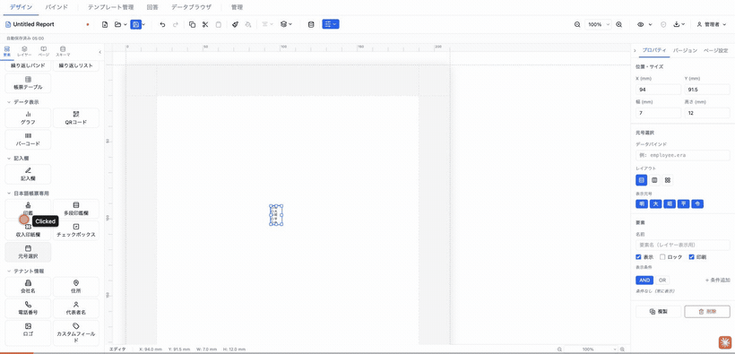
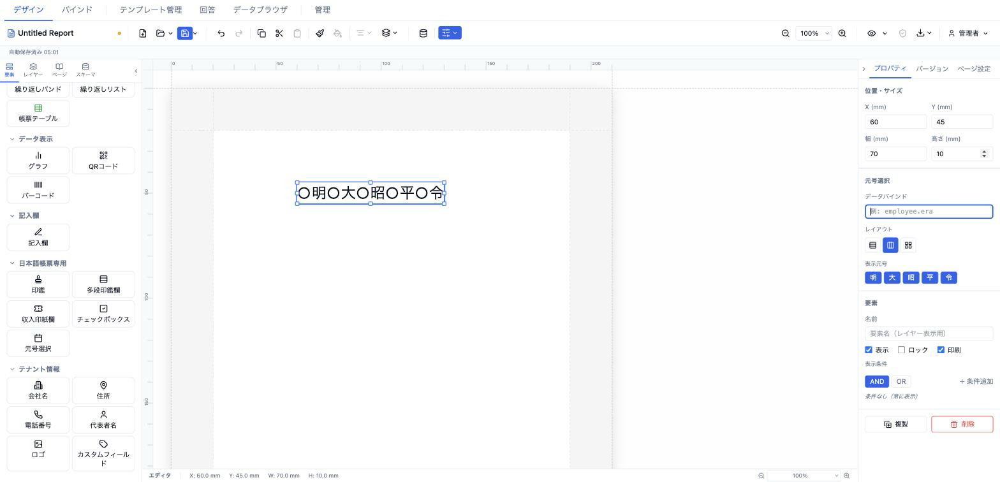

# 元号選択 (eraSelect)

和暦元号（明・大・昭・平・令）を並べ、該当する元号に ● を付けて表す選択欄。申請書・契約書の日付記入欄で使う定番パターン。データバインドで選択中の元号を指定できる。



- **ElementType**: `eraSelect`
- **パレット**: 日本語帳票専用 → `元号選択`
- **ファクトリ**: `createEraSelectElement()` (`src/lib/elementFactories.ts`)
- **Renderer**: `src/elements/eraSelect/Renderer.tsx`
- **PropertiesPanel**: `src/elements/eraSelect/PropertiesPanel.tsx`
- **定数**: `src/elements/eraSelect/constants.ts`（`DEFAULT_ERAS = ['明','大','昭','平','令']`）

## 型定義

```ts
export type EraSelectLayout = 'column' | 'row' | 'grid-2col'

export interface EraSelectElement extends ElementBase {
  type: 'eraSelect'
  /** 選択中の元号 — resolveField で解決。空文字/未設定なら未選択（全て ○） */
  dataSource?: string
  /** レイアウト: column（縦1列）、row（横1行）、grid-2col（2列グリッド） */
  layout?: EraSelectLayout
  /** 表示する元号リスト。未設定時は ['明','大','昭','平','令'] */
  eras?: string[]
}
```

## 設定可能なプロパティ（全網羅）

### 位置・サイズ（共通セクション）

| UIラベル | プロパティ | 型 | 既定値 | 説明・効果 |
|---|---|---|---|---|
| X (mm) | `position.x` | number | 13 | セクション相対の水平位置 |
| Y (mm) | `position.y` | number | 13 | セクション相対の垂直位置 |
| 幅 (mm) | `size.width` | number | 7 | 要素の幅。`row` レイアウトの文字サイズ算出に影響 |
| 高さ (mm) | `size.height` | number | 12 | 要素の高さ。`column`/`grid-2col` の文字サイズ算出に影響 |

### 元号選択（型固有セクション）

| UIラベル | プロパティ | 型 | 既定値 | 説明・効果 |
|---|---|---|---|---|
| データバインド | `dataSource` | string | （未設定） | 選択中の元号を与えるキー（例: `employee.era`）。解決値が元号文字（例 `令`）と厳密一致した項目に ● が付く。空文字・未解決なら全て ○ |
| レイアウト | `layout` | `'column' \| 'row' \| 'grid-2col'`（縦1列／横1行／2列グリッド、アイコントグル） | `column` | 元号の並べ方 |
| 表示元号 | `eras` | string[] | `['明','大','昭','平','令']` | `明/大/昭/平/令` のトグルボタンで表示元号を選択。最低1つは必須（最後の1つは外せない）。順序は元号順に整列 |

### 要素（共通セクション）

| UIラベル | プロパティ | 型 | 既定値 | 説明・効果 |
|---|---|---|---|---|
| 名前 | `name` | string | （未設定） | レイヤーパネル表示名 |
| 表示 | `visible` | boolean | `true` | 非表示化 |
| ロック | `locked` | boolean | `false` | ドラッグ・リサイズ禁止 |
| 印刷 | `printable` | boolean | `true` | 印刷対象か |
| 表示条件 | `conditionalDisplay` | ConditionalDisplay | （未設定） | AND/OR による条件表示 |
| バリアント非表示 | （出力バリアント連動） | — | — | 出力バリアントが定義されている場合のみ表示 |

> 注: 表示元号のトグル候補は常に `DEFAULT_ERAS`（明・大・昭・平・令）のみ。任意の独自元号文字は UI からは追加できず、`eras` を直接編集する必要がある。

## 既定値（ファクトリ）

```ts
{
  type: 'eraSelect',
  position: { x: 13, y: 13 },
  size: { width: 7, height: 12 },
  zIndex: 1, visible: true, locked: false,
  layout: 'column',
  eras: ['明', '大', '昭', '平', '令'],
}
```

## レンダリング挙動

- 各元号を「●/○ ＋ 元号文字」の行で表示。`dataSource` の解決値と厳密一致した元号のみ ●、他は ○。`dataSource` 未設定・空文字は全て ○。
- **レイアウト**: `column`=縦1列（`flex-direction: column`）、`row`=横1行、`grid-2col`=2列グリッド（`grid-template-columns: 1fr 1fr`、5項目なら2×3で右下空き）。
- **フォントサイズ（自動計算・mm）**: `row` は `(width / 元号数) × 0.5`、`grid-2col` は `(height / ceil(元号数/2)) × 0.6`、`column` は `(height / 元号数) × 0.75`。いずれも下限 2.0mm。
- デザイン・プレビューで同一表示（`readonly` 差分なし）。

## 操作手順（GIF デモの流れ）

1. パレットの「日本語帳票専用」→ `元号選択` をキャンバスにドラッグして配置する。
2. 「データバインド」に `employee.era` を入力する。
3. 「レイアウト」を `縦1列` → `横1行` → `2列グリッド` とアイコントグルで切り替える。
4. 「表示元号」で `明` と `大` を外し、`昭・平・令` の3元号だけにする。
5. 外した元号を1つ戻す。最後の1つは外せないことを確認する。
6. 共通「位置・サイズ」で幅・高さを調整し、文字サイズが自動追従することを確認する。
7. 「要素」セクションで名前・表示・ロック・印刷・表示条件を確認する。

## スクリーンショット

編集画面（プロパティパネルで設定）:



設定後のプレビュー表示（プレビュー画面 / PDF 出力のイメージ）:


## 関連要素

- [チェックボックス (checkbox)](./checkbox.md) — 単一項目の ON/OFF
- [現在日付 (currentDate)](../common/currentDate.md) — 和暦（`wareki_full` 等）で自動日付を表示
- [データフィールド (dataField)](../text/dataField.md) — `wareki_full` 書式で元号付き日付を表示
