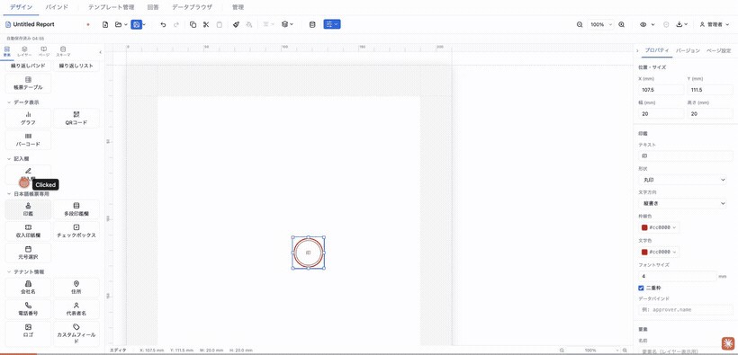
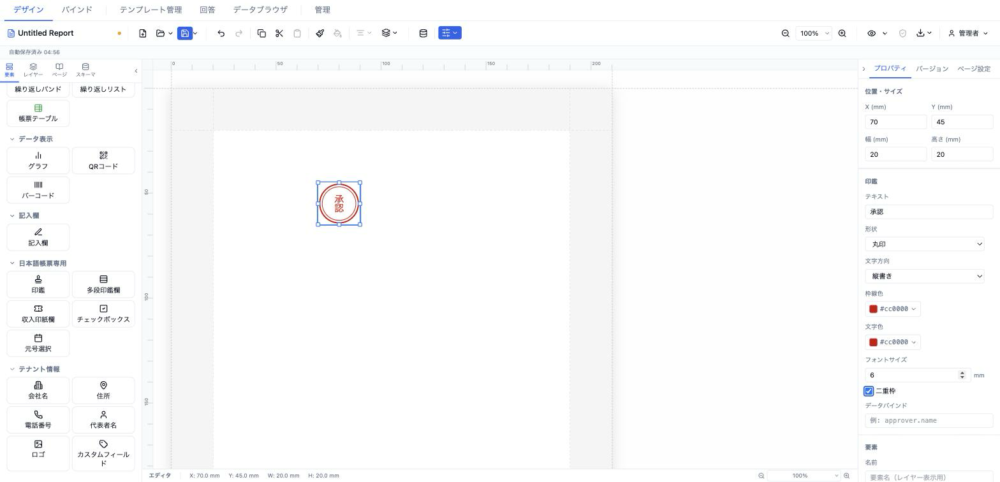

# 印鑑 (hanko)

日本の社印・個人印を模した押印欄。円形／角形、縦書き／横書き、二重枠に対応し、任意でデータソースの値を印面テキストに差し込める。



- **ElementType**: `hanko`
- **パレット**: 日本語帳票専用 → `印鑑`
- **ファクトリ**: `createHankoElement()` (`src/lib/elementFactories.ts`)
- **Renderer**: `src/elements/hanko/Renderer.tsx`
- **PropertiesPanel**: `src/elements/hanko/PropertiesPanel.tsx`

## 型定義

```ts
export interface HankoElement extends ElementBase {
  type: 'hanko'
  /** 印鑑内テキスト (通常は姓) */
  text: string
  shape: 'circle' | 'rectangle'
  borderColor: string
  textColor: string
  fontSize: number   // mm (HankoElement 固有 — TextStyle.fontSize とは別単位)
  writingMode: 'vertical-rl' | 'horizontal-tb'
  doubleBorder: boolean
  /** データソースフィールドからテキストを自動入力 */
  binding?: string
}
```

> ⚠️ **`HankoElement.fontSize` の単位は mm** です。他の要素の `TextStyle.fontSize`（pt）とは異なります。Renderer 内では SVG 座標へ `fontSize × 3.78`（mm→px）で換算されます。

## 設定可能なプロパティ（全網羅）

### 位置・サイズ（共通セクション）

| UIラベル | プロパティ | 型 | 既定値 | 説明・効果 |
|---|---|---|---|---|
| X (mm) | `position.x` | number | 13 | セクション相対の水平位置 |
| Y (mm) | `position.y` | number | 13 | セクション相対の垂直位置 |
| 幅 (mm) | `size.width` | number | 20 | 印鑑の幅 |
| 高さ (mm) | `size.height` | number | 20 | 印鑑の高さ |

### 印鑑（型固有セクション）

| UIラベル | プロパティ | 型 | 既定値 | 説明・効果 |
|---|---|---|---|---|
| テキスト | `text` | string | `印` | 印面に表示する文字（通常は姓） |
| 形状 | `shape` | `'circle' \| 'rectangle'`（丸印／角印） | `circle` | 円形または角形の枠 |
| 文字方向 | `writingMode` | `'vertical-rl' \| 'horizontal-tb'`（縦書き／横書き） | `vertical-rl` | 印面文字の書字方向 |
| 枠線色 | `borderColor` | string(#RRGGBB) | `#cc0000` | 枠の色 |
| 文字色 | `textColor` | string(#RRGGBB) | `#cc0000` | 印面文字の色 |
| フォントサイズ | `fontSize` | number(**mm**) | 4 | 印面文字の大きさ（最小 1mm、単位 mm） |
| 二重枠 | `doubleBorder` | boolean | `true` | 外枠の内側にもう一本の枠を描画 |
| データバインド | `binding` | string | （未設定） | 指定時、`resolveField(data, binding)` の解決値を `text` の代わりに印面へ表示（例: `approver.name`） |

### 要素（共通セクション）

| UIラベル | プロパティ | 型 | 既定値 | 説明・効果 |
|---|---|---|---|---|
| 名前 | `name` | string | （未設定） | レイヤーパネル表示名 |
| 表示 | `visible` | boolean | `true` | 非表示化 |
| ロック | `locked` | boolean | `false` | ドラッグ・リサイズ禁止 |
| 印刷 | `printable` | boolean | `true` | 印刷対象か |
| 表示条件 | `conditionalDisplay` | ConditionalDisplay | （未設定） | AND/OR による条件表示 |
| バリアント非表示 | （出力バリアント連動） | — | — | 出力バリアントが定義されている場合のみ表示 |

## 既定値（ファクトリ）

```ts
{
  type: 'hanko',
  position: { x: 13, y: 13 },
  size: { width: 20, height: 20 },
  zIndex: 1, visible: true, locked: false,
  text: '印',
  shape: 'circle',
  borderColor: '#cc0000',
  textColor: '#cc0000',
  fontSize: 4,               // mm
  writingMode: 'vertical-rl',
  doubleBorder: true,
}
```

## レンダリング挙動

- SVG（`viewBox="0 0 100 100"`）で描画。要素の幅・高さいっぱいに拡大される。
- **形状**: `circle` は中心半径46の円、`rectangle` は 4/4/92/92 の矩形。`doubleBorder` 時は外枠 strokeWidth 3、内枠（円 r40 ／矩形 10/10/80/80）strokeWidth 1.5。二重枠なしは外枠 strokeWidth 2。
- **テキスト**: 中央寄せ（`textAnchor=middle` / `dominantBaseline=central`）。`fontSize × 3.78` で SVG 単位に換算し、`writingMode` を適用。
- **データバインド**: `binding` があれば `resolveField(data, binding)` を優先。解決結果が `null`/`undefined` の場合は `text` にフォールバック。

## 操作手順（GIF デモの流れ）

1. パレットの「日本語帳票専用」→ `印鑑` をキャンバスにドラッグして配置する。
2. 「テキスト」を `山田` に変更する。
3. 「形状」を `丸印` → `角印` に切り替える。
4. 「文字方向」を `縦書き` → `横書き` に切り替える。
5. 「枠線色」を `#cc0000` から任意の色（例 `#1d4ed8`）に変更する。
6. 「文字色」を枠線色と揃える。
7. 「フォントサイズ」を `4`（mm）から `5` に変更する。
8. 「二重枠」チェックをオフにして枠が一本になることを確認し、再度オンに戻す。
9. 「データバインド」に `approver.name` を入力し、印面が解決値に切り替わることを確認する。
10. 共通「位置・サイズ」でサイズを 25×25mm に調整し、「要素」セクションで名前・表示・ロック・印刷・表示条件を確認する。

## スクリーンショット

編集画面（プロパティパネルで設定）:



設定後のプレビュー表示（プレビュー画面 / PDF 出力のイメージ）:


## 関連要素

- [多段印鑑欄 (approvalStampRow)](./approvalStampRow.md) — 承認フロー（担当→課長→部長 等）の複数押印欄
- [収入印紙欄 (revenueStamp)](./revenueStamp.md) — 収入印紙の貼付欄
