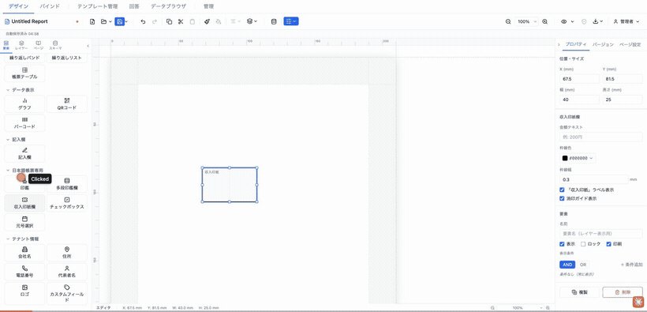
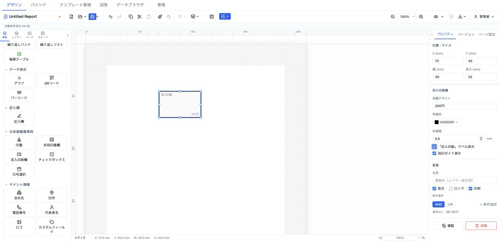
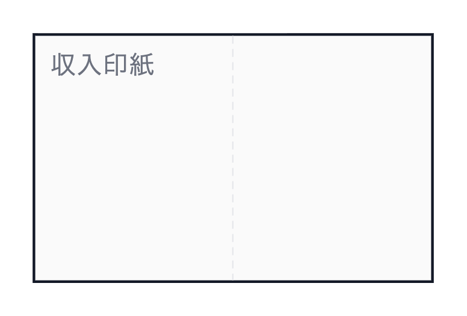

# 収入印紙欄 (revenueStamp)

契約書や領収書に貼付する収入印紙のスペースを示す枠。「収入印紙」ラベル・金額テキスト・消印ガイド（割印用の点線）を任意で表示できる。



- **ElementType**: `revenueStamp`
- **パレット**: 日本語帳票専用 → `収入印紙欄`
- **ファクトリ**: `createRevenueStampElement()` (`src/lib/elementFactories.ts`)
- **Renderer**: `src/elements/revenueStamp/Renderer.tsx`
- **PropertiesPanel**: `src/elements/revenueStamp/PropertiesPanel.tsx`

## 型定義

```ts
export interface RevenueStampElement extends ElementBase {
  type: 'revenueStamp'
  amount?: string
  borderColor: string
  borderWidth: number   // mm
  showLabel: boolean
  showCancellationGuide: boolean
}
```

## 設定可能なプロパティ（全網羅）

### 位置・サイズ（共通セクション）

| UIラベル | プロパティ | 型 | 既定値 | 説明・効果 |
|---|---|---|---|---|
| X (mm) | `position.x` | number | 13 | セクション相対の水平位置 |
| Y (mm) | `position.y` | number | 13 | セクション相対の垂直位置 |
| 幅 (mm) | `size.width` | number | 40 | 印紙欄の幅 |
| 高さ (mm) | `size.height` | number | 25 | 印紙欄の高さ |

### 収入印紙欄（型固有セクション）

| UIラベル | プロパティ | 型 | 既定値 | 説明・効果 |
|---|---|---|---|---|
| 金額テキスト | `amount` | string | （未設定） | 印紙額面（例: `200円`）。枠右下に表示。空にすると非表示 |
| 枠線色 | `borderColor` | string(#RRGGBB) | `#000000` | 枠の色 |
| 枠線幅 | `borderWidth` | number(mm) | 0.3 | 枠の線幅（0 以上、0.1 刻み） |
| 「収入印紙」ラベル表示 | `showLabel` | boolean | `true` | 枠左上に「収入印紙」を表示 |
| 消印ガイド表示 | `showCancellationGuide` | boolean | `true` | 中央に縦の点線（割印ガイド）を表示 |

### 要素（共通セクション）

| UIラベル | プロパティ | 型 | 既定値 | 説明・効果 |
|---|---|---|---|---|
| 名前 | `name` | string | （未設定） | レイヤーパネル表示名 |
| 表示 | `visible` | boolean | `true` | 非表示化 |
| ロック | `locked` | boolean | `false` | ドラッグ・リサイズ禁止 |
| 印刷 | `printable` | boolean | `true` | 印刷対象か |
| 表示条件 | `conditionalDisplay` | ConditionalDisplay | （未設定） | AND/OR による条件表示 |
| バリアント非表示 | （出力バリアント連動） | — | — | 出力バリアントが定義されている場合のみ表示 |

## 既定値（ファクトリ）

```ts
{
  type: 'revenueStamp',
  position: { x: 13, y: 13 },
  size: { width: 40, height: 25 },
  zIndex: 1, visible: true, locked: false,
  borderColor: '#000000',
  borderWidth: 0.3,
  showLabel: true,
  showCancellationGuide: true,
}
```

## レンダリング挙動

- 要素いっぱいの矩形枠（`borderWidth mm solid borderColor`）を薄いグレー背景（`#fafafa`）で描画。
- **ラベル**: `showLabel` 時、左上（top 1mm / left 1.5mm）に「収入印紙」を文字2.5mm・色 `#6b7280`・字間0.05emで表示。
- **金額**: `amount` があれば右下（bottom 1mm / right 1.5mm）に文字2.5mm・色 `#9ca3af` で表示。
- **消印ガイド**: `showCancellationGuide` 時、枠中央に縦の点線（`stroke #e5e7eb`、`strokeDasharray 3 2`）を描画。
- ラベル・金額は `userSelect: none`。デザイン・プレビューで同一表示。

## 操作手順（GIF デモの流れ）

1. パレットの「日本語帳票専用」→ `収入印紙欄` をキャンバスにドラッグして配置する。
2. 「金額テキスト」に `200円` を入力する。
3. 「枠線色」を任意の色に変更する。
4. 「枠線幅」を `0.3` から `0.5` に変更する。
5. 「『収入印紙』ラベル表示」をオフにしてラベルが消えることを確認し、再びオンに戻す。
6. 「消印ガイド表示」をオフにして中央の点線が消えることを確認し、再びオンに戻す。
7. 共通「位置・サイズ」で幅・高さを 50×30mm に調整する。
8. 「要素」セクションで名前・表示・ロック・印刷・表示条件を確認する。

## スクリーンショット

編集画面（プロパティパネルで設定）:



設定後のプレビュー表示（プレビュー画面 / PDF 出力のイメージ）:



## 関連要素

- [印鑑 (hanko)](./hanko.md) — 割印を手動配置したい場合
- [多段印鑑欄 (approvalStampRow)](./approvalStampRow.md) — 承認フローの押印欄
- [図形 (shape)](../shape-image/shape.md) — 枠だけを使いたい場合
