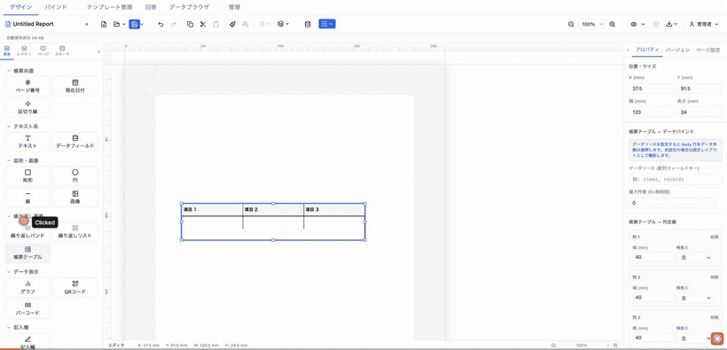
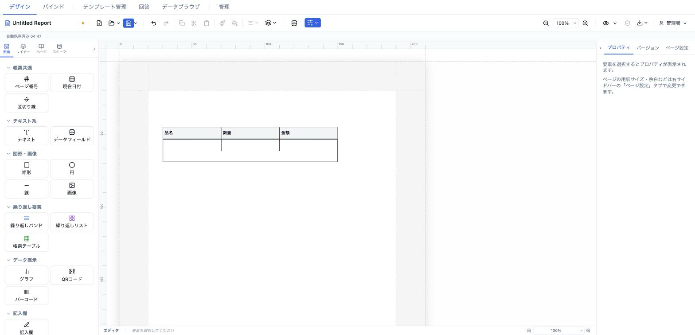
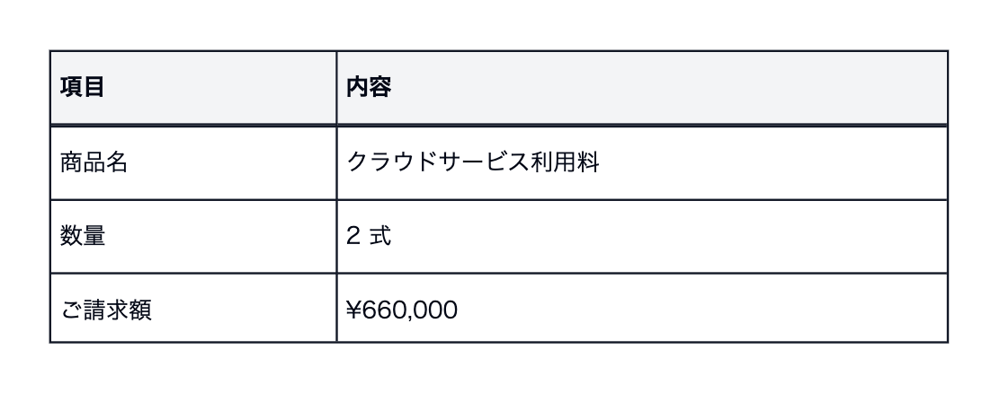

# 帳票テーブル (formTable)

行・列を明示的に定義する帳票専用テーブルです。データソース未設定時は固定レイアウト表（申込書・記入欄など）、データソース設定時は body 行をレコード件数分展開する動的表として機能します。セルは ラベル／記入欄／データフィールド／チェックボックス／元号選択 の5タイプを持ち、キャンバス上で Excel 風の直接編集ができます。



- **ElementType**: `formTable`
- **パレット**: 繰り返し要素 → `帳票テーブル`
- **ファクトリ**: `createFormTableElement()` (`src/lib/elementFactories.ts`)
- **Renderer**: `src/elements/formTable/Renderer.tsx`
- **PropertiesPanel**: `src/elements/formTable/PropertiesPanel.tsx`

## 型定義

```ts
export type FormTableCellType = 'label' | 'input' | 'dataField' | 'checkbox' | 'eraSelect'

export interface FormTableCell {
  id: string                  // UUID（行複製時は新 UUID を生成）
  type: FormTableCellType
  text?: string               // type='label' | 'input'
  placeholder?: string
  fieldKey?: string           // type='dataField'
  format?: CalculationFormat
  fallbackText?: string       // fieldKey 未解決時のフォールバック表示
  style?: TextStyle           // 優先度: cell.style > column.style > row-role style
  checked?: boolean           // type='checkbox'
  checkmark?: CheckmarkStyle  // '✓' | '×' | '●'
  checkboxDataSource?: string // type='checkbox' データバインド（resolveField !== '' なら checked）
  eraDataSource?: string      // type='eraSelect' 選択中の元号データソース
  eraLayout?: EraSelectLayout // 'column' | 'row' | 'grid-2col'
  furiganaEnabled?: boolean   // type='input' セル内フリガナ
  furiganaDataSource?: string
  colspan?: number            // セル結合: 列スパン（未定義=1）
  rowspan?: number            // セル結合: 行スパン（未定義=1）
  mergedInto?: string         // 吸収元マスターセルの id（描画時は非表示）
}

export type FormTableRowRole = 'header' | 'body' | 'footer'

export interface FormTableRow {
  id: string
  role: FormTableRowRole
  height: number              // 行高さ (mm)
  cells: FormTableCell[]      // cells.length は columns.length と一致必須
}

export interface FormTableColumn {
  id: string
  width: number               // 列幅 (mm, 絶対値) — 最小 3mm
  align?: 'left' | 'center' | 'right'
  style?: TextStyle           // cell.style より低優先度
}

export interface FormTableElement extends ElementBase {
  type: 'formTable'
  columns: FormTableColumn[]
  rows: FormTableRow[]
  dataSource?: string         // 設定時 body 行をこの配列で展開
  maxItems?: number           // 0/undefined = 無制限
  borderColor: string
  borderWidth: number         // mm
  headerStyle?: TextStyle     // column/cell より低優先度
  bodyStyle?: TextStyle       // body/footer 行、column/cell より低優先度
  oddRowColor?: string        // body 奇数行背景（cell/column の backgroundColor が優先）
  evenRowColor?: string       // body 偶数行背景（同上）
}
```

## 設定可能なプロパティ（全網羅）

PropertiesPanel（`FormTablePropertiesPanel`）は4セクションで構成されます。行・列・セルの操作系は `tableOperations.ts` の純粋関数を共用します。

### 帳票テーブル — データバインド

| UIラベル | プロパティ | 型 | 既定値 | 説明・効果 |
|---|---|---|---|---|
| データソース (配列フィールドキー) | `dataSource` | string? | 未設定 | 設定すると body 行をデータ件数分展開。未設定なら固定レイアウト表（例: `items`, `records`） |
| 最大件数 (0=無制限) | `maxItems` | number | `0` | 展開する最大件数。0 で全件。min 0 |

### 帳票テーブル — 列定義

`columns[]` を各列カードで編集。「＋ 列を追加」で末尾に列追加（全行に空セルを補完）、「削除」で列除去（最後の1列は削除不可）。

| UIラベル | プロパティ | 型 | 既定値 | 説明・効果 |
|---|---|---|---|---|
| 幅 (mm) | `columns[].width` | number | `20`（追加時） | 列幅。最小 3mm 強制 |
| 横揃え | `columns[].align` | `left`\|`center`\|`right` | `left` | 列全体のセル揃え（cell.style で上書き可） |

### 帳票テーブル — 行定義

`rows[]` を各行カードで編集。「＋ 行を追加」で末尾に body 行追加、「削除」で行除去（最後の1行は削除不可）。各行カード内に列数分のセルエディタが並びます。

| UIラベル | プロパティ | 型 | 既定値 | 説明・効果 |
|---|---|---|---|---|
| 行の役割 | `rows[].role` | `header`\|`body`\|`footer` | 追加時 `body` | ヘッダー／ボディ（繰り返し）／フッター。body 行のみデータ展開対象 |
| 高さ (mm) | `rows[].height` | number | `8`（追加時） | 行高さ。最小 3mm 強制 |

#### セルエディタ（各行の列ごと）

| UIラベル | プロパティ | 型 | 既定値 | 説明・効果 |
|---|---|---|---|---|
| セルタイプ | `cells[].type` | `label`\|`input`\|`dataField`\|`checkbox`\|`eraSelect` | 追加時 `input` | セルの種別（パネルの選択肢はラベル／記入欄／データフィールドの3種。チェックボックス・元号選択はセルポップオーバー経由で設定される既存値を編集） |
| ラベルテキスト | `cells[].text` | string | — | `type='label'` のとき表示する固定文言 |
| プレースホルダー | `cells[].placeholder` | string | — | `type='input'` の記入欄プレースホルダー（灰色イタリック表示） |
| field.key | `cells[].fieldKey` | string | — | `type='dataField'` のバインド先キー |
| チェックマーク | `cells[].checkmark` | `✓`\|`×`\|`●` | `✓` | `type='checkbox'` の記号 |
| dataSource（チェック） | `cells[].checkboxDataSource` | string? | — | `type='checkbox'`。resolveField 非空なら checked |
| 元号レイアウト | `cells[].eraLayout` | `column`\|`row`\|`grid-2col` | `row`（パネル既定） | `type='eraSelect'` の元号並び |
| dataSource（元号） | `cells[].eraDataSource` | string? | — | `type='eraSelect'` の選択中元号バインド先 |

### 帳票テーブル — 外観

| UIラベル | プロパティ | 型 | 既定値 | 説明・効果 |
|---|---|---|---|---|
| 枠線色 | `borderColor` | color | `#000000` | 表全体の罫線色 |
| 枠線幅 | `borderWidth` | number(mm) | `0.3` | min 0 / step 0.1 |
| 奇数行の背景色 | `oddRowColor` | color | `#ffffff` | body 奇数行（cell/column の backgroundColor が優先） |
| 偶数行の背景色（縞模様） | `evenRowColor` | color | `#f9fafb` | body 偶数行（同上） |

### セルポップオーバー（キャンバス上のセル編集）

セルをダブルクリック／Enter で開く `CellPopover` では、パネルより多くのセルプロパティを直接編集できます:

| UIラベル | プロパティ | 説明 |
|---|---|---|
| タイプ | `cell.type` | ラベル／記入欄／データフィールド |
| テキスト | `cell.text` | label のとき |
| プレースホルダー | `cell.placeholder` | input のとき |
| フィールドキー | `cell.fieldKey` | dataField のとき |
| フォールバック | `cell.fallbackText` | dataField のデータなし時テキスト |
| 配置 | `cell.style.textAlign` | 左／中央／右 |
| 背景色 | `cell.style.backgroundColor` | セル背景 |
| 太字 | `cell.style.fontWeight` | bold トグル |

## 既定値（ファクトリ）

`createFormTableElement()`:

- `position` `{x:13,y:13}` / `size` `{width:120,height:24}` / `zIndex` 1 / `visible` true / `locked` false
- `columns`: 3列（各 `width:40, align:'left'`、id は生成時に UUID 化）
- `rows`: 2行
  - header（`height:8`）: `label` × 3（「項目 1」「項目 2」「項目 3」）
  - body（`height:8`）: `input` × 3（placeholder 空）
- `borderColor: '#000000'`、`borderWidth: 0.3`
- `dataSource` / `maxItems` / `oddRowColor` / `evenRowColor` は未設定（undefined）

## レンダリング挙動

Renderer は CSS Grid ベース（`gridTemplateColumns` = 列幅 mm、`gridTemplateRows` = 行高さ mm）で、`records` prop の有無で分岐します（`FormTableRenderer`）。

- **`records === undefined`（デザイン／編集時）** → `FormTableDesignPreview`。header / body / footer 行をそのまま描画。`dataSource` 設定時は右上に青い `帳票テーブル · <dataSource>` バッジと、body の下に `↻ レコード数分 繰り返し`（`maxItems>0` なら `最大 N 件`）の斜線ハッチ帯を表示します。
- **`records` が配列（プレビュー／PDF-PNG 出力時）** → `FormTableLiveRenderer`。header 行→ body 行をレコードごとに複製→ footer 行の順で描画。`maxItems` で件数制限、`recordIdx` で奇偶背景（`oddRowColor`/`evenRowColor`）を適用。0件時は「データなし」行を表示。

`ElementRenderer` 側で `records` は **`readonly && element.dataSource` のときだけ** `mergedData[dataSource]` から供給されます。編集キャンバス（`readonly=false`）では常にデザインプレビュー、プレビュー／エクスポート（`readonly=true`）でのみライブ展開されます。かつては formTable のみライブ描画がゲートされておらず（編集中にも実データ行が出ていた）、現在は `repeatingBand` / `repeatingList` と対称になっています。

セル内容の描画（`CellContent`）はタイプ別:
- `label` → `text` をそのまま
- `input` → `placeholder` を灰色イタリックで
- `checkbox` → 四角枠＋（`checkboxDataSource` の解決値が非空なら）`checkmark`
- `eraSelect` → 元号を ○／●（`eraDataSource` の解決値と一致する元号が ●）
- `dataField` → record あり時 `resolveField(record, fieldKey)`（空なら `fallbackText`）、record なし時は `{{fieldKey}}` プレースホルダー

スタイル優先順位は **cell.style > column.style > 行ロールスタイル（header は headerStyle、body/footer は bodyStyle）**。背景色は cell → header(#f3f4f6) / footer(#f9fafb) / body(奇偶色) の順で解決。`mergedInto` を持つセルは描画されず、`colspan`/`rowspan` は CSS Grid の span で表現されます。

## キャンバス上の操作（Excel 風編集）

要素を **ダブルクリック** すると `FormTableEditor`（青いアウトライン付き）に入り、Esc または外側クリックで解除します（解除時に store へ 1 エントリの undo として統合）。

- **セル選択**: クリックで単一選択、Shift+クリックで矩形範囲選択、矢印キーで移動、Shift+矢印で範囲拡張、Tab / Shift+Tab で前後セルへ移動（行末で折り返し）。
- **インライン編集**: セルのダブルクリック、または選択セルで Enter するとセルポップオーバー（タイプ・テキスト・配置・背景色・太字など）が開く。Esc で閉じる。
- **行・列操作（右クリックメニュー）**: 上／下に行を挿入、行を削除、行を上／下に移動、左／右に列を挿入、列を削除、列を左／右に移動（最後の1行／1列は削除不可）。
- **ツールバー（編集中に上部表示）**: 選択範囲の「結合」（`canMerge` が成立するとき）、結合マスターセルの「分割」、「+ 行」「+ 列」。
- **セル結合**: `colspan` / `rowspan` / `mergedInto` を CSS Grid の span で描画。
- **リサイズ**: 列境界・行境界のドラッグで幅・高さを変更（最小 3mm）。
- **コピー＆ペースト**: Ctrl/Cmd+C コピー、Ctrl/Cmd+X 切り取り、Ctrl/Cmd+V 貼り付け（内部セル＋Excel TSV 対応）。
- **Undo/Redo**: テーブル専用スタックで Ctrl/Cmd+Z、Ctrl/Cmd+Shift+Z。編集モード離脱時に store レベルで 1 エントリに統合。

## 操作手順（GIF デモの流れ）

1. パレットの「繰り返し要素 → 帳票テーブル」をキャンバスに追加する（3列×2行の初期表）。
2. プロパティ「帳票テーブル — データバインド」で、動的表にする場合は **データソース** に配列キー（例: `items`）を入力し **最大件数** を設定する。固定レイアウト表にする場合は未設定のままにする。
3. 「帳票テーブル — 列定義」で「＋ 列を追加」を押し、各列の 幅・横揃え を設定する。不要な列は「削除」する。
4. 「帳票テーブル — 行定義」で「＋ 行を追加」し、各行の **行の役割**（ヘッダー／ボディ／フッター）と **高さ** を設定する。
5. 各行のセルエディタで **セルタイプ** を ラベル／記入欄／データフィールド に切り替え、ラベルテキスト・プレースホルダー・field.key を入力する。
6. 「帳票テーブル — 外観」で 枠線色・枠線幅・奇数行／偶数行の背景色 を調整する。
7. キャンバス上でテーブルをダブルクリックして編集モードに入る。
8. セルをクリック／Shift+クリック／矢印キーで選択し、ダブルクリックまたは Enter でポップオーバーを開いてタイプ・配置・背景色・太字を編集する。
9. 隣接セルを範囲選択し、ツールバーの「結合」で結合、「分割」で解除する。
10. 右クリックメニューで行・列の挿入／削除／移動を行う。
11. 列境界・行境界をドラッグして幅・高さを変える。
12. Ctrl/Cmd+C / V でセルをコピー＆ペースト、Ctrl/Cmd+Z で取り消す。
13. Esc または外側クリックで編集モードを抜ける。
14. プレビューモードに切り替え、`dataSource` 設定時に body 行がレコード件数分展開されることを確認する。

## スクリーンショット

編集画面（プロパティパネルで設定）:



設定後のプレビュー表示（プレビュー画面 / PDF 出力のイメージ）:



## 関連要素

- [繰り返しバンド (repeatingBand)](./repeatingBand.md) — 表形式（明細行）の繰り返し
- [繰り返しリスト (repeatingList)](./repeatingList.md) — カード／グリッド形式の繰り返し
