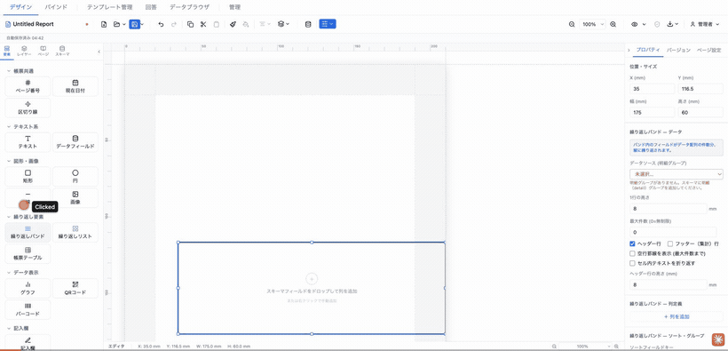
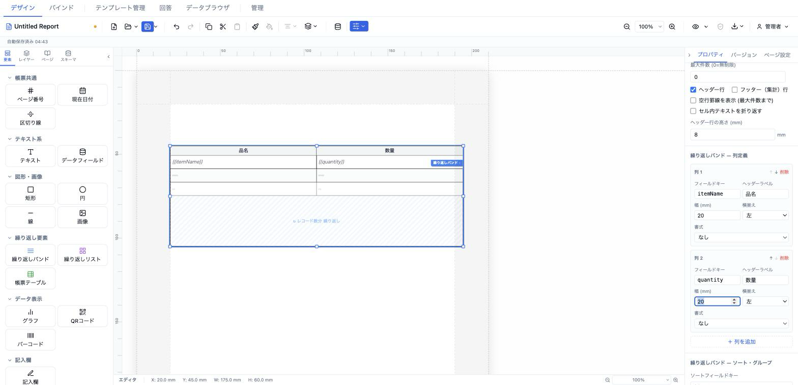
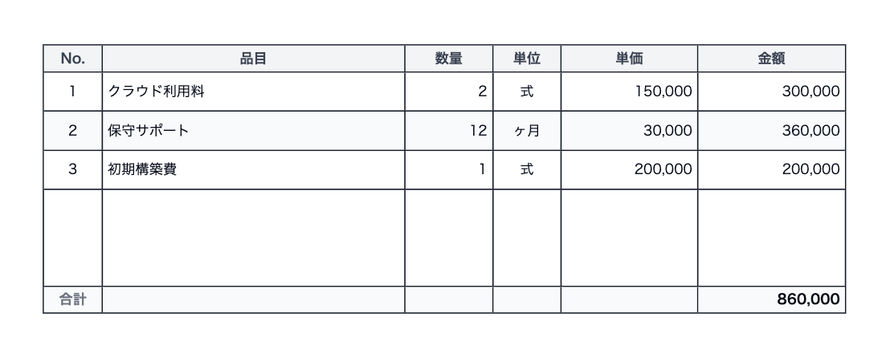

# 繰り返しバンド (repeatingBand)

データ配列を表形式（ヘッダー・明細・集計フッター）で縦に繰り返し描画する明細バンド要素です。請求書・見積書の明細行など、1レコード＝1行の帳票表組に使います（FastReport / JasperReports / DevExpress の "Detail Band" 相当）。



- **ElementType**: `repeatingBand`
- **パレット**: 繰り返し要素 → `繰り返しバンド`
- **ファクトリ**: `createRepeatingBandElement()` / `createRepeatingBandWithDefaults()` (`src/lib/elementFactories.ts`)
- **Renderer**: `src/elements/repeatingBand/Renderer.tsx`
- **PropertiesPanel**: `src/elements/repeatingBand/PropertiesPanel.tsx`

## 型定義

```ts
export interface RepeatingBandField {
  key: string                 // データソース配列内の各レコードのフィールドキー
  label: string               // 列ヘッダーテキスト
  width: number               // 列幅 (mm)
  align?: 'left' | 'center' | 'right'
  format?: CalculationFormat  // 書式
}

export type RepeatingBandTotalFormula = 'sum' | 'count' | 'avg' | 'min' | 'max'

export interface RepeatingBandTotal {
  fieldKey: string
  formula: RepeatingBandTotalFormula
  label?: string
}

export interface RepeatingBandElement extends ElementBase {
  type: 'repeatingBand'
  dataSource: string          // バインドするデータ配列のフィールドキー (e.g. "items")
  itemHeight: number          // 1レコードあたりの行高さ (mm)
  fields: RepeatingBandField[]
  showHeader: boolean
  showFooter: boolean
  totals: RepeatingBandTotal[]
  pageBreak: 'none' | 'before' | 'after'
  maxItems: number            // 最大表示件数 (0=無制限)
  oddRowColor: string
  evenRowColor: string
  borderColor: string
  borderWidth: number         // mm
  // @deprecated innerBorderColor / innerBorderWidth（フォールバック用に残存）
  innerBorderColor?: string
  innerBorderWidth?: number
  // 罫線を部位別に分離（フォールバック: innerBorder* → border*）
  headerBorderColor?: string
  headerBorderWidth?: number
  dataBorderColor?: string
  dataBorderWidth?: number
  columnBorderColor?: string
  columnBorderWidth?: number
  footerBorderColor?: string  // フォールバック: borderColor
  footerBorderWidth?: number  // フォールバック: borderWidth
  sortBy?: string
  sortOrder?: 'asc' | 'desc'
  groupBy?: string
  showGroupSubtotals?: boolean
  groupStyle?: TextStyle
  showEmptyRowLines?: boolean  // maxItems 未満のとき空行罫線を描画
  style?: TextStyle            // ボディ行のテキストスタイル
  headerStyle?: TextStyle
  headerHeight?: number        // 省略時は itemHeight
  wrapText?: boolean           // false = nowrap + ellipsis
  footerLayout?: 'compact' | 'fixed'  // 既定 'fixed'
}
```

## 設定可能なプロパティ（全網羅）

PropertiesPanel（`RepeatingBandPropertiesPanel`）は6セクションで構成されます。

### 繰り返しバンド — データ

| UIラベル | プロパティ | 型 | 既定値 | 説明・効果 |
|---|---|---|---|---|
| データソース (明細グループ) | `dataSource` | string | `''` | 繰り返す配列。スキーマの明細（detail）グループを **ドロップダウンから選択**（値は `group.dataKey`）。未選択／不明値は赤字エラー表示。明細グループが1つもない場合は警告表示 |
| 1行の高さ | `itemHeight` | number(mm) | `8` | 1レコードあたりの行高さ。min 3 / step 0.5 |
| 最大件数 (0=無制限) | `maxItems` | number | `0` | 展開する最大行数。0 で全件。min 0 |
| ヘッダー行 | `showHeader` | boolean | `true` | 列ヘッダー行の表示可否 |
| フッター（集計）行 | `showFooter` | boolean | `false` | 集計フッター行の表示可否 |
| フッター配置 | `footerLayout` | `'fixed'` \| `'compact'` | `'fixed'` | `showFooter` 時のみ表示。fixed=バンド下端に固定、compact=データ行直後に詰めてバンドを縮小 |
| 空行罫線を表示 (最大件数まで) | `showEmptyRowLines` | boolean | `false` | データが maxItems 未満のとき残りを空行の罫線で埋める |
| セル内テキストを折り返す | `wrapText` | boolean | `false` | false は nowrap + 省略記号（…）、true は折り返し |
| ヘッダー行の高さ (mm) | `headerHeight` | number(mm) | `itemHeight` と同値 | 省略時はボディ行と同じ高さ。min 3 / step 0.5 |

### 繰り返しバンド — 列定義

`fields[]` を各列カードで編集。「＋ 列を追加」で追加、各カードの ↑ / ↓ で並び替え、「削除」で除去。

| UIラベル | プロパティ | 型 | 既定値 | 説明・効果 |
|---|---|---|---|---|
| フィールドキー | `fields[].key` | string | `field` | レコード内の値キー |
| ヘッダーラベル | `fields[].label` | string | `新列` | 列見出しテキスト |
| 幅 (mm) | `fields[].width` | number | `20` | 列幅。min 5 / step 1 |
| 横揃え | `fields[].align` | `left`\|`center`\|`right` | `left` | セル内テキスト揃え |
| 書式 | `fields[].format.type` | NumberFormatType | なし | なし/整数/小数/通貨(¥)/通貨($)/パーセント/カンマ区切り/大字 |
| 小数桁数 | `fields[].format.decimalPlaces` | number | `2` | `decimal` / `currency_usd` 選択時のみ表示。0〜10 |

### 繰り返しバンド — ソート・グループ

| UIラベル | プロパティ | 型 | 既定値 | 説明・効果 |
|---|---|---|---|---|
| ソートフィールドキー | `sortBy` | string? | 未設定 | 指定キーでレコードをソート |
| ソート順 | `sortOrder` | `asc`\|`desc` | `asc` | 昇順／降順 |
| グループ化フィールドキー | `groupBy` | string? | 未設定 | 指定キーの値ごとにグループ行を挿入 |
| グループ小計行を表示 | `showGroupSubtotals` | boolean | `false` | `groupBy` 設定時のみ表示。グループ末尾に小計行を出す |

### 繰り返しバンド — 罫線

プリセットボタン（下表）で複数の罫線幅を一括設定。「罫線の詳細設定」を開くと部位別に色・幅を個別編集できます。

| プリセット | 効果（設定される幅 mm: 外枠/ヘッダー下/データ間/列区切り/フッター上）|
|---|---|
| 全罫線 | 0.3 / 0.3 / 0.3 / 0.3 / 0.3 |
| 外枠のみ | 0.3 / 0 / 0 / 0 / 0 |
| 帳票標準 | 0.5 / 0.5 / 0.2 / 0.2 / 0.5 |
| ヘッダー太 | 0.3 / 0.5 / 0.3 / 0.3 / 0.3 |
| 合計太 | 0.3 / 0.3 / 0.3 / 0.3 / 0.5 |
| 罫線なし | 0 / 0 / 0 / 0 / 0 |

詳細設定の個別項目: 外枠の色/幅 (`borderColor`/`borderWidth`)、ヘッダー下の色/幅 (`headerBorderColor`/`headerBorderWidth`)、データ行間の色/幅 (`dataBorderColor`/`dataBorderWidth`)、列区切りの色/幅 (`columnBorderColor`/`columnBorderWidth`)、フッター上の色/幅 (`footerBorderColor`/`footerBorderWidth`)。各幅は min 0 / step 0.1 mm。

### 繰り返しバンド — 外観

| UIラベル | プロパティ | 型 | 既定値 | 説明・効果 |
|---|---|---|---|---|
| ヘッダー背景色 | `headerStyle.backgroundColor` | color | `#f3f4f6` | `showHeader` 時のみ表示 |
| ヘッダー文字色 | `headerStyle.color` | color | ファクトリ `#374151`（パネル既定表示 `#1a1a1a`）| `showHeader` 時のみ表示 |
| 奇数行の背景色 | `oddRowColor` | color | `#ffffff` | 明細行の縞模様（奇数行） |
| 偶数行の背景色（縞模様） | `evenRowColor` | color | `#f9fafb` | 明細行の縞模様（偶数行） |

### 繰り返しバンド — ページ

| UIラベル | プロパティ | 型 | 既定値 | 説明・効果 |
|---|---|---|---|---|
| 改ページ | `pageBreak` | `none`\|`before`\|`after` | `none` | バンドの前／後で改ページ |

### 繰り返しバンド — 集計（フッター）

`showFooter` 有効時のみ表示。`totals[]` を集計カードで編集。「＋ 集計を追加」で追加、「削除」で除去。

| UIラベル | プロパティ | 型 | 既定値 | 説明・効果 |
|---|---|---|---|---|
| フィールドキー | `totals[].fieldKey` | string | `amount` | 集計対象の列キー |
| 集計関数 | `totals[].formula` | `sum`\|`count`\|`avg`\|`min`\|`max` | `sum` | SUM/COUNT/AVG/MIN/MAX |
| ラベル | `totals[].label` | string? | `合計` | フッター行に添えるラベル |

## 既定値（ファクトリ）

`createRepeatingBandElement()`:

- `position` `{x:13,y:13}` / `size` `{width:175,height:60}` / `zIndex` 1 / `visible` true / `locked` false
- `dataSource: ''`、`itemHeight: 8`、`fields: []`（空）
- `showHeader: true`、`showFooter: false`、`totals: []`
- `pageBreak: 'none'`、`maxItems: 0`
- `oddRowColor: '#ffffff'`、`evenRowColor: '#f9fafb'`
- `borderColor: '#000000'`、`borderWidth: 0.3`
- `sortOrder: 'asc'`、`showEmptyRowLines: false`、`showGroupSubtotals: false`
- `style: { fontSize:10, color:'#000000' }`
- `headerStyle: { fontSize:10, fontWeight:'bold', color:'#374151', backgroundColor:'#f3f4f6' }`

`createRepeatingBandWithDefaults()` は上記に加え `dataSource:'items'`、標準請求書6列（No./品目/数量/単位/単価/金額）、`showFooter:true`、`totals:[{fieldKey:'amount',formula:'sum',label:'合計'}]` をプリセットします。

## レンダリング挙動

Renderer は `records` prop の有無で分岐します（`RepeatingBandRenderer`）。

- **`records === undefined`（デザイン／編集時）** → `RepeatingBandDesignPreview`。フェードしたモック行（`{{fieldKey}}` プレースホルダー）、ヘッダー、右下に青い `↻ レコード数分 繰り返し`（`maxItems>0` なら `最大 N 件`）バッジ、ヘッダー下に `繰り返しバンド · <dataSource>`（`groupBy` 設定時は `(<groupBy>でグループ化)` 付き）バッジを表示します。
- **`records` が配列（プレビュー／PDF-PNG 出力時）** → 実データを描画。`sortBy` でソート、`groupBy` があればグループ化パス（`RepeatingBandGroupedRenderer`、グループ見出し＋小計）、なければフラットパス。`maxItems` で件数制限、`showEmptyRowLines` で空行補完、`totals` でフッター集計。0件時は「データなし」を表示。

`ElementRenderer` 側で `records` は **`readonly && element.dataSource` のときだけ** `mergedData[dataSource]` から供給されます。つまり編集キャンバス（`readonly=false`）では常にデザインプレビュー、プレビュー／エクスポート（`readonly=true`）でのみライブ描画されます。`repeatingList` / `formTable` と同じゲート方針です。

## キャンバス上の操作

デザインプレビュー中はヘッダー列をクリックすると **列編集ポップオーバー** が開き、ヘッダーラベル・フィールドキー・幅・揃え・書式の変更、←/→ での列移動、「＋」での右隣への列追加、「削除」ができます（`onFieldsChange`、`readonly=false` のときのみ有効）。列境界のドラッグで列幅も調整できます。

## 操作手順（GIF デモの流れ）

1. パレットの「繰り返し要素 → 繰り返しバンド」をキャンバスにドラッグ＆ドロップ、またはクリックで追加する。
2. プロパティ「繰り返しバンド — データ」で **データソース (明細グループ)** をドロップダウンから選択する。
3. **1行の高さ** を 8mm に、**最大件数** を任意（0=全件）に設定する。
4. **ヘッダー行** ／ **フッター（集計）行** のチェックを切り替える。フッターを有効にしたら **フッター配置** を「下端に固定／データ行に詰める」で切り替える。
5. **空行罫線を表示** と **セル内テキストを折り返す** を試す。**ヘッダー行の高さ** を変更する。
6. 「繰り返しバンド — 列定義」で「＋ 列を追加」を押し、フィールドキー・ヘッダーラベル・幅・横揃えを設定する。**書式** を「通貨 (¥1,234)」等にし、小数系なら小数桁数を調整する。↑/↓ で列を並び替える。
7. 「繰り返しバンド — ソート・グループ」で **ソートフィールドキー** と **ソート順**、**グループ化フィールドキー** を入力し、**グループ小計行を表示** をオンにする。
8. 「繰り返しバンド — 罫線」でプリセット（全罫線／外枠のみ／帳票標準／ヘッダー太／合計太／罫線なし）を順に試し、「罫線の詳細設定」を開いて部位別の色・幅を調整する。
9. 「繰り返しバンド — 外観」でヘッダー背景色・文字色、奇数行／偶数行の背景色を変更する。
10. 「繰り返しバンド — ページ」で **改ページ** を設定する。
11. フッター有効時、「繰り返しバンド — 集計（フッター）」で「＋ 集計を追加」を押し、フィールドキー・集計関数（SUM 等）・ラベルを設定する。
12. デザインプレビュー上でヘッダー列をクリックし、列編集ポップオーバーでラベル・幅・書式を直接編集する。
13. プレビューモードに切り替え、実データで明細が展開・集計されることを確認する。

## スクリーンショット

編集画面（プロパティパネルで設定）:



設定後のプレビュー表示（プレビュー画面 / PDF 出力のイメージ）:



## 関連要素

- [繰り返しリスト (repeatingList)](./repeatingList.md) — カード／グリッド形式の繰り返し
- [帳票テーブル (formTable)](./formTable.md) — 行・列定義を持つ固定＋バインド両対応テーブル
