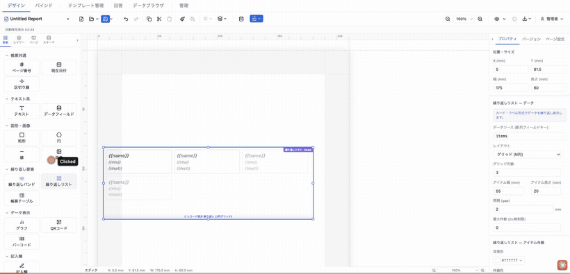
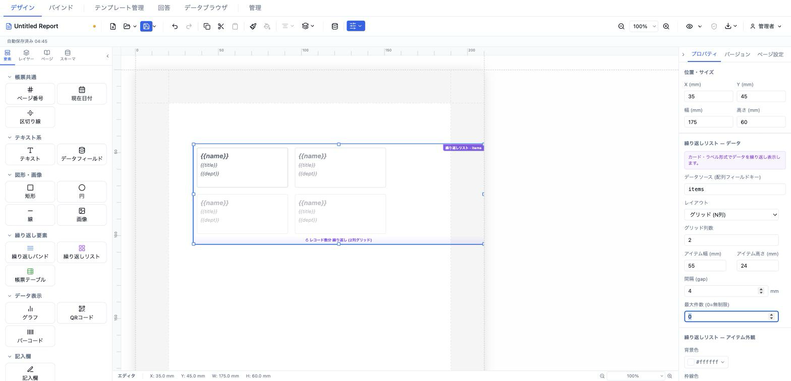

# 繰り返しリスト (repeatingList)

データ配列をカード形式で繰り返し描画する要素です。縦並び・横並び・N列グリッドのレイアウトに対応し、各カード内はアイテム左上からの相対座標でフィールドを自由配置します。商品カタログ・名刺一覧・ラベルシートのような「表ではなくカード」レイアウトに向きます。



- **ElementType**: `repeatingList`
- **パレット**: 繰り返し要素 → `繰り返しリスト`
- **ファクトリ**: `createRepeatingListElement()` (`src/lib/elementFactories.ts`)
- **Renderer**: `src/elements/repeatingList/Renderer.tsx`
- **PropertiesPanel**: `src/elements/repeatingList/PropertiesPanel.tsx`

## 型定義

```ts
export interface RepeatingListField {
  key: string                 // フィールドキー（isLabel=true のときはラベルテキスト）
  label?: string
  x: number                   // カード内の相対 X 座標 (mm)
  y: number                   // カード内の相対 Y 座標 (mm)
  width: number
  height: number
  style?: TextStyle
  isLabel?: boolean           // true = ラベルとして固定表示（繰り返さない）
}

export interface RepeatingListElement extends ElementBase {
  type: 'repeatingList'
  dataSource: string          // バインドするデータ配列のフィールドキー
  layout: 'vertical' | 'horizontal' | 'grid'
  gridColumns: number         // グリッドレイアウト時の列数
  itemWidth: number           // 1アイテムの幅 (mm)
  itemHeight: number          // 1アイテムの高さ (mm)
  gap: number                 // アイテム間のギャップ (mm)
  fields: RepeatingListField[]
  maxItems: number            // 最大表示件数 (0=無制限)
  borderColor?: string
  borderWidth?: number        // mm
  itemBackground?: string
  borderRadius?: number       // mm
  pageBreak: 'none' | 'before' | 'after'
}
```

## 設定可能なプロパティ（全網羅）

PropertiesPanel（`RepeatingListPropertiesPanel`）は3セクションで構成されます。

### 繰り返しリスト — データ

| UIラベル | プロパティ | 型 | 既定値 | 説明・効果 |
|---|---|---|---|---|
| データソース (配列フィールドキー) | `dataSource` | string | `items` | 繰り返す配列のフィールドキーを自由入力（例: `employees`, `products`） |
| レイアウト | `layout` | `vertical`\|`horizontal`\|`grid` | `grid` | 縦並び（リスト）／横並び（水平スクロール）／グリッド（N列） |
| グリッド列数 | `gridColumns` | number | `3` | `layout==='grid'` 時のみ表示。1〜10 |
| アイテム幅 (mm) | `itemWidth` | number(mm) | `55` | 1カードの幅。min 5 / step 1 |
| アイテム高さ (mm) | `itemHeight` | number(mm) | `20` | 1カードの高さ。min 5 / step 1 |
| 間隔 (gap) | `gap` | number(mm) | `2` | カード間の余白。min 0 / step 0.5 |
| 最大件数 (0=無制限) | `maxItems` | number | `0` | 展開する最大カード数。0 で全件。min 0 |

### 繰り返しリスト — アイテム外観

| UIラベル | プロパティ | 型 | 既定値 | 説明・効果 |
|---|---|---|---|---|
| 背景色 | `itemBackground` | color | `#ffffff` | カード背景色 |
| 枠線色 | `borderColor` | color | `#d1d5db` | カード枠線色 |
| 枠線幅 | `borderWidth` | number(mm) | `0.3` | min 0 / step 0.1。0 で枠線なし |
| 角丸 | `borderRadius` | number(mm) | `1` | min 0 / step 0.5 |

### 繰り返しリスト — フィールド定義

`fields[]` を各カードで編集。「＋ フィールドを追加」で追加、「削除」で除去。位置はアイテム左上からの相対座標（mm）。

| UIラベル | プロパティ | 型 | 既定値 | 説明・効果 |
|---|---|---|---|---|
| 固定ラベル（繰り返さない） | `fields[].isLabel` | boolean | `false` | オンにすると `key` をそのままラベルテキストとして表示（データ解決しない） |
| フィールドキー／ラベルテキスト | `fields[].key` | string | `field` | isLabel の状態で入力の意味が切り替わる（キー or 固定文言） |
| フォントサイズ | `fields[].style.fontSize` | number(mm 表記, pt値) | `3.5` | min 1 / step 0.5 |
| X (mm) | `fields[].x` | number | `2` | カード左端からの相対 X。min 0 / step 0.5 |
| Y (mm) | `fields[].y` | number | 追加時 `fields数×5+2` | カード上端からの相対 Y。min 0 / step 0.5 |
| WIDTH (mm) | `fields[].width` | number | `itemWidth-4` | フィールド幅。min 1 / step 0.5 |
| HEIGHT (mm) | `fields[].height` | number | `5` | フィールド高さ。min 1 / step 0.5 |

## 既定値（ファクトリ）

`createRepeatingListElement()`:

- `position` `{x:13,y:13}` / `size` `{width:175,height:60}` / `zIndex` 1 / `visible` true / `locked` false
- `dataSource: 'items'`
- `layout: 'grid'`、`gridColumns: 3`
- `itemWidth: 55`、`itemHeight: 20`、`gap: 2`
- `maxItems: 0`
- `borderColor: '#d1d5db'`、`borderWidth: 0.3`、`itemBackground: '#ffffff'`、`borderRadius: 1`
- `pageBreak: 'none'`
- `fields`: 3件のデフォルト（名前 / 役職 / 部署）
  - `name`: x2 y2 w36 h5, `{fontSize:11, fontWeight:'bold'}`
  - `title`: x2 y8 w36 h4, `{fontSize:8.5, color:'#6b7280'}`
  - `dept`: x2 y13 w36 h4, `{fontSize:8.5, color:'#6b7280'}`

## レンダリング挙動

Renderer は `records` prop の有無で分岐します（`RepeatingListRenderer`）。

- **`records === undefined`（デザイン／編集時）** → `RepeatingListDesignPreview`。フェードした 3〜4 枚のモックカード（フィールド値は `{{key}}` プレースホルダー、`isLabel` は固定文言）、右上に紫の `繰り返しリスト · <dataSource>` バッジ、下部に `↻ レコード数分 繰り返し`（`maxItems>0` なら `最大 N 件`）＋レイアウト名（`N列グリッド`／`横並び`／`縦並び`）を表示します。
- **`records` が配列（プレビュー／PDF-PNG 出力時）** → 実データを描画。各カード内で `resolveField(record, key)` により値を解決（`isLabel` は `key` をそのまま表示）。`maxItems` で件数制限。0件時は「データなし」を表示。

`ElementRenderer` 側で `records` は **`readonly && element.dataSource` のときだけ** `mergedData[dataSource]` から供給されます。編集キャンバス（`readonly=false`）では常にデザインプレビュー、プレビュー／エクスポート（`readonly=true`）でのみライブ描画されます（`repeatingBand` / `formTable` と同じゲート方針）。

## 操作手順（GIF デモの流れ）

1. パレットの「繰り返し要素 → 繰り返しリスト」をキャンバスに追加する。
2. プロパティ「繰り返しリスト — データ」で **データソース** に配列フィールドキー（例: `products`）を入力する。
3. **レイアウト** を 縦並び／横並び／グリッド で切り替える。グリッド選択時は **グリッド列数** を設定する。
4. **アイテム幅**・**アイテム高さ**・**間隔 (gap)**・**最大件数** を調整する。
5. 「繰り返しリスト — アイテム外観」で 背景色・枠線色・枠線幅・角丸 を変更する。
6. 「繰り返しリスト — フィールド定義」で「＋ フィールドを追加」を押し、フィールドキー・フォントサイズ・X/Y/WIDTH/HEIGHT を設定してカード内に配置する。
7. いずれかのフィールドで **固定ラベル（繰り返さない）** をオンにし、`key` に固定文言を入れてラベル表示にする。
8. 不要なフィールドは「削除」で除去する。
9. プレビューモードに切り替え、実データでカードが繰り返し展開されることを確認する。

## スクリーンショット



## 関連要素

- [繰り返しバンド (repeatingBand)](./repeatingBand.md) — 表形式（明細行）の繰り返し
- [帳票テーブル (formTable)](./formTable.md) — 行・列定義を持つ固定＋バインド両対応テーブル
