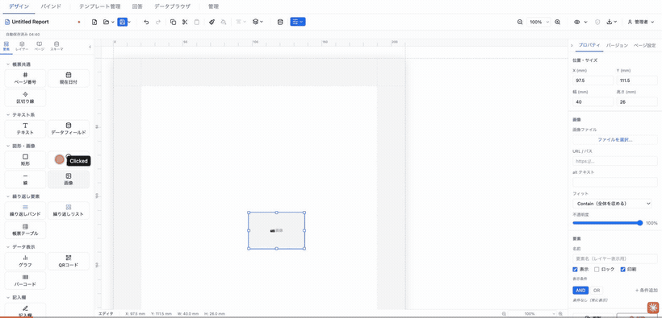
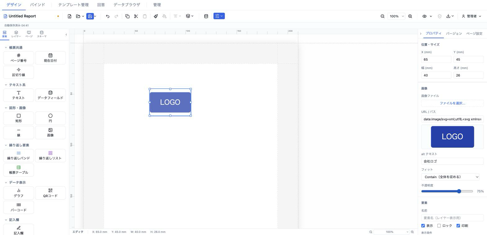

# 画像 (image)

ローカルファイルのアップロード（Base64 data-URI 化）または URL 指定で任意の画像を埋め込む要素です。ロゴ、透かし、写真、SVG 図版などに使います。



- **ElementType**: `image`
- **パレット**: 図形・画像 → `画像`
- **ファクトリ**: `createImageElement()` (`src/lib/elementFactories.ts`)
- **Renderer**: `src/elements/image/Renderer.tsx`
- **PropertiesPanel**: `src/elements/image/PropertiesPanel.tsx`

## 型定義

```ts
export interface ImageElement extends ElementBase {
  type: 'image'
  src: string
  alt: string
  objectFit: 'contain' | 'cover' | 'fill' | 'none'
  opacity?: number
}
```

`ElementBase` から継承する共通フィールド: `id` / `type` / `position`（mm）/ `size`（mm）/ `zIndex` / `locked` / `visible` / `name?` / `conditionalDisplay?` / `printable?` / `schemaBinding?`。

## 設定可能なプロパティ（全網羅）

### 画像セクション（`ImagePropertiesPanel`）

| UIラベル | プロパティ | 型 | 既定値 | 説明・効果 |
|---|---|---|---|---|
| 画像ファイル | `src`（アップロード経由） | ファイル選択ボタン | — | 「ファイルを選択...」でローカル画像を選択。`FileReader` で Base64 data-URI 化し `src` に格納する。許可拡張子: `.png,.jpg,.jpeg,.gif,.webp,.svg`。サイズ上限: SVG は **512KB**、その他ラスターは **2MB**。超過時は `alert` で警告し取り込まない。同じファイルを再選択できるよう input はリセットされる。 |
| URL / パス | `src`（直接入力） | text（placeholder `https://...`） | `''` | 画像の URL または data-URI を直接入力。アップロードと同じ `src` に書き込む。 |
| （プレビュー） | — | 画像サムネイル | — | `src` が非空のときのみ表示。`object-contain` / `max-h-20` の縮小プレビュー。 |
| alt テキスト | `alt` | text | `''` | 代替テキスト。`` に反映。 |
| フィット | `objectFit` | `'contain' \| 'cover' \| 'fill' \| 'none'`（セレクト） | `'contain'` | CSS `object-fit`。Contain（全体を収める）/ Cover（領域を埋める）/ Fill（伸縮して埋める）/ None（原寸）。 |
| 不透明度 | `opacity` | range（min=0, max=1, step=0.05） | `1` | 画像の不透明度。UI では % 表示（例 `100%`）。CSS `opacity` に反映。 |

### 位置・サイズセクション（共通 `PositionSizeSection`）

| UIラベル | プロパティ | 型 | 既定値 | 説明・効果 |
|---|---|---|---|---|
| X (mm) | `position.x` | number（step=0.5） | `13` | セクション相対の X 座標（mm）。表示は小数第1位に丸め。 |
| Y (mm) | `position.y` | number（step=0.5） | `13` | セクション相対の Y 座標（mm）。 |
| 幅 (mm) | `size.width` | number（min=1, step=0.5） | `40` | 画像の幅（mm）。 |
| 高さ (mm) | `size.height` | number（min=1, step=0.5） | `26` | 画像の高さ（mm）。 |

### 要素セクション（共通 `ElementCommonSection`）

| UIラベル | プロパティ | 型 | 既定値 | 説明・効果 |
|---|---|---|---|---|
| 名前 | `name` | text | 未設定 | レイヤーパネル表示用の要素名。 |
| 表示 | `visible` | checkbox | `true` | オフでキャンバス・出力から非表示。 |
| ロック | `locked` | checkbox | `false` | オンでドラッグ・リサイズ・選択操作を抑止。 |
| 印刷 | `printable` | checkbox | `true`（未設定時 true 扱い） | オフで印刷/PDF 出力対象から除外。 |
| （表示条件） | `conditionalDisplay` | `ConditionalDisplay`（`ConditionalDisplayEditor`） | 未設定 | AND/OR ロジックの構造化表示条件。 |
| バリアント非表示 | （`toggleElementHidden`） | 出力バリアント別トグル | — | 出力バリアントが 1 件以上あるときのみ表示。バリアントごとに要素を隠す。 |

> 補足: `zIndex`（重ね順）は型上のフィールドだが、このパネルに数値入力はなく、レイヤーパネルの並べ替え操作で制御する。

## 既定値（ファクトリ）

`createImageElement()`:

| フィールド | 既定値 |
|---|---|
| `type` | `'image'` |
| `position` | `{ x: 13, y: 13 }` |
| `size` | `{ width: 40, height: 26 }` |
| `zIndex` | `1` |
| `visible` | `true` |
| `locked` | `false` |
| `src` | `''` |
| `alt` | `''` |
| `objectFit` | `'contain'` |
| `opacity` | `1` |

## レンダリング挙動

`ImageRenderer` は `src` を `isSafeImageSrc()`（`src/lib/exportUtils.ts`）で検証する。

- **安全な src の判定**:
  - `data:image/svg+xml` → SVG data-URI の安全性チェック（`isSafeSvgDataUri`）を通過したもののみ許可。
  - その他の `data:` → 長さ 2MB 以下かつ許可ラスター prefix（png/jpeg/gif/webp）のもののみ許可。
  - それ以外 → `https://` で始まる URL のみ許可（`http://` や相対パスは不許可）。
- **不許可 / 空の src**: 画像は描画せず、`📷 画像` のプレースホルダー（グレー背景・破線枠）を表示する。
- **許可された src**: `` を `width:100% height:100%`、`object-fit: <objectFit>`、`opacity: <opacity ?? 1>`、`display: block`、`draggable=false` で描画する。
- design（編集）/ preview（`readonly`）で描画差はない。データフィールドバインドを持たない静的画像要素。

## 操作手順（GIF デモの流れ）

1. パレットの「図形・画像」から `画像` をキャンバスに追加する（初期はプレースホルダー `📷 画像` が表示される）。
2. プロパティパネルの「ファイルを選択...」からローカル画像（PNG/JPEG など）をアップロードし、data-URI として取り込まれることを確認する。
3. あるいは「URL / パス」に `https://...` の画像 URL を直接入力して差し替える。
4. 「alt テキスト」に代替テキストを入力する。
5. 「フィット」を `Contain` → `Cover` → `Fill` → `None` と切り替え、収まり方の違いを確認する。
6. 「不透明度」スライダーを 100% から 50% 程度に下げ、透過を確認する。
7. 位置・サイズセクションで X / Y / 幅 / 高さを数値入力してサイズ・配置を調整する。
8. 要素セクションで「名前」を入力し、「印刷」チェックのオン/オフ、表示条件の設定を確認する。
9. （検証）不正な src（`http://` や巨大ファイル）を入れるとプレースホルダーに戻ることを確認する。

## スクリーンショット



## 関連要素

- [図形 (shape)](./shape.md) — 同じ「図形・画像」カテゴリのベクター図形要素。
- [テナントロゴ (tenantLogo)](../tenant/logo.md) — テナント設定のロゴ画像を自動表示する専用要素。
- [バーコード (barcode)](../data-display/barcode.md) — QR / CODE128 等を生成描画する要素。
