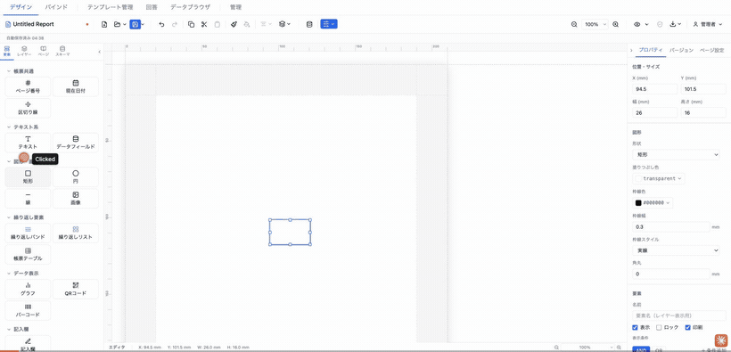
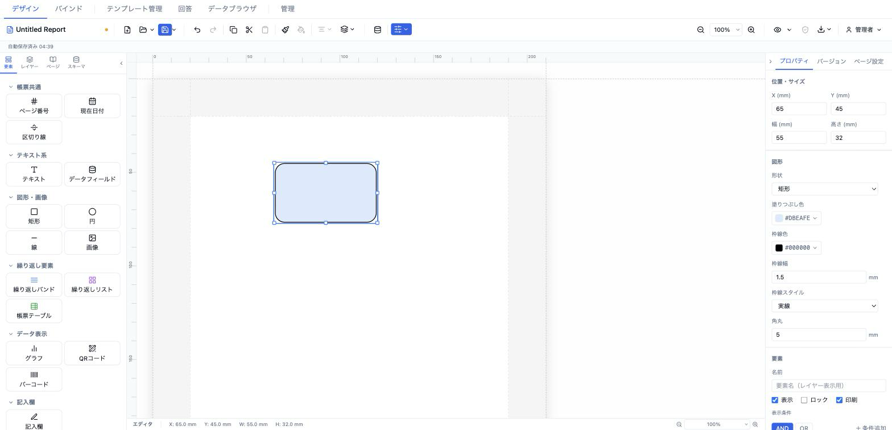
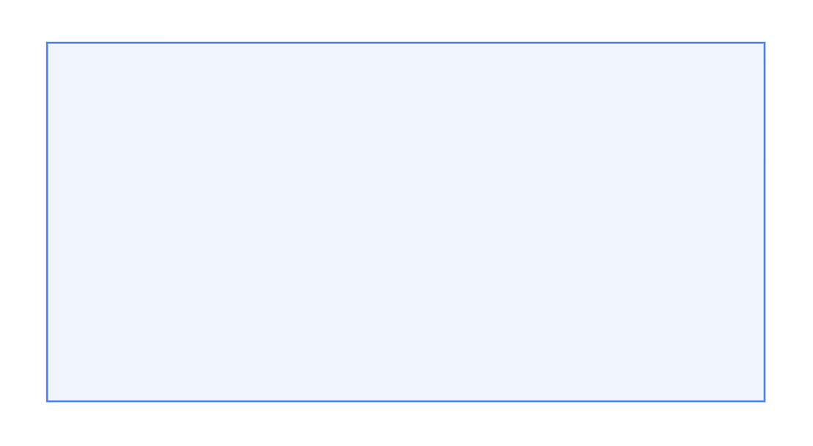

# 図形 (shape)

矩形・円・線の 3 種類のベクター図形を SVG で描画する要素です。区切り枠、背景ボックス、罫線、下線などの装飾に使います。



- **ElementType**: `shape`
- **パレット**: 図形・画像 → `矩形` / `円` / `線`
- **ファクトリ**: `createShapeElement()` (`src/lib/elementFactories.ts`)
- **Renderer**: `src/elements/shape/Renderer.tsx`
- **PropertiesPanel**: `src/elements/shape/PropertiesPanel.tsx`

## 型定義

```ts
export interface ShapeElement extends ElementBase {
  type: 'shape'
  shape: 'rectangle' | 'circle' | 'line'
  fill?: string
  stroke?: string
  strokeWidth?: number
  borderRadius?: number
  strokeDash?: 'solid' | 'dashed' | 'dotted'
}
```

`ElementBase` から継承する共通フィールド: `id` / `type` / `position`（mm）/ `size`（mm）/ `zIndex` / `locked` / `visible` / `name?` / `conditionalDisplay?` / `printable?` / `schemaBinding?`。

## 設定可能なプロパティ（全網羅）

### 図形セクション（`ShapePropertiesPanel`）

| UIラベル | プロパティ | 型 | 既定値 | 説明・効果 |
|---|---|---|---|---|
| 形状 | `shape` | `'rectangle' \| 'circle' \| 'line'`（セレクト: 矩形 / 円 / 線） | `'rectangle'` | 描画する図形の種類。`line` は SVG `<line>`、`circle` は `<ellipse>`、`rectangle` は `<rect>` として描画される。 |
| 塗りつぶし色 | `fill` | color（`ColorInput`） | 表示上 `#ffffff`（未設定時のピッカー既定値。ファクトリ既定は `transparent`） | 図形の内部塗り。`rectangle` / `circle` に適用。`line` には無効（塗り概念なし）。 |
| 枠線色 | `stroke` | color（`ColorInput`） | `#000000` | 枠線（`circle`/`rectangle`）および線（`line`）の色。 |
| 枠線幅 | `strokeWidth` | number（`NumInput`, min=0, step=0.1, 単位 mm） | `0.3` | 枠線・線の太さ（mm）。 |
| 枠線スタイル | `strokeDash` | `'solid' \| 'dashed' \| 'dotted'`（セレクト: 実線 / 破線 / 点線） | `'solid'` | 線種。`solid`=`none`、`dashed`=`6 3`、`dotted`=`2 2` の SVG `strokeDasharray` にマップされる。 |
| 角丸 | `borderRadius` | number（`NumInput`, min=0, step=0.5, 単位 mm） | `0` | 矩形の角丸半径（mm）。**`shape === 'rectangle'` のときのみ表示**。円・線では非表示。 |

### 位置・サイズセクション（共通 `PositionSizeSection`）

| UIラベル | プロパティ | 型 | 既定値 | 説明・効果 |
|---|---|---|---|---|
| X (mm) | `position.x` | number（step=0.5） | `13` | セクション相対の X 座標（mm）。表示は小数第1位に丸め。 |
| Y (mm) | `position.y` | number（step=0.5） | `13` | セクション相対の Y 座標（mm）。 |
| 幅 (mm) | `size.width` | number（min=1, step=0.5） | `26`（線パレットは `53`） | 図形の幅（mm）。 |
| 高さ (mm) | `size.height` | number（min=1, step=0.5） | `16`（線パレットは `0.5`） | 図形の高さ（mm）。`line` では幅と高さの比較で描画方向が決まる。 |

### 要素セクション（共通 `ElementCommonSection`）

| UIラベル | プロパティ | 型 | 既定値 | 説明・効果 |
|---|---|---|---|---|
| 名前 | `name` | text | 未設定 | レイヤーパネル表示用の要素名。 |
| 表示 | `visible` | checkbox | `true` | オフでキャンバス・出力から非表示。 |
| ロック | `locked` | checkbox | `false` | オンでドラッグ・リサイズ・選択操作を抑止。 |
| 印刷 | `printable` | checkbox | `true`（未設定時 true 扱い） | オフで印刷/PDF 出力対象から除外。 |
| （表示条件） | `conditionalDisplay` | `ConditionalDisplay`（`ConditionalDisplayEditor`） | 未設定 | AND/OR ロジックの構造化表示条件。 |
| バリアント非表示 | （`toggleElementHidden`） | 出力バリアント別トグル | — | 出力バリアントが 1 件以上あるときのみ表示。バリアントごとに要素を隠す。 |

> 補足: `zIndex`（重ね順）は型上のフィールドだが、このパネルに数値入力はなく、レイヤーパネルの並べ替え操作で制御する。

## 既定値（ファクトリ）

`createShapeElement()`:

| フィールド | 既定値 |
|---|---|
| `type` | `'shape'` |
| `position` | `{ x: 13, y: 13 }` |
| `size` | `{ width: 26, height: 16 }` |
| `zIndex` | `1` |
| `visible` | `true` |
| `locked` | `false` |
| `shape` | `'rectangle'` |
| `fill` | `'transparent'` |
| `stroke` | `'#000000'` |
| `strokeWidth` | `0.3` |
| `strokeDash` | `'solid'` |

パレットからの生成時に上書きされる値:
- `矩形`: `shape: 'rectangle'`（既定のまま）
- `円`: `shape: 'circle'`
- `線`: `shape: 'line'`, `size: { width: 53, height: 0.5 }`

## レンダリング挙動

いずれも `width="100%" height="100%"` の SVG を出力する（`ShapeRenderer`）。

- **line**: `size.height > size.width` のとき縦線（`x1=x2=50%`, `y` を 0→100%）、それ以外は横線（`y1=y2=50%`, `x` を 0→100%）として `<line>` を描画。`stroke` / `strokeWidth` / `strokeDasharray` を適用。SVG は `overflow: visible`。
- **circle**: `<ellipse cx=50% cy=50% rx=49% ry=49%>`。`fill`（未設定時 `transparent`）/ `stroke`（未設定時 `#000000`）/ `strokeWidth`（未設定時 `0.3`）/ `strokeDasharray` を適用。要素サイズが正方形なら真円、長方形なら楕円になる。
- **rectangle**: `<rect x=1% y=1% width=98% height=98%>`。`borderRadius` があれば `rx=ry=<値>mm` で角丸。`fill` / `stroke` / `strokeWidth` / `strokeDasharray` は circle と同様。
- `strokeDash` → `strokeDasharray` マップ: `solid`→`none`、`dashed`→`6 3`、`dotted`→`2 2`。未知値は `none`。
- design（編集）/ preview（`readonly`）で描画差はない。データバインドを持たない純粋な装飾要素。

## 操作手順（GIF デモの流れ）

1. パレットの「図形・画像」から `矩形` をキャンバスに追加する。
2. プロパティパネルの「形状」を `矩形` → `円` → `線` と切り替え、描画の変化を確認する。
3. 形状を `矩形` に戻す。
4. 「塗りつぶし色」を任意の色（例: 薄い青）に変更する。
5. 「枠線色」を変更する（例: 濃紺）。
6. 「枠線幅」を `0.3` から `1.0` mm に上げる。
7. 「枠線スタイル」を `実線` → `破線` → `点線` と切り替える。
8. 「角丸」を `0` → `3` mm に変更し、角が丸くなることを確認する。
9. 「形状」を `円` に変更する（角丸行が消えることを確認）。
10. 「形状」を `線` に変更し、幅 > 高さで横線、高さ > 幅で縦線になることを、幅/高さを入れ替えて確認する。
11. 位置・サイズセクションで X / Y / 幅 / 高さを数値入力して配置を調整する。
12. 要素セクションで「名前」を入力し、「印刷」チェックのオン/オフ、表示条件の設定を確認する。

## スクリーンショット

編集画面（プロパティパネルで設定）:



設定後のプレビュー表示（プレビュー画面 / PDF 出力のイメージ）:



## 関連要素

- [画像 (image)](./image.md) — 同じ「図形・画像」カテゴリのラスター/ SVG 画像要素。
- [区切り線 (divider)](../common/divider.md) — 線状の区切り専用オート要素。
- [テキスト (text)](../text/text.md) — 枠線・背景を持てるテキストボックス。
