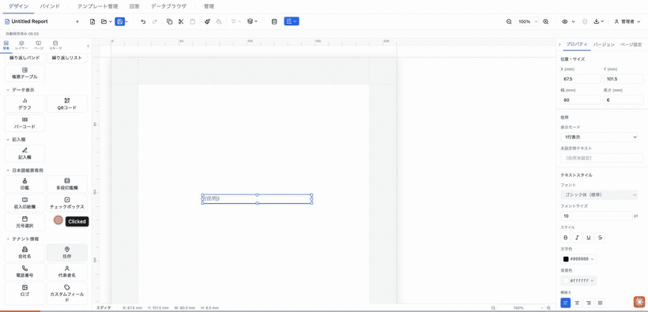
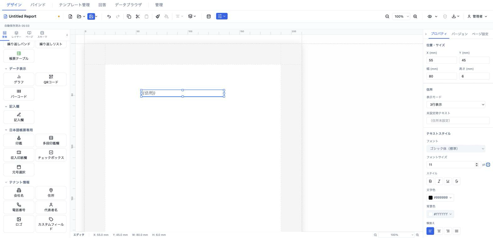
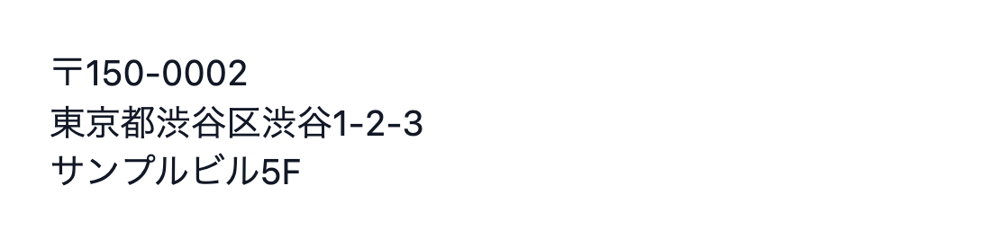

# 住所 (tenantAddress)

テナント情報の住所を自動表示する要素。郵便番号込みの 1 行表示と、郵便番号・都道府県市区町村・番地建物名を改行で分ける 3 行表示を切り替えられます。



- **ElementType**: `tenantAddress`
- **パレット**: テナント情報 → `住所`
- **ファクトリ**: `createTenantAddressElement()` (`src/lib/elementFactories.ts`)
- **Renderer**: `src/elements/tenantAddress/Renderer.tsx`
- **PropertiesPanel**: `src/elements/tenantAddress/PropertiesPanel.tsx`
- **整形**: `src/elements/_blocks/formatAddress.ts`

## 型定義

```ts
export type AddressDisplayMode = 'single' | 'multiLine'

export interface TenantAddressElement extends ElementBase {
  type: 'tenantAddress'
  style: TextStyle
  fallback?: string
  displayMode?: AddressDisplayMode
}
```

## 設定可能なプロパティ（全網羅）

### 住所セクション（`PropSection title="住所"`）

| UIラベル | プロパティ | 型 | 既定値 | 説明・効果 |
|---|---|---|---|---|
| 表示モード | `displayMode` | `'single' \| 'multiLine'` | `'single'` | `single`＝1行表示、`multiLine`＝3行表示。ラベルは「1行表示」「3行表示」。 |
| 未設定時テキスト | `fallback` | `string?` | `undefined` | 住所が空のときプレビュー／出力で表示する文字列。空にすると `undefined` に戻り、内蔵の `（住所未設定）` が使われる。 |

### テキストスタイルセクション（`TextStyleSection` → `el.style`）

`el.style`（`TextStyle`）を編集する共通セクション。未設定プロパティは `defaultTextStyle` を継承（✕ でリセット）。

| UIラベル | プロパティ | 型 | 既定値 | 説明・効果 |
|---|---|---|---|---|
| フォント | `style.fontFamily` | `string` | 継承（`sans-serif`） | フォントファミリー。 |
| フォントサイズ | `style.fontSize` | `number` (pt) | `10` | 文字サイズ。min 1・step 0.5。 |
| スタイル（太字） | `style.fontWeight` | `'normal' \| 'bold'` | 継承（normal） | 太字トグル。 |
| スタイル（斜体） | `style.fontStyle` | `'normal' \| 'italic'` | 継承 | 斜体トグル。 |
| スタイル（下線） | `style.textDecoration` | `'underline' \| 'none'` | 継承 | 下線トグル。 |
| スタイル（打ち消し線） | `style.textDecoration` | `'line-through' \| 'none'` | 継承 | 打ち消し線トグル。 |
| 文字色 | `style.color` | `string` | `#000000` | 文字色。 |
| 背景色 | `style.backgroundColor` | `string` | 継承（`transparent`） | 背景色。 |
| 横揃え | `style.textAlign` | `'left' \| 'center' \| 'right' \| 'justify'` | `'left'` | 水平方向の揃え。 |
| 縦揃え | `style.verticalAlign` | `'top' \| 'middle' \| 'bottom'` | 継承 | 垂直方向の揃え。 |
| 行間 | `style.lineHeight` | `number` (倍率) | 継承（1.5） | 3行表示の行間に影響。min 0.5・max 5。 |
| 文字間隔 | `style.letterSpacing` | `number` (em) | 継承（0） | 字間。min −0.2・max 2。 |
| 文字方向 | `style.writingMode` | `'horizontal-tb' \| 'vertical-rl'` | 横書き | 横書き／縦書き。 |
| テキストフィット | `style.textFit` | `'shrinkText' \| 'expandFrame' \| undefined` | なし | はみ出し時の縮小／枠拡大。 |

## 既定値（ファクトリ）

```ts
position: { x: 13, y: 13 }
size:     { width: 80, height: mode === 'multiLine' ? 15 : 6 }
displayMode: 'single'
style: { fontSize: 10, color: '#000000', textAlign: 'left' }
```

`createTenantAddressElement({ displayMode: 'multiLine' })` で生成した場合のみ、初期高さが改行分を見越して 15mm に拡張される（それ以外は 6mm）。

## レンダリング挙動

Renderer は `resolveValues`（= `readonly`）で表示を切り替える。

- **編集時（`resolveValues=false`）**: 常にリテラルトークン `{{住所}}` を `FIELD_PLACEHOLDER_STYLE` で描画。
- **プレビュー／出力時（`resolveValues=true`）**: `tenantInfo` の `postalCode` / `address1` / `address2` / `address` を `formatAddress(fields, mode)` で整形して表示。結果が空なら `el.fallback`、それも未設定なら内蔵フォールバック `（住所未設定）`。

`formatAddress` の組み立てルール（`address1` が未定義のときは後方互換で `address` を `address1` として扱う）。

| モード | 出力 |
|---|---|
| `single` | `〒{postalCode} {address1}{address2}`（郵便番号があるときのみ `〒…` 接頭辞を付与、1 行） |
| `multiLine` | `〒{postalCode}` / `{address1}` / `{address2}` を改行で結合（空行は省略） |

## テナント情報の設定場所

住所の値（郵便番号・都道府県市区町村・番地建物名）は要素側ではなく、テナント情報として一元管理される（`tenantSlice.tenantInfo` の `postalCode` / `address1` / `address2` / `address`）。編集場所は 2 か所。

- **データ設定モーダル → 「テナント情報」タブ**（`src/components/modals/TenantInfoTab.tsx`）
- **管理 → テナント情報**（`src/components/admin/TenantSettings.tsx`）

## 操作手順（GIF デモの流れ）

1. パレットの「テナント情報」から `住所` をキャンバスにドラッグ。`{{住所}}` プレースホルダが表示される。
2. プロパティパネルの「住所」セクションで「表示モード」を「3行表示」に変更（要素高さが広がる）。
3. 「未設定時テキスト」に文字列（例: `（住所未設定）`）を入力。
4. 「テキストスタイル」でフォントサイズを変更。
5. 横揃えを右 (right) に変更。
6. 行間を 1.4 に変更（3行表示での行間確認）。
7. プレビューモードに切り替え、トークンが `〒…` を含む整形済み住所に変わることを確認。
8. 「表示モード」を「1行表示」に戻し、1 行で表示されることを確認。

## スクリーンショット

編集画面（プロパティパネルで設定）:



設定後のプレビュー表示（プレビュー画面 / PDF 出力のイメージ）:



## 関連要素

- [会社名 (tenantCompanyName)](./companyName.md)
- [電話番号 (tenantPhone)](./phone.md)
- [代表者名 (tenantRepresentative)](./representative.md)
- [ロゴ (tenantLogo)](./logo.md)
- [カスタムフィールド (tenantCustom)](./custom.md)
