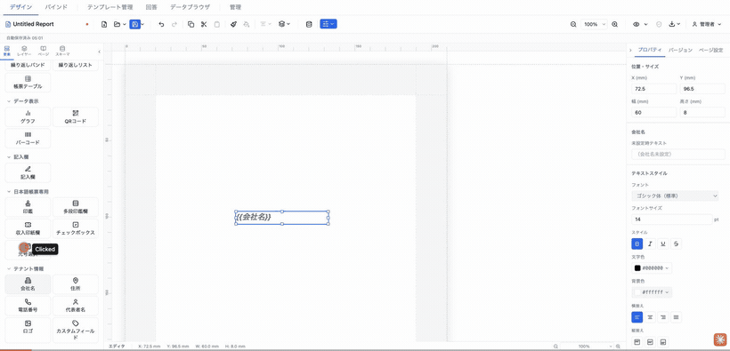
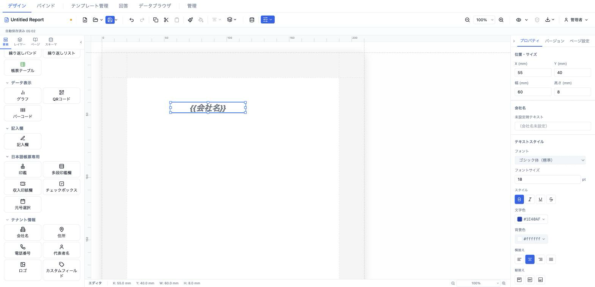

# 会社名 (tenantCompanyName)

テナント情報（`TenantInfo.companyName`）を自動表示する要素。ユーザー入力を必要とせず、組織単位で設定した会社名が全テンプレートに反映されます。



- **ElementType**: `tenantCompanyName`
- **パレット**: テナント情報 → `会社名`
- **ファクトリ**: `createTenantCompanyNameElement()` (`src/lib/elementFactories.ts`)
- **Renderer**: `src/elements/tenantCompanyName/Renderer.tsx`
- **PropertiesPanel**: `src/elements/tenantCompanyName/PropertiesPanel.tsx`

## 型定義

```ts
export interface TenantCompanyNameElement extends ElementBase {
  type: 'tenantCompanyName'
  style: TextStyle
  /** テナント情報が未設定のとき表示する文字列 */
  fallback?: string
}
```

## 設定可能なプロパティ（全網羅）

### 会社名セクション（`PropSection title="会社名"`）

| UIラベル | プロパティ | 型 | 既定値 | 説明・効果 |
|---|---|---|---|---|
| 未設定時テキスト | `fallback` | `string?` | `undefined` | テナント情報の会社名が未設定のときプレビュー／出力で表示する文字列。空にすると `undefined` に戻り、その場合は要素ごと非描画になる（サーバ PDF と同一挙動、#315）。 |

### テキストスタイルセクション（`TextStyleSection` → `el.style`）

`el.style`（`TextStyle`）を編集する共通セクション。値が未設定のプロパティはテンプレートの `defaultTextStyle` を継承し、各入力に継承状態と ✕（リセット）ボタンが表示される。

| UIラベル | プロパティ | 型 | 既定値 | 説明・効果 |
|---|---|---|---|---|
| フォント | `style.fontFamily` | `string` | 継承（`sans-serif`） | フォントファミリー（`FONT_FAMILIES`）。 |
| フォントサイズ | `style.fontSize` | `number` (pt) | `14` | 文字サイズ。min 1・step 0.5。 |
| スタイル（太字） | `style.fontWeight` | `'normal' \| 'bold'` | `'bold'` | 太字トグル。 |
| スタイル（斜体） | `style.fontStyle` | `'normal' \| 'italic'` | 継承 | 斜体トグル。 |
| スタイル（下線） | `style.textDecoration` | `'underline' \| 'none'` | 継承 | 下線トグル（打ち消しと排他）。 |
| スタイル（打ち消し線） | `style.textDecoration` | `'line-through' \| 'none'` | 継承 | 打ち消し線トグル。 |
| 文字色 | `style.color` | `string` | `#000000` | 文字色。 |
| 背景色 | `style.backgroundColor` | `string` | 継承（`transparent`） | 背景色。 |
| 横揃え | `style.textAlign` | `'left' \| 'center' \| 'right' \| 'justify'` | `'left'` | 水平方向の揃え。 |
| 縦揃え | `style.verticalAlign` | `'top' \| 'middle' \| 'bottom'` | 継承 | 垂直方向の揃え。 |
| 行間 | `style.lineHeight` | `number` (倍率) | 継承（1.5） | 行の高さ倍率。min 0.5・max 5。 |
| 文字間隔 | `style.letterSpacing` | `number` (em) | 継承（0） | 字間。min −0.2・max 2。 |
| 文字方向 | `style.writingMode` | `'horizontal-tb' \| 'vertical-rl'` | 横書き | 横書き／縦書き。 |
| テキストフィット | `style.textFit` | `'shrinkText' \| 'expandFrame' \| undefined` | なし | 枠からはみ出す際の縮小／枠拡大挙動。「なし」で `undefined`。 |

## 既定値（ファクトリ）

```ts
position: { x: 13, y: 13 }
size:     { width: 60, height: 8 }
zIndex: 1, visible: true, locked: false
style: { fontSize: 14, color: '#000000', textAlign: 'left', fontWeight: 'bold' }
```

## レンダリング挙動

Renderer は `resolveValues`（= 親から渡る `readonly`）で表示を切り替える。

- **編集時（`resolveValues=false`）**: 常にリテラルトークン `{{会社名}}` を表示。`FIELD_PLACEHOLDER_STYLE`（薄い色）を重ねてプレースホルダとして描画する。
- **プレビュー／出力時（`resolveValues=true`）**: `tenantInfo.companyName` を表示。未設定なら `el.fallback`、それも未設定なら**何も描画しない**（サーバ PDF が要素を出力しないのと一致、#315）。
- どちらも `resolveStyle(el.style, defaultStyle)` で解決したスタイルを `TextContent` に適用する。

## テナント情報の設定場所

会社名の値は要素側ではなく、テナント情報として一元管理される（`tenantSlice.tenantInfo.companyName`）。編集場所は 2 か所。

- **データ設定モーダル → 「テナント情報」タブ**（`src/components/modals/TenantInfoTab.tsx`）
- **管理 → テナント情報**（`src/components/admin/TenantSettings.tsx`）

いずれも `updateTenantInfo` でバックエンドに保存され、テナント情報は undo/redo 履歴やテンプレート定義とは独立している。

## 操作手順（GIF デモの流れ）

1. パレットの「テナント情報」から `会社名` をキャンバスにドラッグ。編集キャンバスに `{{会社名}}` プレースホルダが表示される。
2. プロパティパネルの「会社名」セクションで「未設定時テキスト」に文字列（例: `株式会社サンプル`）を入力。
3. 「テキストスタイル」でフォントサイズを 18 に変更。
4. 太字トグルをオフ→オンで切り替える。
5. 文字色を変更する。
6. 横揃えを中央 (center) に変更。
7. プレビューモードに切り替え、`{{会社名}}` が解決値（またはフォールバック）に変わることを確認。
8. データ設定モーダルの「テナント情報」タブで会社名を設定し、プレビューに反映されることを確認。

## スクリーンショット

編集画面（プロパティパネルで設定）:



設定後のプレビュー表示（プレビュー画面 / PDF 出力のイメージ）:


## 関連要素

- [住所 (tenantAddress)](./address.md)
- [電話番号 (tenantPhone)](./phone.md)
- [代表者名 (tenantRepresentative)](./representative.md)
- [ロゴ (tenantLogo)](./logo.md)
- [カスタムフィールド (tenantCustom)](./custom.md)
