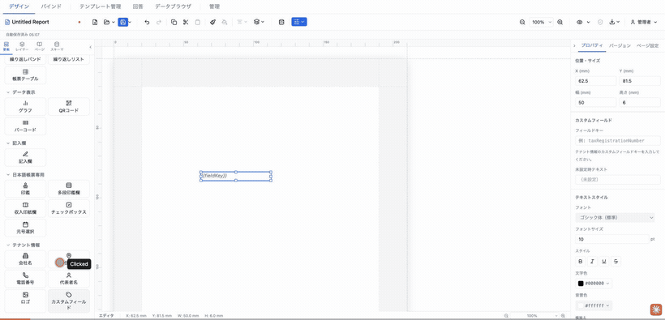
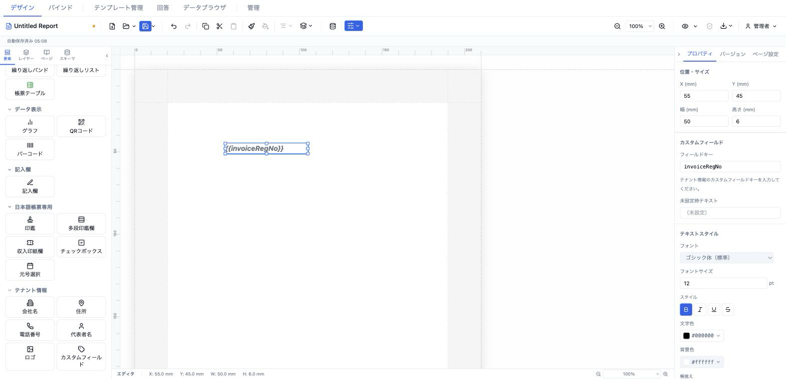

# カスタムフィールド (tenantCustom)

テナント情報のカスタムキー／値マップ（`TenantInfo.custom`）から任意のキーを取り出して表示する要素。標準項目（会社名・住所・電話番号・代表者名・ロゴ）に含まれない情報（インボイス登録番号など）を埋め込むときに使います。



- **ElementType**: `tenantCustom`
- **パレット**: テナント情報 → `カスタムフィールド`
- **ファクトリ**: `createTenantCustomElement()` (`src/lib/elementFactories.ts`)
- **Renderer**: `src/elements/tenantCustom/Renderer.tsx`
- **PropertiesPanel**: `src/elements/tenantCustom/PropertiesPanel.tsx`

## 型定義

```ts
export interface TenantCustomElement extends ElementBase {
  type: 'tenantCustom'
  /** TenantInfo.custom 上のキー */
  fieldKey: string
  style: TextStyle
  fallback?: string
}
```

`TenantInfo.custom` は `Record<string, string>`。参照するキーは `fieldKey` で指定する。

## 設定可能なプロパティ（全網羅）

### カスタムフィールドセクション（`PropSection title="カスタムフィールド"`）

| UIラベル | プロパティ | 型 | 既定値 | 説明・効果 |
|---|---|---|---|---|
| フィールドキー | `fieldKey` | `string` | `''` | `TenantInfo.custom` のキーをそのまま入力（等幅入力欄・自由入力、例: `taxRegistrationNumber`）。案内文「テナント情報のカスタムフィールドキーを入力してください。」あり。 |
| 未設定時テキスト | `fallback` | `string?` | `undefined` | キーの値が見つからないときプレビュー／出力で表示する文字列。空にすると `undefined` に戻る。 |

### テキストスタイルセクション（`TextStyleSection` → `el.style`）

`el.style`（`TextStyle`）を編集する共通セクション。未設定プロパティは `defaultTextStyle` を継承（✕ でリセット）。

| UIラベル | プロパティ | 型 | 既定値 | 説明・効果 |
|---|---|---|---|---|
| フォント | `style.fontFamily` | `string` | 継承（`sans-serif`） | フォントファミリー。 |
| フォントサイズ | `style.fontSize` | `number` (pt) | `10` | 文字サイズ。min 1・step 0.5。 |
| スタイル（太字） | `style.fontWeight` | `'normal' \| 'bold'` | 継承（normal） | 太字トグル。 |
| スタイル（斜体） | `style.fontStyle` | `'normal' \| 'italic'` | 継承 | 斜体トグル。 |
| スタイル（下線） | `style.textDecoration` | `'underline' \| 'none'` | 継承 | 下線トグル。 |
| スタイル（打ち消し線） | `style.textDecoration` | `'line-through' \| 'none'` | 継承 | 打ち消し線トグル。 |
| 文字色 | `style.color` | `string` | `#000000` | 文字色。 |
| 背景色 | `style.backgroundColor` | `string` | 継承（`transparent`） | 背景色。 |
| 横揃え | `style.textAlign` | `'left' \| 'center' \| 'right' \| 'justify'` | `'left'` | 水平方向の揃え。 |
| 縦揃え | `style.verticalAlign` | `'top' \| 'middle' \| 'bottom'` | 継承 | 垂直方向の揃え。 |
| 行間 | `style.lineHeight` | `number` (倍率) | 継承（1.5） | 行の高さ倍率。min 0.5・max 5。 |
| 文字間隔 | `style.letterSpacing` | `number` (em) | 継承（0） | 字間。min −0.2・max 2。 |
| 文字方向 | `style.writingMode` | `'horizontal-tb' \| 'vertical-rl'` | 横書き | 横書き／縦書き。 |
| テキストフィット | `style.textFit` | `'shrinkText' \| 'expandFrame' \| undefined` | なし | はみ出し時の縮小／枠拡大。 |

## 既定値（ファクトリ）

```ts
position: { x: 13, y: 13 }
size:     { width: 50, height: 6 }
fieldKey: ''
style: { fontSize: 10, color: '#000000', textAlign: 'left' }
```

## レンダリング挙動

Renderer は `resolveValues`（= `readonly`）で表示を切り替える。

- **編集時（`resolveValues=false`）**: `fieldKey` を含むリテラルトークン `` を `FIELD_PLACEHOLDER_STYLE` で描画。`fieldKey` が空のときは `{{fieldKey}}`。
- **プレビュー／出力時（`resolveValues=true`）**: `tenantInfo.custom?.[fieldKey]` を表示。値がなければ `el.fallback`、それも未設定なら内蔵フォールバック（`fieldKey` があれば `（<fieldKey> 未設定）`、`fieldKey` が空なら `（キー未設定）`）。

## テナント情報の設定場所

カスタムフィールドのキーと値は要素側ではなく、テナント情報として一元管理される（`tenantSlice.tenantInfo.custom`）。編集場所は 2 か所で、キー／値の追加・編集・削除を行える（データ設定モーダルのタブは最大 20 件まで）。

- **データ設定モーダル → 「テナント情報」タブ**（`src/components/modals/TenantInfoTab.tsx`、`MAX_CUSTOM_FIELDS = 20`）
- **管理 → テナント情報**（`src/components/admin/TenantSettings.tsx`）

要素の `fieldKey` は、ここで登録したキー名と一致させる必要がある。

## 操作手順（GIF デモの流れ）

1. パレットの「テナント情報」から `カスタムフィールド` をキャンバスにドラッグ。`{{fieldKey}}` プレースホルダが表示される。
2. データ設定モーダルの「テナント情報」タブでカスタムフィールドを追加し、キー（例: `invoiceRegistrationNumber`）と値を登録。
3. プロパティパネルの「フィールドキー」に同じキー（`invoiceRegistrationNumber`）を入力。トークンが `{{invoiceRegistrationNumber}}` に変わる。
4. 「未設定時テキスト」にフォールバック（例: `T0000000000000`）を入力。
5. 「テキストスタイル」でフォントサイズと太字を変更。
6. プレビューモードに切り替え、登録した値が表示されることを確認。
7. キーを存在しない名前に変更し、フォールバック／`（… 未設定）` が表示されることを確認。

## スクリーンショット



## 関連要素

- [会社名 (tenantCompanyName)](./companyName.md) 等の標準テナント要素
- [テキスト (text)](../text/text.md) — 固定ラベル（例: 「登録番号:」）を添えたい場合
