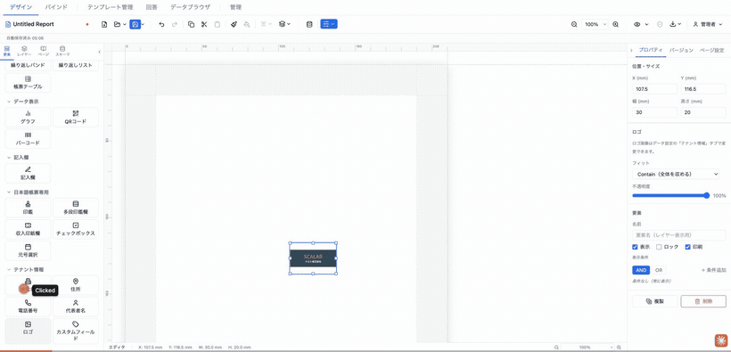
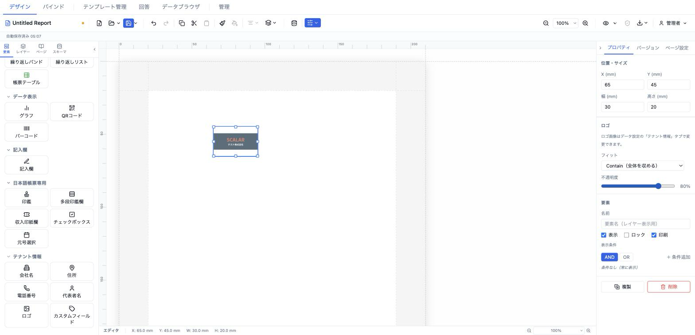

# ロゴ (tenantLogo)

テナント情報のロゴ画像（`TenantInfo.logoBase64`）を自動表示する要素。汎用 `image` 要素と異なり `src` を手動指定する必要はなく、テナント設定に登録した画像を全テンプレートで共有します。



- **ElementType**: `tenantLogo`
- **パレット**: テナント情報 → `ロゴ`
- **ファクトリ**: `createTenantLogoElement()` (`src/lib/elementFactories.ts`)
- **Renderer**: `src/elements/tenantLogo/Renderer.tsx`
- **PropertiesPanel**: `src/elements/tenantLogo/PropertiesPanel.tsx`

## 型定義

```ts
export interface TenantLogoElement extends ElementBase {
  type: 'tenantLogo'
  objectFit: 'contain' | 'cover' | 'fill' | 'none'
  opacity?: number
}
```

テキスト要素ではないため `style` / `fallback` を持たず、`TextStyleSection` も表示されない。

## 設定可能なプロパティ（全網羅）

### ロゴセクション（`PropSection title="ロゴ"`）

パネル上部に案内文「ロゴ画像はデータ設定の「テナント情報」タブで変更できます。」が表示される（ロゴ画像自体は要素からは差し替え不可）。

| UIラベル | プロパティ | 型 | 既定値 | 説明・効果 |
|---|---|---|---|---|
| フィット | `objectFit` | `'contain' \| 'cover' \| 'fill' \| 'none'` | `'contain'` | CSS `object-fit`。選択肢: Contain（全体を収める）／Cover（領域を埋める）／Fill（伸縮して埋める）／None（原寸）。 |
| 不透明度 | `opacity` | `number` | `1` | 0〜1 のスライダー（step 0.05）。右側に % 表示。透かし（ウォーターマーク）用途で下げる。 |

## 既定値（ファクトリ）

```ts
position: { x: 13, y: 13 }
size:     { width: 30, height: 20 }
zIndex: 1, visible: true, locked: false
objectFit: 'contain'
opacity:   1
```

## レンダリング挙動

このロゴ要素は `resolveValues`（`readonly`）を受け取らず、**編集時もプレビュー時も同じく `tenantInfo.logoBase64` を読む**（トークン表示は行わない）。

- **ロゴ未設定 / 不正な `src`**: `isSafeImageSrc` で検証し、通らなければ灰色の破線プレースホルダ（`🏢 ロゴ未設定`）を表示する。
- **ロゴ設定済み**: `` として描画し、`objectFit` と `opacity`（既定 1）を CSS で適用する。`draggable={false}`。

## テナント情報の設定場所

ロゴ画像は要素側ではなく、テナント情報として一元管理される（`tenantSlice.tenantInfo.logoBase64`、Base64 data-URI）。編集場所は 2 か所で、いずれも `TenantLogoField` によるアップロード UI を備える。

- **データ設定モーダル → 「テナント情報」タブ**（`src/components/modals/TenantInfoTab.tsx`）
- **管理 → テナント情報**（`src/components/admin/TenantSettings.tsx`）

## 操作手順（GIF デモの流れ）

1. パレットの「テナント情報」から `ロゴ` をキャンバスにドラッグ。ロゴ未設定の場合は `🏢 ロゴ未設定` プレースホルダが表示される。
2. データ設定モーダルの「テナント情報」タブでロゴ画像をアップロードし、キャンバスに実画像が表示されることを確認。
3. プロパティパネルの「フィット」を Cover に変更し、領域を埋める挙動を確認。
4. 「フィット」を Contain に戻す。
5. 「不透明度」スライダーを 8% 付近まで下げ、透かし表示になることを確認。
6. 不透明度を 100% に戻す。
7. 要素をリサイズし、objectFit の効果を確認。

## スクリーンショット

編集画面（プロパティパネルで設定）:



設定後のプレビュー表示（プレビュー画面 / PDF 出力のイメージ）:


## 関連要素

- [画像 (image)](../shape-image/image.md) — 任意の画像を個別に埋め込みたい場合
- [会社名 (tenantCompanyName)](./companyName.md)
- [住所 (tenantAddress)](./address.md)
