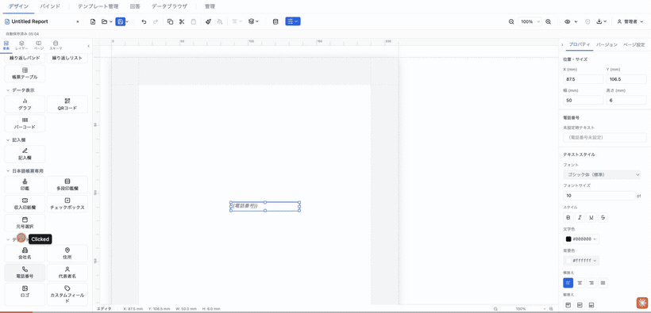
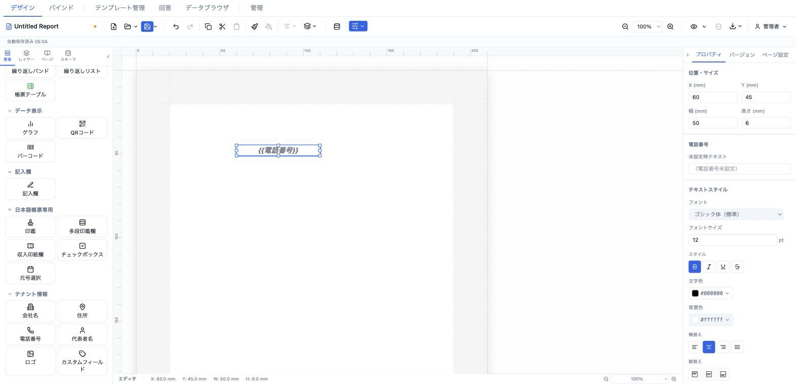

# 電話番号 (tenantPhone)

テナント情報（`TenantInfo.phone`）の電話番号を自動表示する要素。整形は行わず、設定された値をそのまま描画します。



- **ElementType**: `tenantPhone`
- **パレット**: テナント情報 → `電話番号`
- **ファクトリ**: `createTenantPhoneElement()` (`src/lib/elementFactories.ts`)
- **Renderer**: `src/elements/tenantPhone/Renderer.tsx`
- **PropertiesPanel**: `src/elements/tenantPhone/PropertiesPanel.tsx`

## 型定義

```ts
export interface TenantPhoneElement extends ElementBase {
  type: 'tenantPhone'
  style: TextStyle
  fallback?: string
}
```

## 設定可能なプロパティ（全網羅）

### 電話番号セクション（`PropSection title="電話番号"`）

| UIラベル | プロパティ | 型 | 既定値 | 説明・効果 |
|---|---|---|---|---|
| 未設定時テキスト | `fallback` | `string?` | `undefined` | 電話番号が未設定のときプレビュー／出力で表示する文字列。空にすると `undefined` に戻り、内蔵の `（電話番号未設定）` が使われる。 |

### テキストスタイルセクション（`TextStyleSection` → `el.style`）

`el.style`（`TextStyle`）を編集する共通セクション。未設定プロパティは `defaultTextStyle` を継承（✕ でリセット）。

| UIラベル | プロパティ | 型 | 既定値 | 説明・効果 |
|---|---|---|---|---|
| フォント | `style.fontFamily` | `string` | 継承（`sans-serif`） | フォントファミリー。 |
| フォントサイズ | `style.fontSize` | `number` (pt) | `10` | 文字サイズ。min 1・step 0.5。 |
| スタイル（太字） | `style.fontWeight` | `'normal' \| 'bold'` | 継承（normal） | 太字トグル。 |
| スタイル（斜体） | `style.fontStyle` | `'normal' \| 'italic'` | 継承 | 斜体トグル。 |
| スタイル（下線） | `style.textDecoration` | `'underline' \| 'none'` | 継承 | 下線トグル。 |
| スタイル（打ち消し線） | `style.textDecoration` | `'line-through' \| 'none'` | 継承 | 打ち消し線トグル。 |
| 文字色 | `style.color` | `string` | `#000000` | 文字色。 |
| 背景色 | `style.backgroundColor` | `string` | 継承（`transparent`） | 背景色。 |
| 横揃え | `style.textAlign` | `'left' \| 'center' \| 'right' \| 'justify'` | `'left'` | 水平方向の揃え。 |
| 縦揃え | `style.verticalAlign` | `'top' \| 'middle' \| 'bottom'` | 継承 | 垂直方向の揃え。 |
| 行間 | `style.lineHeight` | `number` (倍率) | 継承（1.5） | 行の高さ倍率。min 0.5・max 5。 |
| 文字間隔 | `style.letterSpacing` | `number` (em) | 継承（0） | 字間。min −0.2・max 2。 |
| 文字方向 | `style.writingMode` | `'horizontal-tb' \| 'vertical-rl'` | 横書き | 横書き／縦書き。 |
| テキストフィット | `style.textFit` | `'shrinkText' \| 'expandFrame' \| undefined` | なし | はみ出し時の縮小／枠拡大。 |

## 既定値（ファクトリ）

```ts
position: { x: 13, y: 13 }
size:     { width: 50, height: 6 }
style: { fontSize: 10, color: '#000000', textAlign: 'left' }
```

## レンダリング挙動

Renderer は `resolveValues`（= `readonly`）で表示を切り替える。

- **編集時（`resolveValues=false`）**: 常にリテラルトークン `{{電話番号}}` を `FIELD_PLACEHOLDER_STYLE` で描画。
- **プレビュー／出力時（`resolveValues=true`）**: `tenantInfo.phone` を表示。未設定なら `el.fallback`、それも未設定なら内蔵フォールバック `（電話番号未設定）`。
- ハイフン挿入などの整形は行わず、保存された値をそのまま描画する。

## テナント情報の設定場所

電話番号の値は要素側ではなく、テナント情報として一元管理される（`tenantSlice.tenantInfo.phone`）。編集場所は 2 か所。

- **データ設定モーダル → 「テナント情報」タブ**（`src/components/modals/TenantInfoTab.tsx`）
- **管理 → テナント情報**（`src/components/admin/TenantSettings.tsx`）

## 操作手順（GIF デモの流れ）

1. パレットの「テナント情報」から `電話番号` をキャンバスにドラッグ。`{{電話番号}}` プレースホルダが表示される。
2. プロパティパネルの「電話番号」セクションで「未設定時テキスト」を入力（例: `（電話番号未登録）`）。
3. 「テキストスタイル」でフォントサイズを 13 に変更。
4. 太字トグルをオンにする。
5. 横揃えを右 (right) に変更。
6. プレビューモードに切り替え、トークンが解決値（またはフォールバック）に変わることを確認。
7. データ設定モーダルの「テナント情報」タブで電話番号を設定し、プレビューに反映されることを確認。

## スクリーンショット

編集画面（プロパティパネルで設定）:



設定後のプレビュー表示（プレビュー画面 / PDF 出力のイメージ）:


## 関連要素

- [会社名 (tenantCompanyName)](./companyName.md)
- [住所 (tenantAddress)](./address.md)
- [代表者名 (tenantRepresentative)](./representative.md)
- [カスタムフィールド (tenantCustom)](./custom.md)
