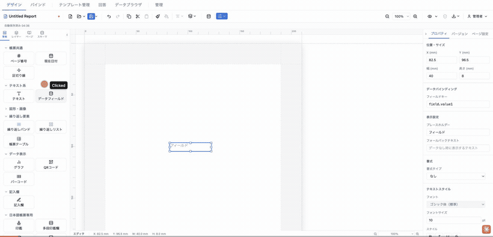
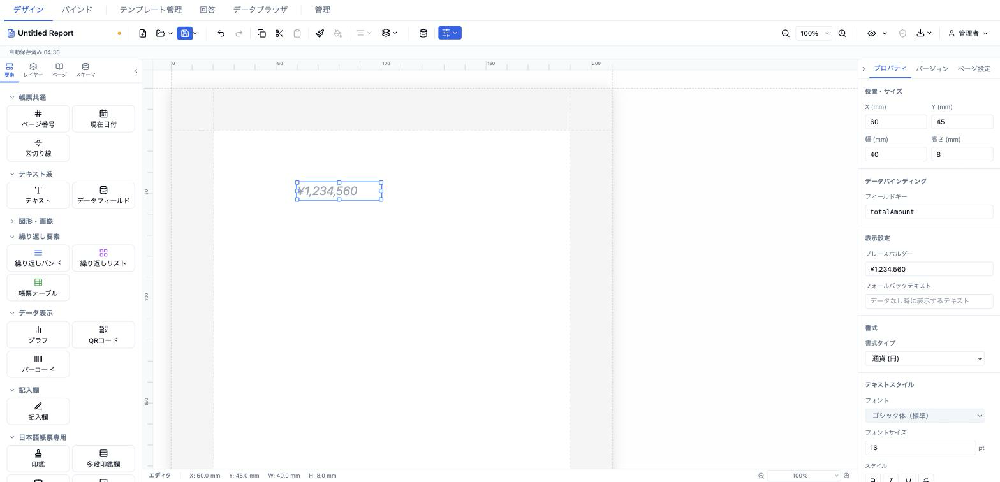

# データフィールド (dataField)

単一のデータソースフィールドを表示する要素。書式（通貨・日付・和暦・住所 等）とフォールバック表示を持つ。`text` が本文中に `{{token}}` を混在させるのに対し、`dataField` は単一値の表示に特化する。



- **ElementType**: `dataField`
- **パレット**: テキスト系 → `データフィールド`
- **ファクトリ**: `createDataFieldElement()` / `createDataFieldFromSchema()` (`src/lib/elementFactories.ts`)
- **Renderer**: `src/elements/dataField/Renderer.tsx`
- **PropertiesPanel**: `src/elements/dataField/PropertiesPanel.tsx`

## 型定義

```ts
export interface DataFieldElement extends ElementBase {
  type: 'dataField'
  fieldKey: string
  label?: string
  style: TextStyle
  format?: CalculationFormat
  fallbackText?: string
}

export interface CalculationFormat {
  type: NumberFormatType | DateFormatType | AddressFormatType
  decimalPlaces?: number
  customPattern?: string
}

export type NumberFormatType =
  | 'integer' | 'decimal' | 'currency_jpy' | 'currency_usd'
  | 'percent' | 'comma' | 'kanji_numeral' | 'custom'
export type DateFormatType =
  | 'yyyy/MM/dd' | 'yyyy年MM月dd日' | 'MM/dd/yyyy'
  | 'wareki_full' | 'wareki_short' | 'custom'
export type AddressFormatType = 'address_single' | 'address_multiline'
```

`TextStyle`（全16プロパティ）と `ElementBase`（`position` / `size` / `visible` / `locked` / `printable` / `conditionalDisplay` / `schemaBinding` 等の共通フィールド）は [テキスト (text)](./text.md#型定義) と共通。

## 設定可能なプロパティ（全網羅）

パネルは上から「位置・サイズ」→「データバインディング」→「表示設定」→「書式」→「テキストスタイル」→「要素」の順に表示される（「位置・サイズ」「要素」は全要素共通）。

### 位置・サイズ（共通セクション）

| UIラベル | プロパティ | 型 | 既定値 | 説明・効果 |
|---|---|---|---|---|
| X (mm) | `position.x` | number | 13 | セクション相対の左位置（0.1mm 丸め、step 0.5） |
| Y (mm) | `position.y` | number | 13 | セクション相対の上位置（0.1mm 丸め、step 0.5） |
| 幅 (mm) | `size.width` | number | 40 | 要素幅（min 1、step 0.5） |
| 高さ (mm) | `size.height` | number | 8 | 要素高さ（min 1、step 0.5） |

### データバインディング（`DataBindingSection`）

| UIラベル | プロパティ | 型 | 既定値 | 説明・効果 |
|---|---|---|---|---|
| フィールドキー | `fieldKey` | text (`FieldKeyInput`) | `field.value{n}` | 解決対象のデータキー。2階層（`dataKey.fieldKey`）まで DB バインド可。連番付き既定値で重複バインドを回避（#176） |

### 表示設定（`PropSection` "表示設定"）

| UIラベル | プロパティ | 型 | 既定値 | 説明・効果 |
|---|---|---|---|---|
| プレースホルダー | `label` | text | `フィールド` | 値が空（未解決）のとき灰色イタリックで表示する見出し。空なら `fieldKey` を表示 |
| フォールバックテキスト | `fallbackText` | text | `''` | 値が null/空のとき resolver が返す代替文字列 |

### 書式（`FormatSection`）

| UIラベル | プロパティ | 型 | 既定値 | 説明・効果 |
|---|---|---|---|---|
| 書式タイプ | `format.type` | select | なし（`undefined`） | 下記の書式一覧から選択。「なし」で `format` を削除 |
| 小数桁数 | `format.decimalPlaces` | number | 2 | `書式タイプ = 小数(decimal)` のときのみ表示。min 0、max 10 |
| パターン | `format.customPattern` | text | `''` | `書式タイプ = カスタム(custom)` のときのみ表示。例: `#,##0.00` |

書式タイプの選択肢:

| ラベル | 値 |
|---|---|
| 整数 | `integer` |
| 小数 | `decimal` |
| 通貨 (円) | `currency_jpy` |
| 通貨 ($) | `currency_usd` |
| パーセント | `percent` |
| カンマ区切り | `comma` |
| 漢数字 | `kanji_numeral` |
| yyyy/MM/dd | `yyyy/MM/dd` |
| yyyy年MM月dd日 | `yyyy年MM月dd日` |
| 和暦 (令和8年4月1日) | `wareki_full` |
| 和暦略 (R8.04.01) | `wareki_short` |
| カスタム | `custom` |
| 住所（1行） | `address_single` |
| 住所（3行） | `address_multiline` |

### テキストスタイル（`TextStyleSection`, ふりがな無効）

`text` 要素の同名セクションと同じコントロール（フォント／フォントサイズ／太字・斜体・下線・打ち消し線／文字色／背景色／横揃え／縦揃え／行間／文字間隔／文字方向／テキストフィット）。継承インジケータと ✕ リセット付き。`dataField` では `showFurigana` を渡さないため「ふりがな」入力は出ない。詳細は [テキスト (text) の一覧](./text.md#テキストスタイルtextstylesection-showfurigana-有効) を参照。

### 要素（共通セクション）

| UIラベル | プロパティ | 型 | 既定値 | 説明・効果 |
|---|---|---|---|---|
| 名前 | `name` | text | `フィールド`（スキーマ由来時はラベル） | レイヤーパネル表示名 |
| 表示 | `visible` | checkbox | true | 非表示にすると描画されない |
| ロック | `locked` | checkbox | false | ドラッグ・リサイズを禁止 |
| 印刷 | `printable` | checkbox | true | オフで出力から除外 |
| 表示条件 | `conditionalDisplay` | エディタ | 未設定 | AND/OR ロジックの構造化表示条件 |
| バリアント非表示 | （`OutputVariant.hiddenElementIds`） | checkbox 群 | — | 出力バリアントがあるときのみ表示 |

※パネル最下部に「複製」「削除」ボタン（共通）。`schemaBinding.fieldId` はスキーマフィールドをドラッグ配置したときに自動設定され、パネル上の直接編集 UI は無い。

## 既定値（ファクトリ）

```ts
// セッション単位の連番 dataFieldKeySeq で fieldKey を一意化（#176）
export function createDataFieldElement(overrides?: Partial<ReportElement>): ReportElement {
  dataFieldKeySeq += 1
  return {
    id: uuidv4(),
    type: 'dataField',
    position: { x: 13, y: 13 },
    size: { width: 40, height: 8 },
    zIndex: 1,
    visible: true,
    locked: false,
    fieldKey: `field.value${dataFieldKeySeq}`,
    label: 'フィールド',
    style: { fontSize: 10, fontWeight: 'normal', color: '#000000', textAlign: 'left' },
    fallbackText: '',
    ...overrides,
  } as ReportElement
}

// スキーマフィールドをドラッグ配置したとき（fieldKey + schemaBinding を設定）
export function createDataFieldFromSchema(field): ReportElement {
  return createDataFieldElement({
    fieldKey: field.fieldKey,
    name: field.fieldLabel,
    label: field.fieldLabel,
    schemaBinding: { fieldId: field.fieldId },
  })
}
```

## レンダリング挙動

`DataFieldRenderer`（`src/elements/dataField/Renderer.tsx`）の実挙動:

- **値解決**: `useDataResolver(el.fieldKey, data, { format, fallbackText })` が `resolveField` → `applyFormat` の順で処理。値が `null`/空文字なら `fallbackText`（未指定なら空文字）を `resolved` として返す。
- **未解決時のプレースホルダ**: `resolved` が空のとき、`label ?? fieldKey` を灰色（`#9ca3af`）・イタリックで描画。これは編集・プレビュー共通。
- **書式適用**: `format` があると `applyFormat(rawValue, format, { data, fieldKey })` で整形（通貨・パーセント・漢数字・和暦・住所改行など）。`format` 未指定なら `String(rawValue)`。
- **サンプルヒント**（`sampleHint = !readonly`、編集時のみ）: 値が解決できたとき、`SAMPLE_VALUE_HINT_STYLE`（水色点線下線）を要素下端に重ね「この値はサンプル/計算データで、実レコードで変わる」ことを示す。プレビュー/出力では付かない（非破壊）。
- **空バインディング抑制**（`readonly` のプレビューのみ、`ElementRenderer` 側）: バインド済みで解決結果が空の `dataField` はプレビューで非表示になる（`isDataEmptyInPreview`）。編集時はプレースホルダを表示。ただし `fallbackText` が設定されているフィールドは非表示にされない。
- **スタイル解決**: `resolveStyle(el.style, defaultStyle)` でテンプレート既定スタイルにマージし `TextContent` へ渡す。縦書き・テキストフィット・行間などは `TextStyle` 経由で `text` と同じ挙動。
- `text` と異なりインライン編集は無い（値はデータ由来のため）。

## 操作手順（GIF デモの流れ）

1. パレットの「テキスト系 → データフィールド」をキャンバスにドラッグして配置する（未解決状態で灰色プレースホルダが出る）。
2. 「位置・サイズ」で X/Y と 幅/高さ を調整する。
3. 「データバインディング」のフィールドキーに `invoice.total` などを入力し、値が表示される様子を見せる。
4. 「表示設定」のプレースホルダーを変更し、未解決時の見出しが変わることを見せる。
5. 「フォールバックテキスト」に「（未入力）」などを入れ、データなし時の表示を見せる。
6. 「書式」の書式タイプを「通貨 (円)」に変更する。
7. 書式タイプを「小数」に変え、「小数桁数」を調整する。
8. 書式タイプを「和暦 (令和8年4月1日)」に変え、日付が和暦整形される様子を見せる。
9. 書式タイプを「カスタム」に変え、「パターン」に `#,##0 個` を入力する。
10. 「テキストスタイル」でフォント・サイズ・太字・文字色・横揃え（right）などを変更する。
11. 「要素」セクションで名前・表示・ロック・印刷・表示条件を切り替える。

## スクリーンショット



## 関連要素

- [テキスト (text)](./text.md) — 固定文字列や複数トークンの混在表示
- 繰り返しバンド / 帳票テーブル — 配列データを表形式で表示
