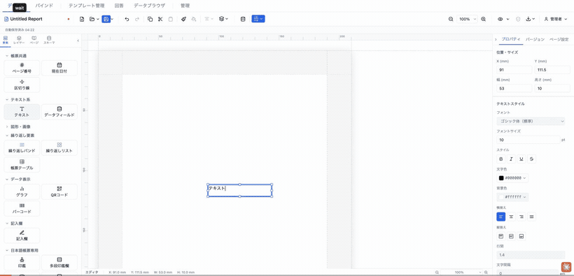
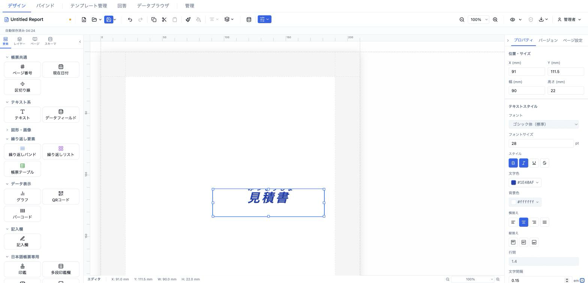

# テキスト (text)

固定テキストを配置する基本要素。本文中に `{{フィールドキー}}` トークンを埋め込むとデータを差し込め、ラベル用途にも使う（旧 `label` 要素は `text` に統合済み）。



- **ElementType**: `text`
- **パレット**: テキスト系 → `テキスト`
- **ファクトリ**: `createTextElement()` (`src/lib/elementFactories.ts`)
- **Renderer**: `src/elements/text/Renderer.tsx`
- **PropertiesPanel**: `src/elements/text/PropertiesPanel.tsx`

## 型定義

```ts
export interface TextElement extends ElementBase {
  type: 'text'
  content: string
  style: TextStyle
  /** ふりがな (ruby テキスト) */
  furigana?: string
  /** ふりがなフォントサイズ倍率 (default: 0.5) */
  furiganaScale?: number
}

// ElementBase（全要素共通）
export interface ElementBase {
  id: string
  type: ElementType
  position: Position          // Section 相対座標 (mm)
  size: Size                  // サイズ (mm)
  zIndex: number
  locked: boolean
  visible: boolean
  name?: string               // レイヤーパネル表示名
  conditionalDisplay?: ConditionalDisplay
  printable?: boolean         // 印刷対象か (default: true)
  schemaBinding?: ElementSchemaBinding
}

// style に使う TextStyle（全16プロパティ）
export interface TextStyle {
  fontSize?: number               // pt
  fontFamily?: string
  fontWeight?: 'normal' | 'bold'
  fontStyle?: 'normal' | 'italic'
  textDecoration?: 'none' | 'underline' | 'line-through'
  color?: string                  // '#RRGGBB'
  backgroundColor?: string        // 'transparent' or '#RRGGBB'
  textAlign?: 'left' | 'center' | 'right' | 'justify'
  verticalAlign?: 'top' | 'middle' | 'bottom'
  letterSpacing?: number          // em
  lineHeight?: number             // 倍率
  paddingTop?: number             // mm
  paddingRight?: number           // mm
  paddingBottom?: number          // mm
  paddingLeft?: number            // mm
  writingMode?: 'horizontal-tb' | 'vertical-rl'
  textFit?: 'shrinkText' | 'expandFrame'
}
```

## 設定可能なプロパティ（全網羅）

プロパティパネルは上から「位置・サイズ」→「テキストスタイル」→「コンテンツ」→「要素」の順に表示される（「位置・サイズ」「要素」は全要素共通、`src/components/sidebar/PropertiesPanel.tsx`）。

### 位置・サイズ（共通セクション）

| UIラベル | プロパティ | 型 | 既定値 | 説明・効果 |
|---|---|---|---|---|
| X (mm) | `position.x` | number | 13 | セクション相対の左位置（0.1mm 丸め、step 0.5） |
| Y (mm) | `position.y` | number | 13 | セクション相対の上位置（0.1mm 丸め、step 0.5） |
| 幅 (mm) | `size.width` | number | 53 | 要素幅（min 1、step 0.5） |
| 高さ (mm) | `size.height` | number | 10 | 要素高さ（min 1、step 0.5） |

### テキストスタイル（`TextStyleSection`, `showFurigana` 有効）

各行にはテンプレート既定スタイル（`definition.defaultTextStyle`）からの継承インジケータと、継承へ戻す ✕ リセットボタンが付く。値が `undefined` の場合は継承状態。

| UIラベル | プロパティ | 型 | 既定値 | 説明・効果 |
|---|---|---|---|---|
| フォント | `style.fontFamily` | select | ゴシック体（標準）(`sans-serif`) | 12 種のフォント（`FONT_FAMILIES`）。明朝/ゴシックの日本語ラベルで表示 |
| フォントサイズ | `style.fontSize` | number(pt) | 10 | min 1、step 0.5 |
| スタイル: 太字 | `style.fontWeight` | toggle | `normal` | トグルで `bold`⇔`normal` |
| スタイル: 斜体 | `style.fontStyle` | toggle | `normal` | トグルで `italic`⇔`normal` |
| スタイル: 下線 | `style.textDecoration` | toggle | `none` | トグルで `underline`⇔`none`（打ち消し線と排他） |
| スタイル: 打ち消し線 | `style.textDecoration` | toggle | `none` | トグルで `line-through`⇔`none`（下線と排他） |
| 文字色 | `style.color` | color | `#000000` | カラーピッカー |
| 背景色 | `style.backgroundColor` | color | `#ffffff`(表示) | 未設定時のレンダリングは `transparent` |
| 横揃え | `style.textAlign` | icon 4択 | `left` | `left`/`center`/`right`/`justify` |
| 縦揃え | `style.verticalAlign` | icon 3択 | `top` | `top`/`middle`/`bottom`（flex で実現） |
| 行間 | `style.lineHeight` | number | 1.4 | min 0.5、max 5、step 0.1（倍率） |
| 文字間隔 | `style.letterSpacing` | number(em) | 0 | min -0.2、max 2、step 0.05 |
| 文字方向 | `style.writingMode` | icon 2択 | `horizontal-tb` | 横書き / 縦書き（`vertical-rl`） |
| テキストフィット | `style.textFit` | select | なし(`clip`) | なし（はみ出し非表示）/ テキストを縮小(`shrinkText`) / 枠を拡大(`expandFrame`） |
| ふりがな | `furigana` | text | 未設定 | 入力すると本文の上（縦書き時は右）に ruby として表示。空文字は `undefined` に正規化 |

> 補足: `TextStyle` の `paddingTop/Right/Bottom/Left` と `furiganaScale`（ふりがな倍率、既定 0.5）はレンダラー（`TextContent`）が解釈するが、プロパティパネルには操作 UI が無い（テンプレート JSON / プログラム経由でのみ設定）。

### コンテンツ

| UIラベル | プロパティ | 型 | 既定値 | 説明・効果 |
|---|---|---|---|---|
| （テキストエリア） | `content` | textarea(4行) | `テキスト` | 本文。プレースホルダは「テキスト内容（{{フィールドキー}} でデータ参照）」。`{{fieldKey}}` トークンでデータ差し込み可（`TokenInput`） |

### 要素（共通セクション）

| UIラベル | プロパティ | 型 | 既定値 | 説明・効果 |
|---|---|---|---|---|
| 名前 | `name` | text | 未設定 | レイヤーパネル表示名 |
| 表示 | `visible` | checkbox | true | 非表示にすると描画されない |
| ロック | `locked` | checkbox | false | ドラッグ・リサイズを禁止 |
| 印刷 | `printable` | checkbox | true | オフで出力（PDF/印刷）から除外 |
| 表示条件 | `conditionalDisplay` | エディタ | 未設定 | AND/OR ロジックの構造化表示条件（`ConditionalDisplayEditor`） |
| バリアント非表示 | （`OutputVariant.hiddenElementIds`） | checkbox 群 | — | 出力バリアントが 1 つ以上あるときのみ表示。バリアント別に要素を隠す |

※パネル最下部に「複製」「削除」ボタン（共通）。

## 既定値（ファクトリ）

```ts
export function createTextElement(overrides?: Partial<ReportElement>): ReportElement {
  return {
    id: uuidv4(),
    type: 'text',
    position: { x: 13, y: 13 },
    size: { width: 53, height: 10 },
    zIndex: 1,
    visible: true,
    locked: false,
    content: 'テキスト',
    style: { fontSize: 10, fontWeight: 'normal', color: '#000000', textAlign: 'left' },
    ...overrides,
  } as ReportElement
}
```

## レンダリング挙動

`TextRenderer`（`src/elements/text/Renderer.tsx`）の実挙動:

- **トークン展開**: `interpolate(el.content, data)` で本文中の `{{fieldKey}}` を解決。design（編集）/ preview（プレビュー・PDF）とも同じ `data` に対して解決するので値は同一。
- **スタイル解決**: `resolveStyle(el.style, defaultStyle)` でテンプレート既定スタイルにマージした値を `TextContent` に渡す。
- **サンプルヒント**（`sampleHint = !readonly`、編集時のみ）: 本文が実際に `{{token}}` を含み、かつ展開結果が非空のときだけ、`SAMPLE_VALUE_HINT_STYLE`（水色の点線下線）を要素下端に重ねる。静的リテラルテキストには付かない。プレビュー/出力では付かない（非破壊）。
- **縦書き**: `style.writingMode === 'vertical-rl'` で縦書き（`TextContent` が `writingMode` と `word-break: break-all` を適用）。
- **ふりがな**: `furigana` があると相対配置の `<span>` として本文上（縦書き時は右）に重ねる。サイズは `furiganaScale * 100%`（既定 0.5）。
- **テキストフィット**: `shrinkText` は `useLayoutEffect` 内で二分探索し、はみ出さない最大フォントサイズ（下限 1pt）まで縮小。`expandFrame` は高さ `auto` + `minHeight: 100%` でオーバーフローを可視化。未指定（`clip`）ははみ出し非表示。
- **縦揃え**: 外側 flex コンテナの `justifyContent` を `verticalAlign` から算出（`toFlexAlign`）。
- **インライン編集**: `TextInlineEditor`（`src/elements/text/InlineEditor.tsx`）。キャンバス上でダブルクリックすると `contentEditable="plaintext-only"` の編集ボックス（青枠）が要素に重なる。Enter で確定、Shift+Enter で改行、Esc でキャンセル、フォーカスアウト（blur）で確定。IME 変換中は Enter/Esc を横取りしない。最大 10,000 文字、`innerText` から改行正規化・NUL 除去して `content` にコミット。

## 操作手順（GIF デモの流れ）

1. パレットの「テキスト系 → テキスト」をキャンバスにドラッグして配置する。
2. 「位置・サイズ」で X/Y と 幅/高さ を調整する。
3. テキストスタイルの「フォント」を明朝体に変更する。
4. 「フォントサイズ」を大きくする（例: 10 → 14pt）。
5. 「スタイル」の太字・斜体・下線・打ち消し線を順にトグルする。
6. 「文字色」「背景色」を変更する。
7. 「横揃え」を center → right と切り替える。
8. 「縦揃え」を middle に切り替える。
9. 「行間」「文字間隔」を調整する。
10. 「文字方向」を縦書きに切り替え、横書きに戻す。
11. 「テキストフィット」を「テキストを縮小」に変更し、枠に収まる様子を見せる。
12. 「ふりがな」に読みを入力し、本文上にルビが乗る様子を見せる。
13. 「コンテンツ」欄で本文を編集し、`{{customer.name}}` のようなトークンを入力してデータ差し込みを見せる。
14. キャンバス上で要素をダブルクリックしてインライン編集し、Enter で確定する。
15. 「要素」セクションで名前を付け、表示・ロック・印刷・表示条件を切り替える。

## スクリーンショット

編集画面（プロパティパネルで設定）:



設定後のプレビュー表示（プレビュー画面 / PDF 出力のイメージ）:


## 関連要素

- [データフィールド (dataField)](./dataField.md) — 単一フィールドをフォールバック付きで表示
- 繰り返しバンド / 帳票テーブル — 複数レコードの表形式表示
