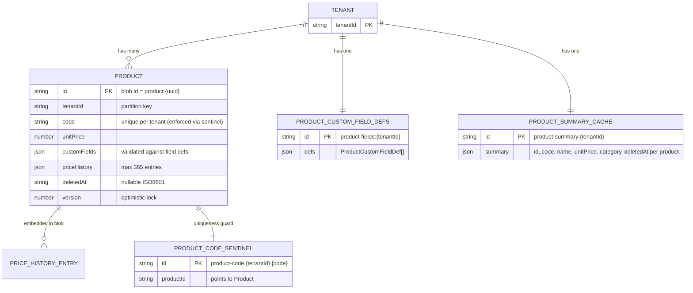

# feat: 商品マスター登録・管理・帳票参照機能

## Enhancement Summary

**Deepened on:** 2026-04-12
**Research agents used:** architecture-strategist, security-sentinel, performance-oracle, data-integrity-guardian, kieran-typescript-reviewer, julik-frontend-races-reviewer, best-practices-researcher, code-simplicity-reviewer, accessibility/UX learnings

### Key Improvements Over Initial Plan

1. **専用 ScalarDB テーブル** — `products` テーブルを独立させる（共有 blob テーブルへの group_key prefix は廃止）
2. **商品コードのユニーク制約** — O(n) スキャンをセンチネルレコード + ScalarDB トランザクションに置き換え
3. **`GenericJsonController` 再利用** — `ProductFieldsController.java` は不要（既存クラスを流用）
4. **`SystemGroupResolver` レジストリ** — V2BindingResolveController の __xx__ マジック文字列分岐を解消
5. **集約サマリー blob** — 商品一覧取得を N blob 読み込みから 1 blob 読み込みに削減（SLA 達成）
6. **TypeScript 型の修正** — `subscriptionPeriod: string | null`、`CustomFieldValue` union、Zod スキーマ
7. **フロントエンド競合制御** — ダイアログスナップショットパターン、per-entity 操作ロック
8. **セキュリティ強化** — カスタムフィールドのキー検証、レート制限、テナント所有権チェック
9. **価格履歴キャップ** — priceHistory は最大 365 エントリ
10. **削除後 SKU コード保留期間** — 論理削除後 90 日間は同一コードの再登録を禁止

---

## Overview

テナント単位で商品マスターを管理し、帳票テンプレートから参照できる機能を追加する。
商品の CRUD 管理UIをテナント設定モーダルに追加し、帳票デザイン時に2方式（単品ルックアップ・一覧表示）でデータを参照できるようにする。

主な特徴:
- 商品コード・名称・単価・カテゴリ等の基本フィールド＋カスタムフィールド
- 単価変更履歴（`priceHistory[]`）による帳票生成時点の正確な価格再現
- 論理削除（`deletedAt`）による安全な削除と過去帳票との整合性保持
- サブスクリプション対応（期間・価格単位フィールド）

---

## Problem Statement

現在の帳票スタジオには商品情報を事前定義して参照する機能がない。ユーザーは帳票ごとにデータソースへ手動入力する必要があり、同一商品情報の重複定義・更新漏れが発生している。商品マスターを一元管理することで、帳票作成の効率化と価格情報の正確性を担保する。

---

## Data Model

(see brainstorm: docs/brainstorms/2026-04-12-product-master-brainstorm.md#1-データモデル)

### TypeScript 型定義 (`src/types/index.ts` に追記)

```ts
// 税区分
export type TaxType = 'none' | 'standard' | 'reduced'

// ISO 8601 日付文字列（ブランド型で誤代入を防止）
export type ISODateString = string & { readonly __brand: 'ISODateString' }

// カスタムフィールドが取り得る値型（unknown は使わない）
export type CustomFieldValue = string | number | boolean | null

// 価格履歴エントリ（追記専用・削除/更新禁止）
export interface PriceHistoryEntry {
  price: number
  effectiveFrom: ISODateString
}

// カスタムフィールド定義
export interface ProductCustomFieldDef {
  key: string          // 英数字・ハイフン・アンダースコアのみ（__proto__ 等を禁止）
  label: string        // 表示名
  type: 'text' | 'number' | 'date' | 'boolean'
}

// 商品
export interface Product {
  id: string                               // UUID（システム生成）
  code: string                             // 商品コード（テナント内ユニーク）
  name: string
  unitPrice: number                        // 現在の単価（基準値）
  category: string
  description: string
  stockCount: number
  taxType: TaxType
  unit: string                             // 個/本/kg 等
  manufacturer: string
  subscriptionPeriod: string | null        // null = 非サブスクリプション（空文字は使わない）
  subscriptionPriceUnit: string | null
  customFields: Record<string, CustomFieldValue>
  priceHistory: PriceHistoryEntry[]        // 最大 365 エントリ（降順）
  deletedAt: ISODateString | null          // null = 有効
  createdAt: ISODateString
  updatedAt: ISODateString
  version: number                          // 楽観的排他制御用バージョン番号
}

// CRUD リクエスト型
export type CreateProductRequest = Omit<Product,
  'id' | 'createdAt' | 'updatedAt' | 'deletedAt' | 'priceHistory' | 'version'>

export type UpdateProductPayload = Partial<Pick<Product,
  'name' | 'code' | 'unitPrice' | 'category' | 'description' |
  'stockCount' | 'taxType' | 'unit' | 'manufacturer' |
  'subscriptionPeriod' | 'subscriptionPriceUnit' | 'customFields'>>

// テナントレベルの商品マスター定義
export interface ProductMasterDefinition {
  customFieldDefs: ProductCustomFieldDef[]
  products: Product[]
}
```

> **変更点（初期計画からの修正）:**
> - `subscriptionPeriod: string | null`（空文字センチネル廃止）
> - `customFields: Record<string, CustomFieldValue>`（`unknown` → 型付き union）
> - `effectiveFrom: ISODateString`（ブランド型）
> - `version: number` 追加（楽観的排他）
> - `UpdateProductPayload` 型エイリアスを独立定義

### Zod スキーマ (`src/lib/schemas/product.ts` — 新規ファイル)

```ts
import { z } from 'zod'

export const PriceHistoryEntrySchema = z.object({
  price: z.number().nonnegative(),
  effectiveFrom: z.string().regex(/^\d{4}-\d{2}-\d{2}$/),
})

export const ProductCustomFieldDefSchema = z.object({
  key: z.string().regex(/^[a-zA-Z0-9_-]+$/).min(1).max(64),
  label: z.string().min(1).max(100),
  type: z.enum(['text', 'number', 'date', 'boolean']),
})

export const ProductSchema = z.object({
  id: z.string().uuid(),
  code: z.string().regex(/^[a-zA-Z0-9_-]+$/).min(1).max(64),
  name: z.string().min(1).max(200),
  unitPrice: z.number().nonnegative(),
  category: z.string().max(100),
  description: z.string().max(2000),
  stockCount: z.number().int().nonnegative(),
  taxType: z.enum(['none', 'standard', 'reduced']),
  unit: z.string().max(20),
  manufacturer: z.string().max(200),
  subscriptionPeriod: z.string().max(50).nullable(),
  subscriptionPriceUnit: z.string().max(50).nullable(),
  customFields: z.record(
    z.string().regex(/^[a-zA-Z0-9_-]+$/),  // キー名のサニタイズ（__proto__ 等を禁止）
    z.union([z.string(), z.number(), z.boolean(), z.null()])
  ).optional().default({}),
  priceHistory: z.array(PriceHistoryEntrySchema).max(365),
  deletedAt: z.string().nullable(),
  createdAt: z.string(),
  updatedAt: z.string(),
  version: z.number().int().nonnegative(),
})

export type Product = z.infer<typeof ProductSchema>
```

### ERD



---

## Technical Approach

### Architecture

既存の TenantInfo パターンを踏襲しつつ、アーキテクチャレビューで指摘された問題を修正する:

- **バックエンド:** `ProductController.java` が **専用 `products` テーブル**（`JsonBlobRepository(factory, NAMESPACE, "products")`）を使用。カスタムフィールド定義は既存の `GenericJsonController` を再利用
- **コードユニーク制約:** センチネルレコード（`id="product-code:{tenantId}:{code}"`）を使い ScalarDB `DistributedTransaction` で O(1) チェック
- **一覧パフォーマンス:** `product-summary:{tenantId}` という集約サマリー blob を 1 件読み込むことで N 個の blob 読み込みを回避
- **帳票統合:** `SystemGroupResolver` インターフェースを導入し V2BindingResolveController を疎結合に保つ
- **フロントエンド state:** `productSlice.ts`（`src/store/admin/` に配置）

### Storage Layout (Dedicated `products` Table)

```
ScalarDB — "products" テーブル（専用、AppWiring で provisions）
├── id="product:{uuid}"         → Product blob（個別商品）
├── id="product:{uuid}"         → Product blob
├── id="product-code:{t}:{code}" → Sentinel blob（コードユニーク制約用）
├── id="product-code:{t}:{code}" → Sentinel blob
├── id="product-summary:{t}"    → Summary blob（一覧 API 高速化用）
└── id="product-fields:{t}"     → CustomFieldDef singleton blob
```

> **初期計画からの変更:** `group_key = "products:{tenantId}"` のプレフィックスではなく、エンティティ専用テーブルを使用（`templates`, `schemas`, `tenant` テーブルと同じ規約）

### Price Resolution Logic

```
帳票生成時の単価解決順序:
1. priceHistory[] が空でなければ →
   effectiveFrom ≤ reportDate の最新エントリの price を使用
   (LocalDate.parse はストリーム前に1回だけ実行 — ホットパスでの繰り返し parse を避ける)
2. priceHistory[] が空 → unitPrice を使用
3. reportDate が指定なし → 現在日付を使用

priceHistory エントリ上限: 365件。超過時は最古エントリをアーカイブ
```

### Code Uniqueness (Sentinel Pattern)

```java
// O(1) ユニークチェック（O(n) スキャンは使わない）
DistributedTransaction tx = manager.start();
try {
  String sentinelId = "product-code:" + tenantId + ":" + code;
  Optional<Result> existing = tx.get(Get.newBuilder()
    .namespace(NAMESPACE).table("products").partitionKey(Key.ofText("id", sentinelId)).build());
  if (existing.isPresent()) {
    tx.abort();
    ctx.status(409).json(Map.of("error", "DUPLICATE_CODE",
      "message", "この商品コードは既に使用されています"));
    return;
  }
  // sentinel + product の両方を同一 tx で write
  tx.put(sentinelRecord);
  tx.put(productRecord);
  tx.commit();
} catch (Exception e) {
  tx.abort();
  throw e;
}
```

---

## Implementation Phases

### Phase 1: データモデル & 型定義

**タスク:**
- [ ] `src/types/index.ts` に修正版の型定義を追記（`ISODateString` ブランド型、`CustomFieldValue` union、`version` フィールド、`subscriptionPeriod: string | null`）
- [ ] `src/lib/schemas/product.ts` を新規作成（Zod スキーマ群）
- [ ] 既存型との競合がないことを確認
- [ ] `npm run build` で型チェック通過

**成果物:** `src/types/index.ts`、`src/lib/schemas/product.ts`（新規）

---

### Phase 2: バックエンド実装

#### 2a. AppWiring.java — `products` テーブルの provisions 追加

**参考:** `AppWiring.java`（`tenantRepo` の provisions パターン）

```java
// AppWiring.java に追加
private static final String PRODUCTS_TABLE = "products";

JsonBlobRepository productRepo =
  new JsonBlobRepository(transactionFactory, NAMESPACE, PRODUCTS_TABLE);
productRepo.ensureTable(); // ScalarDB にテーブルが存在しなければ作成

ProductController productController = new ProductController(productRepo, objectMapper);
GenericJsonController productFieldsController =
  new GenericJsonController(productRepo, "product-fields", "[]");
  // ↑ ProductFieldsController.java は不要。GenericJsonController を流用
```

#### 2b. ProductController.java（新規）

**参考:** `V2TenantController.java:1-93`（全体構造）

```java
// server/src/main/java/com/report/server/ProductController.java
public class ProductController {

  // GET /api/v1/products → サマリー blob から一覧取得（N blob 読み込みではなく 1 blob）
  public void list(Context ctx) throws Exception {
    String tenantId = extractTenantId(ctx); // JWT から抽出
    String summaryId = "product-summary:" + tenantId;
    Optional<String> summaryJson = repo.get(summaryId);
    // サマリーがなければ空配列を返す
    ctx.json(summaryJson.orElse("[]"));
  }

  // GET /api/v1/products/{id} → 個別商品の全フィールド取得
  public void get(Context ctx) throws Exception { ... }

  // POST /api/v1/products → センチネルパターンでコード重複チェック + 登録
  // カスタムフィールドはフィールド定義に照合してバリデーション
  public void create(Context ctx) throws Exception {
    validateCustomFields(req.customFields, getFieldDefs(tenantId)); // 定義照合
    // sentinelパターン (上述) でコード重複チェック
    // 成功後: サマリー blob を更新
    updateSummary(tenantId);
  }

  // PUT /api/v1/products/{id} → 更新（version チェック + 楽観的排他）
  public void update(Context ctx) throws Exception {
    // 所有権確認: 取得した blob の tenantId == JWT の tenantId
    // version 不一致: 409 Conflict
    // unitPrice 変更: priceHistory 先頭に追記（上限 365 件チェック）
    // 成功後: サマリー blob を更新
  }

  // DELETE /api/v1/products/{id} → 論理削除
  public void softDelete(Context ctx) throws Exception {
    // 所有権確認
    // deletedAt = 現在時刻
    // コードセンチネルは削除しない（90 日間保留）
    // サマリー blob を更新
  }

  // コード保留チェック（削除後 90 日以内は 409）
  private boolean isCodeHeld(String tenantId, String code) {
    // sentinel blob に deletedAt が含まれ、かつ 90 日以内なら true
  }
}
```

**重要な追加事項（初期計画からの修正）:**

| 項目 | 初期計画 | 修正後 |
|------|----------|--------|
| コードユニーク | O(n) スキャン | センチネルレコード + DistributedTransaction |
| 一覧取得 | group_key スキャン | サマリー blob 1 件読み込み |
| フィールドコントローラー | `ProductFieldsController.java`（新規） | `GenericJsonController`（流用） |
| 所有権チェック | 不明確 | 全 PUT/DELETE で tenantId 照合必須 |
| 削除後コード保留 | なし | 90 日間保留 |
| バージョン管理 | `updatedAt` 比較 | `version` int + 409 on mismatch |

#### 2c. SystemGroupResolver.java（新規）— V2BindingResolveController の疎結合化

**参考:** `V2BindingResolveController.java:165-189`（現在のグループ処理）

```java
// インターフェース
public interface SystemGroupResolver {
  String getGroupId();
  Map<String, Object> resolve(ResolveParams params, Context ctx) throws Exception;
}

// 実装
public class ProductMasterResolver implements SystemGroupResolver {
  @Override public String getGroupId() { return "__productMaster__"; }
  @Override public Map<String, Object> resolve(...) {
    // mode=single: productCode で1件取得
    // mode=list: サマリー blob から全有効商品
    // 価格解決: ProductPriceResolver.resolvePrice(product, reportDate)
  }
}

// AppWiring でレジストリに登録
Map<String, SystemGroupResolver> systemGroupRegistry = Map.of(
  "__productMaster__", new ProductMasterResolver(productRepo)
);
// V2BindingResolveController のコンストラクタに注入
```

V2BindingResolveController のループは `systemGroupRegistry.get(groupId)` で委譲するだけ。**マジック文字列の直書きは禁止。**

#### 2d. ProductPriceResolver.java（新規）

```java
public static double resolvePrice(Product product, LocalDate reportDate) {
  // ホットパス最適化: ループ前に LocalDate.parse を1回だけ実行
  return product.getPriceHistory()
    .stream()
    .map(h -> Map.entry(LocalDate.parse(h.getEffectiveFrom()), h.getPrice()))
    .filter(e -> !e.getKey().isAfter(reportDate))
    .max(Map.Entry.comparingByKey())
    .map(Map.Entry::getValue)
    .orElse(product.getUnitPrice());
}
```

#### 2e. Caffeine キャッシュ — 帳票プレビュー最適化

```java
// V2BindingResolveController に追加
private final Cache<String, List<Product>> productListCache =
  Caffeine.newBuilder()
    .expireAfterWrite(30, TimeUnit.SECONDS)
    .maximumSize(1000)
    .build();

// ProductController.update/create/softDelete 呼び出し後に無効化
productListCache.invalidate(tenantId);
```

#### 2f. レート制限 — `/api/v1/products*` エンドポイント

```java
// ApiRoutes.java — 商品エンドポイントのレート制限
// 読み取り: 100 req/min per tenant
// 書き込み: 30 req/min per tenant
// 既存の /api/v2/templates/{id}/resolve-bindings のレート制限パターンを踏襲
```

#### 2g. ApiRoutes.java への追加

```java
app.get("/api/v1/products", productController::list, readRateLimit);
app.get("/api/v1/products/{id}", productController::get, readRateLimit);
app.post("/api/v1/products", productController::create, writeRateLimit);
app.put("/api/v1/products/{id}", productController::update, writeRateLimit);
app.delete("/api/v1/products/{id}", productController::softDelete, writeRateLimit);
app.get("/api/v1/products/fields", productFieldsController::get, readRateLimit);
app.put("/api/v1/products/fields", productFieldsController::put, writeRateLimit);
```

**成果物:** `AppWiring.java`（更新）、`ProductController.java`（新規）、`SystemGroupResolver.java`（新規）、`ProductMasterResolver.java`（新規）、`ProductPriceResolver.java`（新規）、`ApiRoutes.java`（更新）、`V2BindingResolveController.java`（更新：レジストリ委譲）

---

### Phase 3: フロントエンド Store

**参考:** `src/store/tenantSlice.ts:1-49`（完全に踏襲）

**配置:** `src/store/admin/productSlice.ts`（report 編集スライスと分離）

```ts
// src/store/admin/productSlice.ts

// per-entity 操作ロック（競合制御）
type ProductOp = 'idle' | 'saving' | 'deleting'

interface ProductSliceState {
  products: Product[]
  customFieldDefs: ProductCustomFieldDef[]
  productsLoading: boolean
  productsError: string | null
  productOps: Map<string, ProductOp>  // id → 操作状態
  fetchSeq: number                     // stale response 破棄用シーケンス番号
}

interface ProductSliceActions {
  fetchProducts: () => Promise<void>
  addProduct: (p: CreateProductRequest) => Promise<Product>
  updateProduct: (id: string, patch: UpdateProductPayload, expectedVersion: number) => Promise<void>
  deleteProduct: (id: string) => Promise<void>
  fetchCustomFieldDefs: () => Promise<void>
  updateCustomFieldDefs: (defs: ProductCustomFieldDef[]) => Promise<void>
  setProductOp: (id: string, op: ProductOp) => void
}
```

**学習事項の適用（`docs/solutions/performance-issues/zustand-store-batch-updates-and-state-leak-fixes.md`）:**
- `Set` ルックアップは `set()` の外で構築
- 一括操作は atomic な `set()` 1回で実行
- `Pick` で patch 型を whitelist 管理（→ `UpdateProductPayload` 型エイリアスを使用）

**stale response 対策:**
```ts
fetchProducts: async () => {
  const seq = get().fetchSeq + 1
  set(s => { s.fetchSeq = seq; s.productsLoading = true })
  const products = await getProducts()
  set(s => {
    if (s.fetchSeq !== seq) return  // stale response を破棄
    s.products = products
    s.productsLoading = false
  })
}
```

**成果物:** `src/store/admin/productSlice.ts`（新規）、`src/store/reportStore.ts`（admin スライス追加）

---

### Phase 4: API クライアント

**参考:** `src/lib/reportApi.ts:766-777`（TenantInfo 関数のパターン）

```ts
// src/lib/reportApi.ts に追加（Zod バリデーション付き）
import { ProductSchema, ProductCustomFieldDefSchema } from '@/lib/schemas/product'

export async function getProducts(): Promise<Product[]> {
  const res = await fetch('/api/v1/products', { headers: authHeaders() })
  if (!res.ok) throw new ApiError(res)
  return z.array(ProductSchema).parse(await res.json())
}

export async function createProduct(p: CreateProductRequest): Promise<Product> {
  const res = await fetch('/api/v1/products', {
    method: 'POST', headers: authHeaders(),
    body: JSON.stringify(p),
  })
  if (res.status === 409) throw new DuplicateCodeError()
  if (!res.ok) throw new ApiError(res)
  return ProductSchema.parse(await res.json())
}

export async function updateProduct(
  id: string,
  patch: UpdateProductPayload,
  expectedVersion: number
): Promise<Product> {
  const res = await fetch(`/api/v1/products/${id}`, {
    method: 'PUT', headers: { ...authHeaders(), 'If-Match': String(expectedVersion) },
    body: JSON.stringify(patch),
  })
  if (res.status === 409) throw new ConflictError()
  if (!res.ok) throw new ApiError(res)
  return ProductSchema.parse(await res.json())
}

export async function deleteProduct(id: string): Promise<void> { ... }
export async function getProductCustomFieldDefs(): Promise<ProductCustomFieldDef[]> { ... }
export async function putProductCustomFieldDefs(defs: ProductCustomFieldDef[]): Promise<void> { ... }
```

**成果物:** `src/lib/reportApi.ts`（更新）

---

### Phase 5: 管理UI

**参考:** `src/components/modals/TenantInfoTab.tsx:1-256`（フォーム構造）、`src/components/modals/DataBindingModal.tsx:11-20`（タブ追加パターン）

**適用する学習事項:**
- モーダルの visible/tab 状態は `useState` ではなく Zustand に保持（`docs/solutions/feature-implementation/sidebar-ui-reorganization-databinding-modal-templates.md`）
- ARIA roles: `tablist`, `tab`, `tabpanel` + 矢印キーでのタブ切り替え（`docs/solutions/ui-bugs/accessibility-aria-keyboard-navigation.md`）
- 破壊的操作（削除）には確認ダイアログを必ず表示（`docs/solutions/ui-bugs/sidebar-panel-ux-master-hf-localization.md`）
- カスタムフィールドキー名の XSS 禁止リスト適用（`docs/solutions/security-issues/xss-prototype-pollution-image-validation.md`）

#### 5a. ProductMasterTab.tsx（新規）

```tsx
// src/components/modals/ProductMasterTab.tsx

// ⚠️ 競合制御パターン（julik-frontend-races-reviewer 指摘）:
// - customFieldDefs は useState でスナップショット（ダイアログ開時に固定）
// - 削除ボタンは per-row isDeleting フラグで即時無効化
// - fetchProducts と addProduct の競合: fetchSeq で stale response を破棄

export function ProductMasterTab() {
  const { products, fetchProducts } = useProductStore()
  const [editingProduct, setEditingProduct] = useState<Product | null>(null)
  const [isAddOpen, setIsAddOpen] = useState(false)

  // 破壊的操作の確認
  const handleDelete = async (product: Product) => {
    const confirmed = window.confirm(
      `商品「${product.name}」を削除しますか？\n` +
      `削除後 90 日間は同じ商品コードは使用できません。`
    )
    if (!confirmed) return
    // per-entity ロック確認
    if (getProductOp(product.id) !== 'idle') return
    setProductOp(product.id, 'deleting')
    await deleteProduct(product.id)
    setProductOp(product.id, 'idle')
  }

  return (
    <div role="tabpanel" aria-labelledby="tab-product-master">
      {/* カスタムフィールド定義セクション */}
      <CustomFieldDefsSection />

      {/* 商品一覧 */}
      <div>
        <input
          type="search"
          placeholder="商品コード・商品名で検索"
          aria-label="商品を検索"
          onChange={e => setSearch(e.target.value)}
        />
        <button onClick={() => setIsAddOpen(true)}>追加</button>

        <table aria-label="商品一覧">
          <thead>
            <tr>
              {['code', 'name', 'category', 'unitPrice'].map(col => (
                <th
                  key={col}
                  onClick={() => toggleSort(col)}
                  aria-sort={sortCol === col ? sortDir : 'none'}
                  style={{ cursor: 'pointer' }}
                >
                  {COLUMN_LABELS[col]}
                </th>
              ))}
              <th>操作</th>
            </tr>
          </thead>
          <tbody>
            {filteredProducts.map(p => (
              <tr key={p.id}>
                <td>{p.code}</td>
                <td>{p.name}</td>
                <td>{p.category}</td>
                <td>{p.unitPrice.toLocaleString('ja-JP')}円</td>
                <td>
                  <button
                    onClick={() => setEditingProduct(p)}
                    disabled={getProductOp(p.id) !== 'idle'}
                    aria-label={`${p.name}を編集`}
                  >
                    編集
                  </button>
                  <button
                    onClick={() => handleDelete(p)}
                    disabled={getProductOp(p.id) !== 'idle'}
                    aria-label={`${p.name}を削除`}
                  >
                    削除
                  </button>
                </td>
              </tr>
            ))}
          </tbody>
        </table>
      </div>

      {(editingProduct || isAddOpen) && (
        <ProductEditDialog
          product={editingProduct}  // null = 新規追加
          onClose={() => { setEditingProduct(null); setIsAddOpen(false) }}
        />
      )}
    </div>
  )
}
```

#### 5b. ProductEditDialog.tsx（新規）

```tsx
// src/components/modals/ProductEditDialog.tsx

// ⚠️ スナップショットパターン（julik-frontend-races-reviewer 指摘）:
// customFieldDefs と product の両方をダイアログ開時に useState でスナップショット。
// バックグラウンドの fetchProducts/fetchCustomFieldDefs が store を更新しても
// 入力中のフォームは再レンダリングされない。

export function ProductEditDialog({ product, onClose }: Props) {
  // ダイアログ開時のスナップショット（store の更新に引きずられない）
  const [frozenDefs] = useState(() => store.getState().customFieldDefs)
  const [form, setForm] = useState<UpdateProductPayload>(() =>
    product ? { ...product } : DEFAULT_PRODUCT_FORM
  )
  const [isSubmitting, setIsSubmitting] = useState(false)

  const handleSave = async () => {
    setIsSubmitting(true)
    try {
      if (product) {
        // version を渡して楽観的排他チェック
        await updateProduct(product.id, form, product.version)
      } else {
        await addProduct(form as CreateProductRequest)
      }
      onClose()
    } catch (e) {
      if (e instanceof ConflictError) {
        alert('他のユーザーが同じ商品を更新しました。最新データを確認してから再試行してください。')
      } else if (e instanceof DuplicateCodeError) {
        setError('code', 'この商品コードは既に使用されています')
      } else {
        toast.error('保存に失敗しました。再試行してください。')
      }
    } finally {
      setIsSubmitting(false)
    }
  }

  return (
    <dialog role="dialog" aria-modal="true"
      aria-label={product ? '商品を編集' : '商品を追加'}>
      {/* 基本フィールド */}
      <label>商品コード *<input value={form.code} onChange={...} required /></label>
      <label>商品名 *<input value={form.name} onChange={...} required /></label>
      <label>単価<input type="number" min="0" value={form.unitPrice} onChange={...} /></label>
      <label>税区分
        <select value={form.taxType} onChange={...}>
          <option value="none">非課税</option>
          <option value="standard">標準税率</option>
          <option value="reduced">軽減税率</option>
        </select>
      </label>
      {/* ...他のフィールド */}

      {/* カスタムフィールド（frozenDefs を使用） */}
      {frozenDefs.map(def => (
        <DynamicFieldInput key={def.key} def={def}
          value={form.customFields?.[def.key] ?? null}
          onChange={v => setForm(f => ({
            ...f,
            customFields: { ...f.customFields, [def.key]: v }
          }))}
        />
      ))}

      {/* 価格履歴（読み取り専用） */}
      {product && product.priceHistory.length > 0 && (
        <details>
          <summary>単価変更履歴（{product.priceHistory.length}件）</summary>
          <table aria-label="単価変更履歴">
            {product.priceHistory.map((h, i) => (
              <tr key={i}>
                <td>{h.effectiveFrom}</td>
                <td>{h.price.toLocaleString('ja-JP')}円</td>
              </tr>
            ))}
          </table>
        </details>
      )}

      <button onClick={handleSave} disabled={isSubmitting}>保存</button>
      <button onClick={onClose} disabled={isSubmitting}>キャンセル</button>
    </dialog>
  )
}
```

#### 5c. テナント設定モーダルへのタブ追加

テナント設定モーダルのファイル（TenantInfoTab.tsx を含むモーダル）を特定し:

```ts
// ARIA 準拠のタブ追加パターン（DataBindingModal.tsx:11-20 踏襲）
type TabId = 'tenant-info' | 'product-master'  // 既存タブに追加

const TABS = [
  { id: 'tenant-info' as TabId, label: 'テナント情報' },
  { id: 'product-master' as TabId, label: '商品マスター' },
]

// タブリスト: role="tablist" + 矢印キーローテーション
// タブコンテンツ: role="tabpanel" + hidden 属性
{activeTab === 'product-master' && <ProductMasterTab />}
```

**成果物:** `src/components/modals/ProductMasterTab.tsx`（新規）、`src/components/modals/ProductEditDialog.tsx`（新規）、テナント設定モーダル（更新）

---

### Phase 6: 帳票統合

(see brainstorm: docs/brainstorms/2026-04-12-product-master-brainstorm.md#4-帳票参照方式)

#### 6a. SchemaDefinition システムグループ

**フロントエンド（`src/store/schemaSlice.ts`）:**

```ts
// システムグループ識別定数（文字列リテラルの直書きを禁止）
export const SYSTEM_GROUP_PRODUCT_MASTER = '__productMaster__' as const

// アプリ起動時に自動挿入（既存チェック付き）
function ensureSystemGroups(state: SchemaState) {
  const exists = state.schema.groups.some(g => g.id === SYSTEM_GROUP_PRODUCT_MASTER)
  if (!exists) {
    state.schema.groups.push({
      id: SYSTEM_GROUP_PRODUCT_MASTER,
      name: '商品マスター',
      role: 'master',
      isSystem: true,  // UIで削除・名称変更不可
      fields: buildProductSchemaFields(),  // Product の各フィールドを SchemaField に変換
    })
  }
}

// システムグループの削除・名称変更をガード
export function isSystemGroup(id: string): boolean {
  return id === SYSTEM_GROUP_PRODUCT_MASTER  // 完全一致のみ（prefix/suffix マッチ禁止）
}
```

#### 6b. V2BindingResolveController.java 更新（SystemGroupResolver レジストリ使用）

```java
// 既存の group イテレーションループ内（165-189 付近）
for (SchemaGroup group : schema.getGroups()) {
  SystemGroupResolver sysResolver = systemGroupRegistry.get(group.getId());
  if (sysResolver != null) {
    // システムグループはレジストリに委譲
    result.putAll(sysResolver.resolve(resolveParams, ctx));
    continue;
  }
  // ... 既存の ScalarDB テーブル解決ロジック（変更なし）
}
```

**成果物:** `SystemGroupResolver.java`（新規）、`ProductMasterResolver.java`（新規）、`ProductPriceResolver.java`（新規）、`V2BindingResolveController.java`（更新）、`schemaSlice.ts`（更新）

---

## System-Wide Impact

### Interaction Graph

```
ProductMasterTab → productSlice.updateProduct(id, patch, version)
  → reportApi.updateProduct(id, patch, version) [If-Match: version]
    → PUT /api/v1/products/{id}
      → ProductController.update() [version check + tenantId ownership assert]
        → DistributedTransaction: read current → version check → write
          → productRepo.put() [products テーブル専用]
          → productListCache.invalidate(tenantId)
          → updateSummary(tenantId)  // サマリー blob 更新

DataBindingModal(__productMaster__) → V2BindingResolveController.resolve()
  → systemGroupRegistry.get("__productMaster__") → ProductMasterResolver
    → productListCache.get(tenantId) or productRepo.get("product-summary:{tenantId}")
      → ProductPriceResolver.resolvePrice(product, reportDate)
        → LivePreviewData として返却
```

### Error & Failure Propagation

| エラー | 場所 | フロント対処 |
|--------|------|------------|
| 商品コード重複 | `ProductController.create()` → 409 | ProductEditDialog: フィールドエラー表示 |
| version 不一致（楽観的排他） | `ProductController.update()` → 409 | ProductEditDialog: "他のユーザーが更新しました" ダイアログ |
| 論理削除済み商品の帳票参照 | `ProductMasterResolver` | フィールドに `null` + `__stale__` メタフラグ |
| 削除済みカスタムフィールド参照 | `ProductMasterTab` | "N/A" 表示（ブロックしない） |
| priceHistory 空 + reportDate 指定 | `ProductPriceResolver` | `unitPrice` フォールバック（エラーにしない） |
| ScalarDB タイムアウト | `ProductController` → 503 | toast.error("サーバーエラー。再試行してください") |
| カスタムフィールド型不一致 | `ProductController.create/update()` → 422 | ProductEditDialog: フィールドエラー表示 |
| レート制限超過 | ApiRoutes → 429 | toast.error("リクエストが多すぎます。しばらく待ってから再試行してください") |

### State Lifecycle Risks

- **同時編集:** `version` int + If-Match で楽観的排他制御。`put()` の rows_affected=0 で 409 返却
- **カスタムフィールド定義削除:** 既存商品の `customFields` に孤立キーが残る → **書き込み時に孤立キーを strip** してブロブ肥大化を防ぐ
- **単価変更の原子性:** `unitPrice` 変更検知 → `priceHistory` 追記 → 保存を1 DistributedTransaction で実行
- **サマリー blob 更新の原子性:** Product blob 更新と同一 tx でサマリーを更新（読み取り専用のサマリーが旧データを返すウィンドウを最小化）
- **コードセンチネルの削除後保留:** sentinel blob は削除せず `deletedAt` タイムスタンプを記録。90 日経過後に物理削除可能

### API Surface Parity

- 商品参照は `resolve-bindings` API 経由（`/api/v2/templates/{id}/resolve-bindings`）で統一
- 管理 CRUD は `/api/v1/products` — テナント認証済みユーザーのみ
- カスタムフィールド定義の変更は全テナントユーザーの帳票デザイン画面に即時反映

### Integration Test Scenarios

1. **価格変更後の帳票再生成:** 単価 1000→2000 に変更後、過去日付で帳票生成 → priceHistory から 1000 円が解決されること
2. **楽観的排他の競合検知:** 同一商品を2セッションで同時編集 → 後発のセッションが 409 を受け取り警告ダイアログを表示すること
3. **カスタムフィールド追加 → 商品編集 → 帳票参照:** 新規フィールド定義 → 商品に値設定 → `__productMaster__` グループでフィールドが解決されること
4. **商品コード重複登録:** 同一コードで2件目を POST → 409 + フィールドエラー表示されること
5. **削除後 90 日コード保留:** 商品削除後に即座に同一コードで登録 → 409 + "90 日間使用できません" エラーが返ること

---

## Acceptance Criteria

### 機能要件

**管理UI:**
- [ ] テナント設定モーダルに「商品マスター」タブが存在する（ARIA `tablist`/`tab`/`tabpanel` 準拠）
- [ ] 商品一覧で code / name を対象に検索できる
- [ ] code, name, category, unitPrice カラムでクライアントサイドソートができる
- [ ] [追加]ボタンでサブモーダルが開き、全フィールドを入力して保存できる
- [ ] [編集]ボタンで既存商品を編集できる（単価変更時に priceHistory が自動追記される）
- [ ] [削除]ボタンで確認ダイアログ後に論理削除される（一覧から消える）
- [ ] カスタムフィールド定義の追加/削除ができる（削除時は確認ダイアログを表示）
- [ ] 商品コード重複時にフィールドレベルエラー "この商品コードは既に使用されています" が表示される
- [ ] 別セッションとの version 衝突時に "他のユーザーが更新しました" ダイアログが表示される

**帳票統合:**
- [ ] SchemaPanel に `__productMaster__` システムグループが表示される（削除・名称変更不可）
- [ ] 単品ルックアップ: 商品コードをパラメータとして商品フィールドが帳票に展開される
- [ ] リスト表示: `formTable`/`table` の data source に product_master を指定すると全有効商品が行として展開される
- [ ] 論理削除済み商品を参照するバインドは null 値を返し、プレビューに警告が表示される

**価格履歴:**
- [ ] 単価を変更して保存すると priceHistory に旧価格エントリが追記される
- [ ] 帳票生成時に `reportDate` を指定すると、その日付以前の最新価格が適用される
- [ ] priceHistory が空の場合は unitPrice にフォールバックされる
- [ ] priceHistory が 365 件を超えた場合、古いエントリがアーカイブされ上限が保たれる

**コード保留:**
- [ ] 論理削除後 90 日以内は同一コードでの再登録が 409 で拒否される

### 非機能要件

- [ ] 商品 500 件での一覧表示・検索が体感 1 秒以内（サマリー blob 方式）
- [ ] バックエンドの全エンドポイントに認証ガード + テナント所有権チェック適用
- [ ] 全 PUT/DELETE はテナント所有権を re-fetch して確認（クライアント提供の tenantId は信用しない）
- [ ] `/api/v1/products*` にレート制限: 読み取り 100 req/min、書き込み 30 req/min（per tenant）
- [ ] ScalarDB 列名変更に対して位置依存バインドを使用しない（`docs/solutions/integration-issues/scalardb-column-ordering-positional-binding-mismatch.md`）
- [ ] カスタムフィールドキー名に `__proto__`、`constructor`、`prototype` を禁止
- [ ] 全 UI ラベル・メッセージが日本語

### Quality Gates

- [ ] フロントエンド型チェック: `npm run build` 0 errors
- [ ] バックエンドビルド: `npm run build:backend` 0 errors
- [ ] フロントエンドテスト: `priceHistory` 解決・`fetchSeq` 競合制御・Zod バリデーションのユニットテスト追加（カバレッジ 80%+）
- [ ] バックエンドテスト: ProductController の CRUD・センチネル重複チェック・論理削除・90 日保留・version 衝突の JUnit テスト追加

---

## Dependencies & Prerequisites

- `JsonBlobRepository` が `products` 専用テーブルとして AppWiring に provisioned されていること
- `GenericJsonController` が存在すること（カスタムフィールド定義 singleton 用）
- テナント設定モーダルのファイル特定（`TenantInfoTab.tsx` を含むモーダルコンポーネント）
- Caffeine キャッシュが build.gradle の依存に追加されていること
- `V2BindingResolveController` への `SystemGroupResolver` 注入が `AppWiring` で行われていること

---

## Risk Analysis & Mitigation

| リスク | 確率 | 影響 | 対策 |
|--------|------|------|------|
| AppWiring.java の `products` テーブル provisions パターンが不明 | 低 | 中 | `tenantRepo` の provisioning コードをそのまま複製 |
| `GenericJsonController` が期待通りの singleton get/put を提供しない | 低 | 低 | `V2TenantController` の実装に fallback |
| ScalarDB `DistributedTransaction` でのセンチネル書き込みが重い | 中 | 中 | commit に 10-50ms 追加。create は書き込み操作なので許容範囲 |
| Caffeine cache と ScalarDB の整合性（cache miss 時の cold start） | 低 | 低 | 30s TTL + 書き込み時 invalidate で整合性確保 |
| `SystemGroupResolver` レジストリパターンの過度な抽象化 | 低 | 低 | 実装は ProductMasterResolver 1 件のみ。Map.of() で十分シンプル |
| 商品 500 件超でクライアントサイドソートが重くなる | 中 | 低 | 500 件を hard ceiling として API コントラクトに明記 |

---

## Out of Scope

(see brainstorm: docs/brainstorms/2026-04-12-product-master-brainstorm.md#out-of-scope-yagni)

- CSV インポート/エクスポート（フェーズ2以降）
- 商品画像のアップロード
- 商品間の親子関係
- 複数通貨対応
- 外部ECシステムとの同期
- サーバーサイドフィルタリング（〜500 件は client-side で対応）

---

## Sources & References

### Origin

- **Brainstorm document:** [docs/brainstorms/2026-04-12-product-master-brainstorm.md](docs/brainstorms/2026-04-12-product-master-brainstorm.md)
  - Key decisions carried forward: 独立エンドポイント（Option B）、テナントスコープ、サブモーダル編集UI、priceHistory[] による価格履歴管理、論理削除

### Internal References

- Store スライスパターン: `src/store/tenantSlice.ts:1-49`
- 管理UIテンプレート: `src/components/modals/TenantInfoTab.tsx:1-256`
- タブ追加パターン: `src/components/modals/DataBindingModal.tsx:11-20`
- バックエンドコントローラーパターン: `server/src/main/java/com/report/server/V2TenantController.java:1-93`
- ストレージ層: `server/src/main/java/com/report/server/JsonBlobRepository.java:70-109`
- バインド解決: `server/src/main/java/com/report/server/V2BindingResolveController.java:165-189`
- ルート登録: `server/src/main/java/com/report/server/ApiRoutes.java:250-252`
- AppWiring（DI・provisions）: `server/src/main/java/com/report/server/AppWiring.java`
- GenericJsonController（再利用）: `server/src/main/java/com/report/server/GenericJsonController.java`（存在確認要）

### Institutional Learnings Applied

- ScalarDB 列順序バグ（**重要**）: `docs/solutions/integration-issues/scalardb-column-ordering-positional-binding-mismatch.md`
- Zustand バッチ更新パターン: `docs/solutions/performance-issues/zustand-store-batch-updates-and-state-leak-fixes.md`
- モーダル/タブ UI パターン: `docs/solutions/feature-implementation/sidebar-ui-reorganization-databinding-modal-templates.md`
- アクセシビリティ・ARIA: `docs/solutions/ui-bugs/accessibility-aria-keyboard-navigation.md`
- 確認ダイアログ・日本語ローカライズ: `docs/solutions/ui-bugs/sidebar-panel-ux-master-hf-localization.md`
- XSS・prototype pollution 防止: `docs/solutions/security-issues/xss-prototype-pollution-image-validation.md`
