# ユーザー操作マニュアル

Report Studio の画面と操作を、利用者の視点で説明します。起動方法は [導入方法](./setup.md) を参照してください。本マニュアルの画面ショットと動画は、実際にアプリを操作して撮影したものです（サンプルテンプレート「御見積書」を使用）。

## 図解で見る基本フロー

ログイン → テンプレートを選ぶ → 編集 → プレビュー → バインド → 出力 → 回答/ステータス管理、という一連の流れです。


---

## 1. 画面構成とナビゲーション

ログイン後、画面上部に常時表示されるタブで各機能を切り替えます。

| タブ | 用途 |
|------|------|
| **デザイン** | 帳票テンプレートを編集するエディタ |
| **バインド** | 要素 ↔ スキーマフィールド ↔ データベースを結線する |
| **テンプレート管理** | テンプレート一覧の管理・バリアント設定 |
| **回答** | フォーム回答の一覧・ステータス管理・一括 PDF |
| **データブラウザ** | ScalarDB テーブル・商品マスター・回答データの閲覧/編集 |
| **管理** | ユーザー・サーバー・テナント情報・デフォルトスタイル（`admin` ロール必須） |

タブは矢印キー / Home / End でも移動できます。デザインタブはタブを切り替えても編集状態が保持されます。

### デザインタブのレイアウト

- **上部ツールバー**: ファイル操作・編集・表示・ズーム・エクスポート・ユーザーメニュー。
- **左サイドバー**（アイコンで切替）: **要素**（パレット）/ **レイヤー** / **ページ** / **スキーマ**。
- **中央キャンバス**: 帳票を編集する領域。要素が無いときはオンボーディングが表示されます。
- **右サイドバー**: **プロパティ** / **バージョン** / **ページ設定**。
- **下部ステータスバー**: ズーム率や「要素を選択してください」を表示。

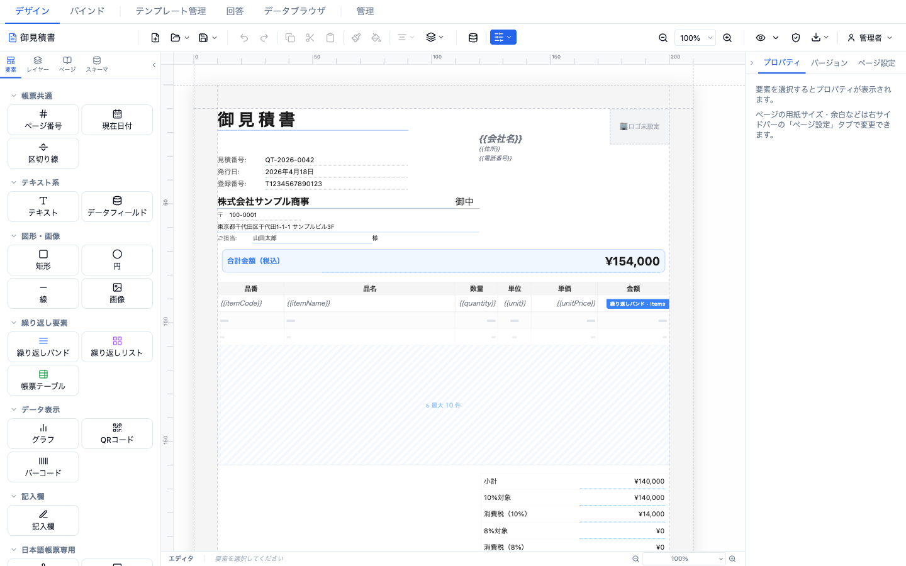

> キャンバス上の `{{itemCode}}` `{{itemName}}` などが `{{fieldKey}}` トークンです。青い「繰り返しバンド · items」バッジは、明細行がデータソースに紐付いていることを示します。

---

## 2. テンプレート編集

### 2.1 テンプレートを始める

空のキャンバスには **「帳票づくりを始めましょう」** のオンボーディングが表示され、**テンプレートから始める** / **白紙のまま作る** を選べます。左のパレットから要素をドラッグして配置することもできます。

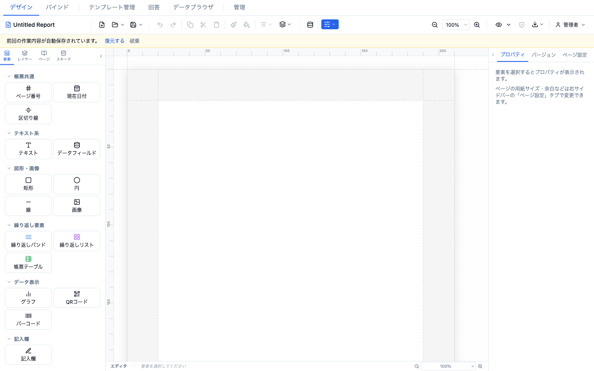

ツールバーの **新規作成**（または **サーバーのテンプレートを開く**）をクリックすると、テンプレート選択モーダルが開きます。

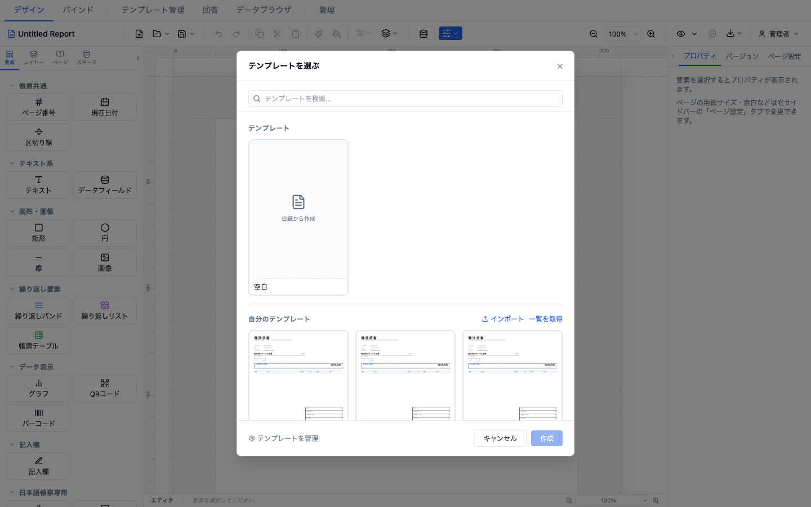

- 検索ボックス（**テンプレートを検索...**）、カテゴリチップ、タグフィルタで絞り込み。
- セクション: **テンプレート**（**空白 / 白紙から作成** カードを含む）/ **自分のテンプレート** / **公開テンプレート**。
- テンプレートを選んで **作成** すると、帳票がキャンバスに展開されます。

### 2.2 要素パレット

左サイドバーの **要素** タブから、要素をキャンバスへドラッグして配置します。要素は 24 種類あり、カテゴリ別に整理されています。

| カテゴリ | 要素 |
|---------|------|
| 帳票共通 | ページ番号（書式選択可）、現在日付（和暦対応）、区切り線 |
| テキスト系 | テキスト（`{{fieldKey}}` の埋め込み可・ラベルにも使用）、データフィールド（データソースの項目を表示） |
| 図形・画像 | 矩形、円、線、画像 |
| 繰り返し要素 | 繰り返しバンド（明細行）、繰り返しリスト（カード/グリッド）、帳票テーブル（行列定義・データバインド対応） |
| データ表示 | グラフ、QRコード、バーコード |
| 記入欄 | 記入欄（手書き記入用）、チェックボックス、元号選択（明/大/昭/平/令） |
| 日本語帳票専用 | 印鑑、多段印鑑欄、収入印紙欄 |
| テナント情報 | 会社名、住所、電話番号、代表者名、ロゴ、カスタムフィールド（テナント設定から自動入力） |

> **スキーマフィールドの直接配置**: 左サイドバーの **スキーマ** タブからは、スキーマフィールドを直接キャンバスへドラッグしてバインド済み要素を作れます（マスターは青「マスター」、明細は橙「↻ 明細」、計算フィールドは「fx」バッジ）。グループ全体を繰り返しバンドにドラッグすることも可能です。

### 2.3 プロパティパネル

要素を選択すると、右サイドバーの **プロパティ** タブに設定が表示されます（要素タイプごとに異なります）。共通セクション:

- **位置・サイズ**: x / y / 幅 / 高さ（数値入力）。
- **要素**: 要素名（レイヤー表示用）、表示/非表示、**ロック**、印刷対象フラグ、**条件表示** の編集。
- **検証エラー** / **バリアント非表示** などの状態表示。

何も選択していないときは「要素を選択するとプロパティが表示されます。」と表示されます。

### 2.4 選択・移動・リサイズ・整列

キャンバス操作とツールバー、キーボードショートカットで行います。

- **編集**: 元に戻す/やり直す（⌘Z / ⌘⇧Z / ⌘Y）、コピー/切り取り/貼り付け（⌘C / ⌘X / ⌘V）、複製（⌘D）、全選択（⌘A）、削除（Delete / Backspace、トーストで元に戻せます）。
- **スタイルのコピー/貼り付け**: 書式だけを別要素へ複製。
- **整列**（2 つ以上選択時）: 左/水平中央/右揃え、上/垂直中央/下揃え、水平/垂直の均等配置。
- **重ね順**: 最前面へ / 前面へ / 背面へ / 最背面へ。
- **矢印キーで微調整**: 1px（Shift + 矢印で 5px）。スナップ有効時はグリッドに吸着。
- **リサイズ**: 要素の 8 方向ハンドルをドラッグ。

### 2.5 ページとセクション

- **ページ** タブ: ページの追加・名称変更・削除、クリックでアクティブページ切替。
- **ページ設定** タブ: ページ名、用紙サイズ（カスタム mm 可）、用紙方向（縦/横）、余白（プリセット 標準/狭い/最小/なし + 各辺 mm）、ヘッダー/フッター高さ、背景色。
  - **メタデータ**（折りたたみ）: バージョン、帳票種別、説明、適用規制・基準、有効開始日/終了日、カテゴリ、タグ。
  - **採番設定**（折りたたみ）: プレフィックス、桁数、サフィックス、年次リセット、「次の番号」プレビュー。テキストに `{{documentNumber}}` で埋め込み。
- **マスターヘッダー/フッター**: ツールバーの表示メニューから編集モードに入り、Escape で離脱します。

### 2.6 表示・グリッド・スナップ・ズーム

- **表示メニュー**: グリッド表示、スナップ、トンボ、余白ガイド、ヘッダー/フッター編集モード。
- **ズーム**: ボタン / 数値入力 / プリセット（25〜200%）、横幅フィット / ページ全体フィット。ショートカット ⌘= / ⌘- / ⌘0。エディタとプレビューのズームが異なると警告と **プレビューをエディタに同期** が表示されます。

### 2.7 自動保存と復元

- 編集内容は 1 秒デバウンスで `localStorage` にユーザー別で自動保存され、**「自動保存済み HH:MM」** と表示されます。
- 再読み込み時に下書きがあると **「前回の作業内容が自動保存されています。」** と表示され、**復元する** / **破棄** を選べます。
- 未保存のままタブを閉じようとすると警告が出ます（ツールバーに橙のドットも表示）。

---

## 3. データ設計（バインド）

**バインド** タブは、要素・スキーマ・データベースを結ぶ 3 ペイン構成です。

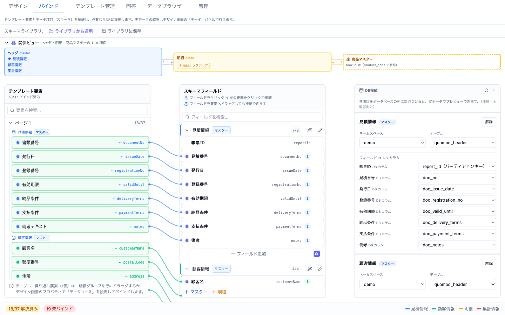

> 左の「テンプレート要素」と中央の「スキーマフィールド」が曲線で結線され、右の「DB接続」で各フィールドを `demo.quomod_header` などの列に対応づけます。上部の関係ビューは ヘッダ（master）・明細（detail）・商品マスター（lookup）の関係を示します。

- **左（要素）**: テンプレートの要素をページ別に一覧。バインド済み状態を表示。
- **中央（スキーマフィールド）**: フッターの **+ マスター** / **+ 明細** でスキーマグループを追加。各グループにフィールドを追加し、明細グループには 親マスター を設定できます。
  - 結線方法は 2 通り: ①フィールドをクリック → 要素をクリック、②フィールドを要素にドラッグ。
- **右（DB接続）**: スキーマグループの各項目を **ScalarDB テーブルの列** に対応づけ（任意・上級者向け）。テーブル作成フォームも利用できます。「各項目をデータベースの列に対応づけると、実データでプレビューできます。」

**関係ビューの操作**（上部）:
- グループ名をクリックすると、中央のスキーマフィールドの該当グループへジャンプします（自動で展開し、一時的にハイライト表示）。
- 明細グループの **商品ルックアップ** ボタンで、明細の指定列を商品マスターに紐付けられます（例: 明細.`itemCode` → 商品マスター.`code`）。設定済みのルックアップはマッピング内容がツールチップで確認できます。

**スキーマライブラリ**: **ライブラリから適用** / **ライブラリに保存** で、スキーマ定義を再利用できます。

**計算フィールド（JEXL）**: **計算フィールドを編集** ダイアログで、フィールド名（英数字とアンダースコアのみ）と計算式（JEXL）を入力します。式にエラーがあると保存前に警告されます。左パネルの関数をクリックすると詳細が表示されます。

### サンプルデータ・プレビューデータ

ツールバーの **データ設定** モーダル → **テンプレートデータ** タブで設定します。

- **サンプルデータ**: `{{fieldKey}}` の参照に使用。
- **プレビューデータ**: プレビューモードで表示するデータ（省略時はサンプルデータを使用）。

---

## 4. プレビューと出力

### プレビュー

- **ライブプレビュー**（目のアイコン）: キャンバス横にプレビューペインを開きます（**プレビューを広げる** / **標準幅に戻す**）。全ページを読み取り専用でレンダリングします。
- **フルプレビュー（PDF）**: サーバー生成の PDF プレビュー（「PDF生成中...」）。

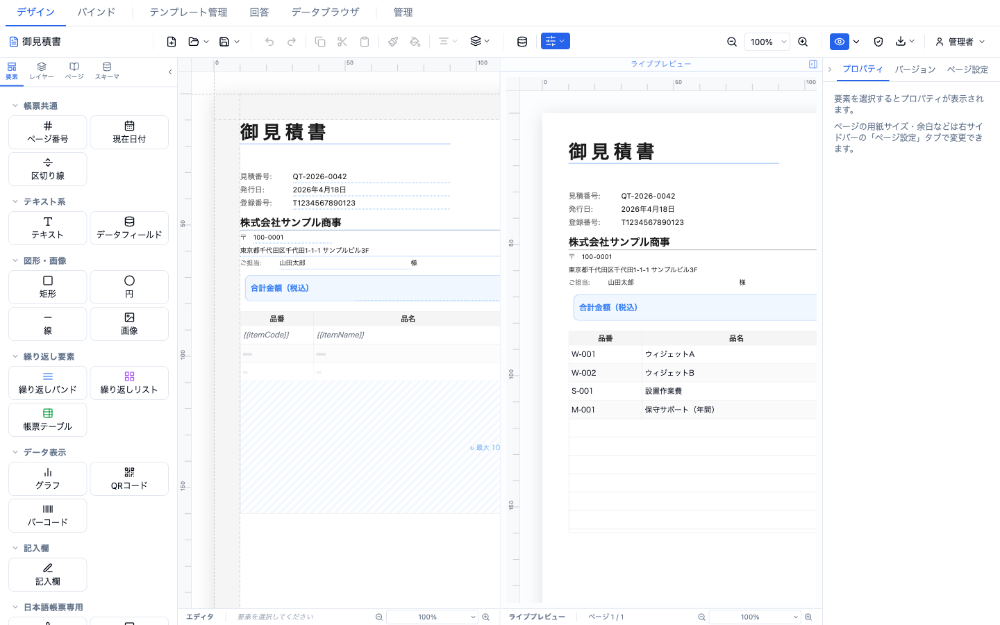

> 左（設計）の `{{itemCode}}` / `{{itemName}}` が、右（プレビュー）では実データ（W-001 ウィジェットA など）に解決されます。両者は同じデータに対して解決されるため、値は一致します。

### エクスポート（ダウンロードアイコン）

| メニュー | 内容 |
|---------|------|
| **PDF（現在の編集内容・高品質）** | サーバー側ベクター PDF（推奨） |
| **Excel（帳票データ・サーバー生成）** | XLSX |
| **CSV（帳票データ）** | CSV |
| **PNG（現在のページ・画像）** | クライアント画像出力（アクティブページ） |
| **PDF（サーバー保存版から再生成）** | 保存済みテンプレートから再生成（未保存の編集は反映されない） |

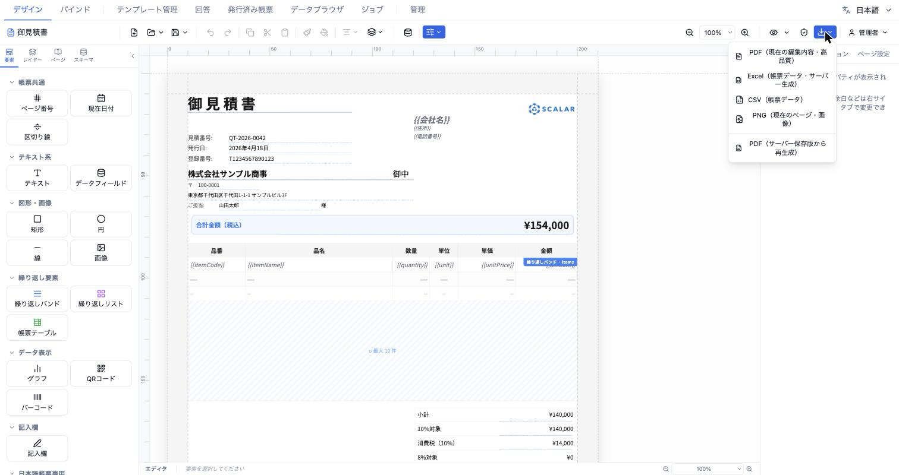

### 出力バリアント（宛先別マスキング）

PDF 出力前に **PDF出力バリアント** ダイアログで **なし（すべて表示）** または名前付きバリアントを選べます。各バリアントは 対象者 と 非表示 N / マスク N を表示します。

バリアントは **テンプレート管理 → バリアント設定** ウィザードで作成します: 基本情報（バリアント名・対象者）→ 非表示要素の選択 → マスクする要素（伏せ字：完全置換 or 部分マスク）→ 確認。「同じテンプレートから宛先ごとに異なるPDFを出力できます。」

### バリデーション

ツールバーのシールドボタン **バリデーション実行**（保存済みテンプレートが必要）で検証を実行し、違反件数をバッジ表示します。警告がある状態で出力しようとすると確認ダイアログが出ます。

---

## 5. データブラウザ

**データブラウザ** タブで、データソースを閲覧・編集します。

- **左のツリー**: **ScalarDB テーブル**（名前空間 → テーブル。内部名前空間 `report_studio` / `scalardb` / `coordinator` は「システム」タグで折りたたみ）、**商品マスター**、**フォーム回答**（テンプレート別）。
- **右のグリッド**: 検索、行数表示、上位 10,000 件のみ表示の警告、**CSV** エクスポート。**行を追加**（必須項目チェックあり）、セルのインライン編集、行の削除（確認あり）が可能です。
- **商品マスター** を選ぶと、追加・編集・削除がその場でグリッドに即時反映されます（再読み込み不要）。詳細な編集（カスタムフィールド・CSV 一括取り込み）は [6. マスターデータ管理](#6-マスターデータ管理) を参照してください。

---

## 6. マスターデータ管理

帳票に差し込む参照データを **マスター** と呼びます。ここでは **商品マスター** の操作を説明します。もう一つのマスターである **テナント情報**（会社名・住所・ロゴなど）は [10. テナント情報](#10-テナント情報) を参照してください。

### 6.1 商品マスターを開く

商品マスターは 2 か所から扱えます。用途に応じて使い分けます。

| 場所 | 用途 |
|------|------|
| **データ設定モーダル → 商品マスター** タブ（ツールバーのデータベースアイコン） | 一覧・検索・追加/編集/削除・CSV 取り込み・カスタムフィールド定義まで一通りの管理 |
| **データブラウザ → 商品マスター** | グリッドで素早く閲覧・インライン編集。追加/編集/削除は即時反映 |

以下は主に **商品マスター** タブでの操作です。

### 6.2 一覧の見方・検索・並べ替え

- 列は **コード / 名称 / カテゴリ / 単価 / 在庫数 / 税区分**。
- 列ヘッダーをクリックすると昇順（↑）・降順（↓）に並べ替わります（もう一度クリックで反転）。
- 検索ボックスは **コード** と **名称** を対象に絞り込みます。
- 商品数が多い場合は **50 件ごとにページ送り**（‹ / › で移動、現在ページ / 総ページ数を表示）されます。

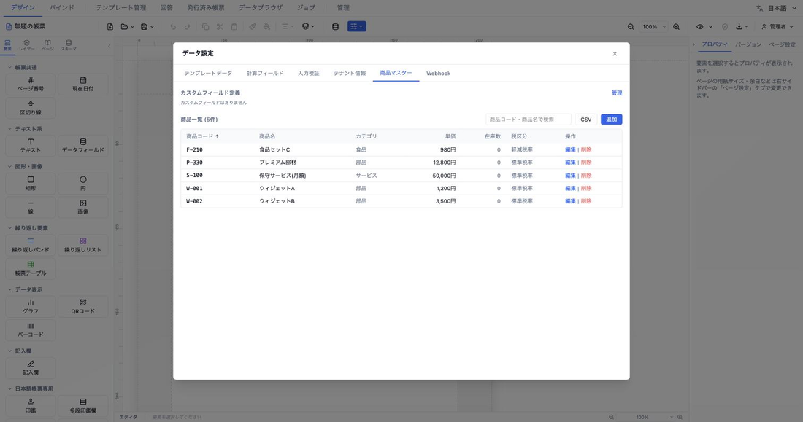

列ヘッダーで並べ替え、検索ボックスで絞り込む操作の例:

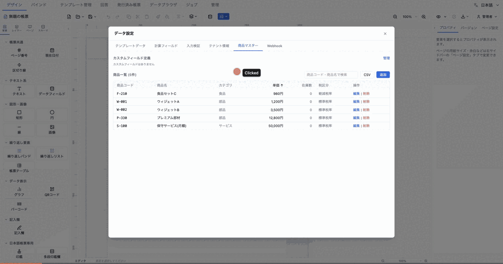

> 単価の列ヘッダーをクリックして昇順（↑）→ 降順（↓）に並べ替え、検索ボックスに「ウィジェット」と入力して 2 件に絞り込んでいます。

### 6.3 商品を追加・編集する

**＋ 追加** ボタン、または各行の **編集** から編集ダイアログを開きます。項目:

| 項目 | 説明 |
|------|------|
| **コード**（必須） | テナント内で一意。重複すると保存時にエラーになります |
| **名称**（必須） | 商品名 |
| **単価** | 基準となる単価（数値） |
| **税区分** | なし / 標準税率 / 軽減税率。実際の税率は テナント情報の税率設定 + JEXL `taxRates` で解決されます |
| **カテゴリ / 単位 / 在庫数 / 製造元 / 説明** | 任意の付帯情報（単位は「個」「本」「kg」など） |
| **サブスクリプション期間 / 価格単位** | 継続課金商品のときのみ設定 |
| **カスタムフィールド** | 6.6 で定義した項目がここに表示され、値を入力できます |

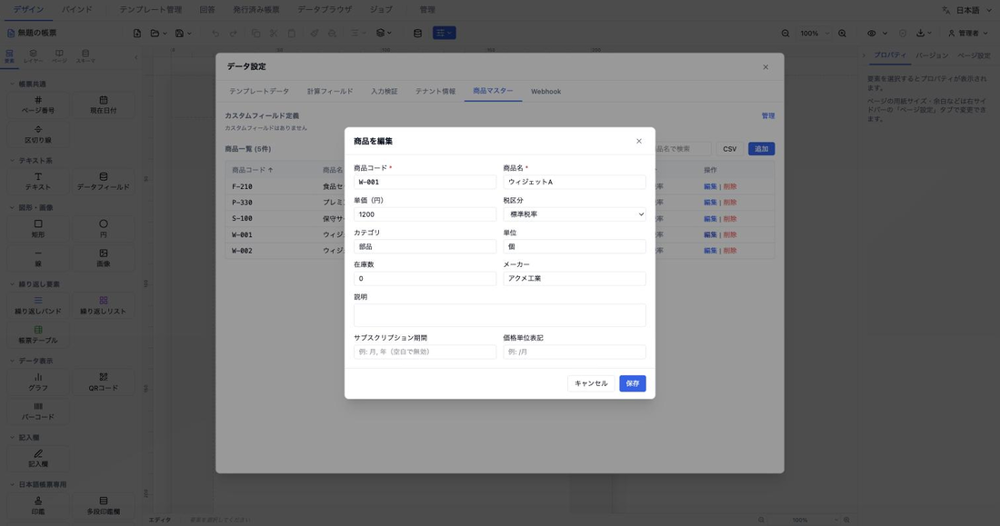

- **価格履歴**: 既存商品の編集画面では、単価の変更履歴（適用日・価格）が新しい順に表示されます（閲覧のみ）。
- **同時更新の保護**: 他の利用者が先に更新していた場合は「バージョンが競合しました」と表示され、上書きを防ぎます。最新を読み直してから再編集してください。

### 6.4 商品を削除する

各行の **削除** を押すと確認ダイアログが出ます。削除は即座に一覧へ反映されます。内部的には論理削除で、**削除後 90 日間は同じ商品コードを再利用できません**。

### 6.5 CSV で一括取り込みする

**CSV** ボタンを押すと、取り込みパネルがその場に展開します（別ウィンドウは開きません）。

- **CSV の先頭行が列名** として自動認識されます。
- 対応列: `code`（必須）・`name`・`unitPrice`・`category`・`taxType`・`unit`・`manufacturer`。**それ以外の列はカスタムフィールドとして自動追加**されます。
- **ファイルを選択** で `.csv` を読み込むか、テキスト欄に直接貼り付けます。
- **インポート実行** すると、登録件数・スキップ件数・行ごとのエラー（`行N / 列: 理由`）が表示されます。

```csv
code,name,unitPrice
P001,商品A,1000
P002,商品B,2000
```

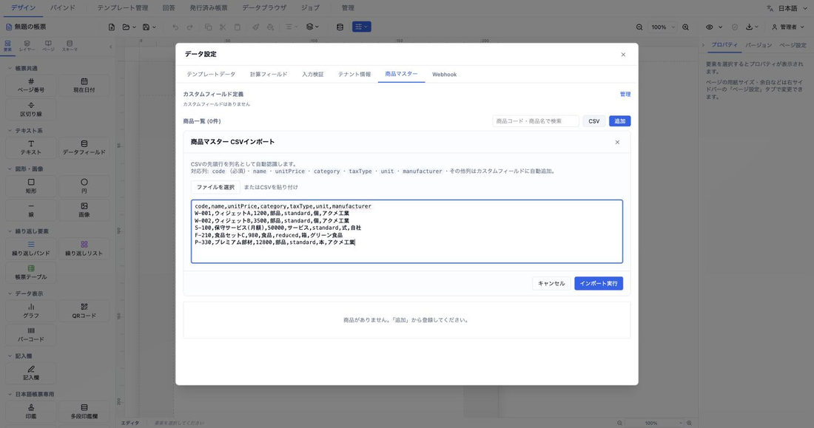

> 対応列の説明とテキスト貼り付け欄が、商品一覧の直上にインライン展開されます。

### 6.6 カスタムフィールドを定義する

商品ごとに持たせたい独自項目を定義できます。

- **カスタムフィールド** 見出しの **管理** を押すと、定義パネルがその場に展開します（もう一度押すと閉じます）。
- 各項目は **キー**（英数字）・**ラベル**・**型**（テキスト / 数値 / 日付 / 真偽）を持ちます。**＋ フィールドを追加** で行を増やし、不要な行は削除できます。
- **保存** すると、定義した項目が各商品の編集ダイアログ（6.3）に現れ、値を入力できるようになります。

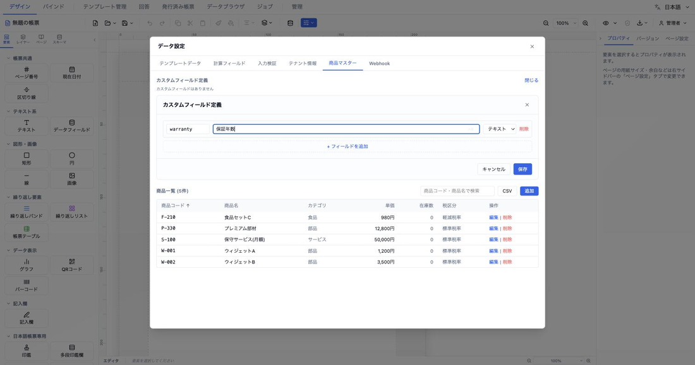

### 6.7 帳票で商品マスターを使う

商品マスターは、明細（detail）グループに **ルックアップ** で紐付けて利用します。

- [3. データ設計（バインド）](#3-データ設計バインド) の関係ビューで、明細グループの **商品ルックアップ** ボタンから、明細の指定列（例: `itemCode`）を商品マスターの列（例: `code`）に対応づけます。
- これにより、明細に商品コードを入れるだけで、名称・単価・税区分などを商品マスターから引けるようになります。

---

## 7. テンプレートの保存と開く

### 保存

- ツールバーの **保存** → **サーバーに保存** / **JSON ファイルとしてダウンロード**。
- 新規/初回保存では **テンプレートを保存** ダイアログ（テンプレート名・カテゴリ・タグ）が開きます。
- **自分のテンプレート** と **公開テンプレート** を区別します。公開テンプレートは「クリックでコピー」で自分のテンプレートに複製されます。白紙からの保存は新規テンプレートとして、開いたサーバーテンプレートの保存は上書きとして扱われます。

### 開く

- ツールバーの **開く**（バックエンド接続時はテンプレートピッカーが開きます）。ドロップダウンで **ローカルファイルを開く** / **サーバーから開く**。
- テンプレートカードはホバーで 名前変更 / エクスポート（.rds2.json）/ 複製 / 削除。**インポート**（.rds2.json / .json）や **一覧を取得** も可能。
- 未保存の変更があるまま開こうとすると **「未保存の変更があります」** の確認（**破棄して開く** / **保存して開く**）が出ます。

---

## 8. フォーム回答とステータス管理

**回答** タブ（バックエンドと現在のテンプレートが必要）。

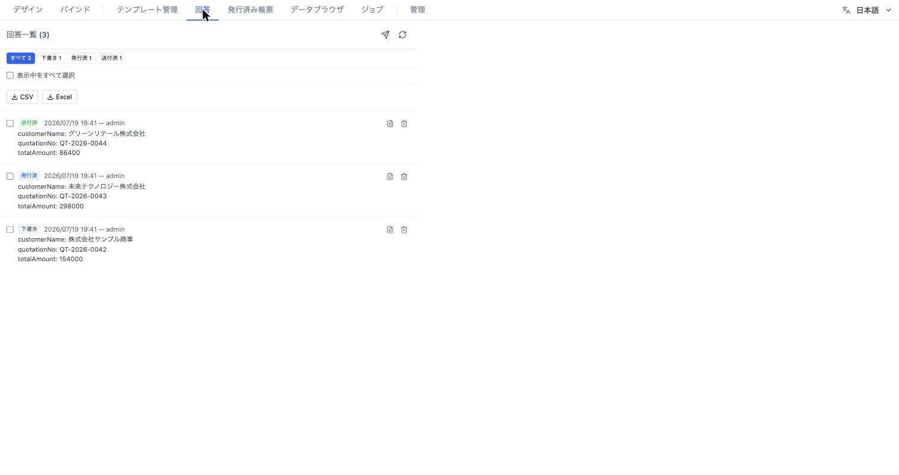

- ヘッダー **回答一覧 (N)** に **回答を送信**（現在のデータを確認して送信）と **再読み込み**。
- **ステータスのライフサイクル**: **下書き → 発行済 → 送付済 → 無効**。各行のステータスバッジをクリックすると順に切り替わります。
- **ステータスフィルタ**: すべて + ステータス別の件数チップ。
- **一括操作**（チェックボックスで複数選択時）: **ステータス変更…**（一括変更）と **一括PDF**。
- **行ごとの操作**: **PDF回答票** ダウンロード、**削除**（この操作は元に戻せません）。
- **エクスポート**: 全回答を **CSV** / **Excel** で出力。

---

## 9. 一括 PDF 生成

**回答** タブで複数の回答を選択し **一括PDF** を実行します。ジョブが投入され、進捗（X/Y 完了）を表示し、完了すると ZIP（`batch_YYYYMMDD.zip`）が自動ダウンロードされます。キャンセルも可能です。

> CLI からのバッチ生成（CSV 1 行 → 1 PDF）は [導入方法 › CLI](./setup.md#cli) の `batch` コマンドを参照。

---

## 10. テナント情報

**管理 → テナント情報**（または データ設定モーダルの テナント情報 タブ）で組織情報を設定します。

- フィールド: 会社名、郵便番号、住所1、住所2、電話番号、メールアドレス、代表者名、ロゴ。
- **保存** すると「テナント情報を保存しました。」と表示されます。
- これらの値はパレットの **テナント情報** 要素（会社名/住所/電話番号/代表者名/ロゴ/カスタムフィールド）に自動反映されます。

---

## 11. ログインとユーザー管理

- **ログイン**: バックエンドに接続でき未認証のとき、ログインモーダル（**レポートデザインスタジオ**）が表示されます。ユーザーID + パスワードを入力。

  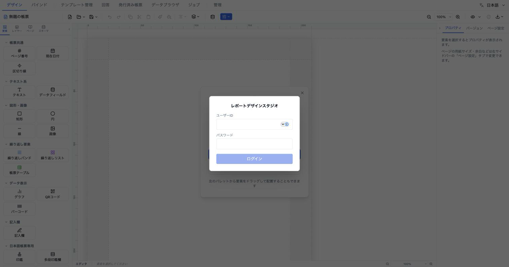

  - エラー: 401「ユーザー名またはパスワードが正しくありません」/ 429「ログイン試行回数が多すぎます…」/ ネットワークエラー。
- **ユーザーメニュー**（右上）: 表示名・**設定**（サーバー設定）・**ログアウト**。ログアウト時は現在のテンプレートと自動保存データがクリアされます（ユーザー間の分離）。
- **管理タブ**（`admin` ロール必須）: **ユーザー管理**（ユーザー作成/一覧）、**サーバー設定**、**テナント情報**、**デフォルトスタイル**、**テンプレート**。

---

## 12. データ設定モーダル（まとめ）

ツールバーのデータベースアイコンから開く **データ設定** モーダルのタブ:

| タブ | 内容 |
|------|------|
| テンプレートデータ | サンプルデータ + プレビューデータ |
| 計算フィールド | JEXL 計算値（数値/文字列/パーセント/カスタム書式、`{{...}}` で埋め込み） |
| 入力検証 | 検証ルール（条件式・エラーメッセージ・エクスポート中断/警告のみ） |
| テナント情報 | 組織情報（[10. テナント情報](#10-テナント情報)） |
| 商品マスター | 商品カタログの管理（操作の詳細は [6. マスターデータ管理](#6-マスターデータ管理)） |
| Webhook | 回答送信時などの Webhook 設定 |
